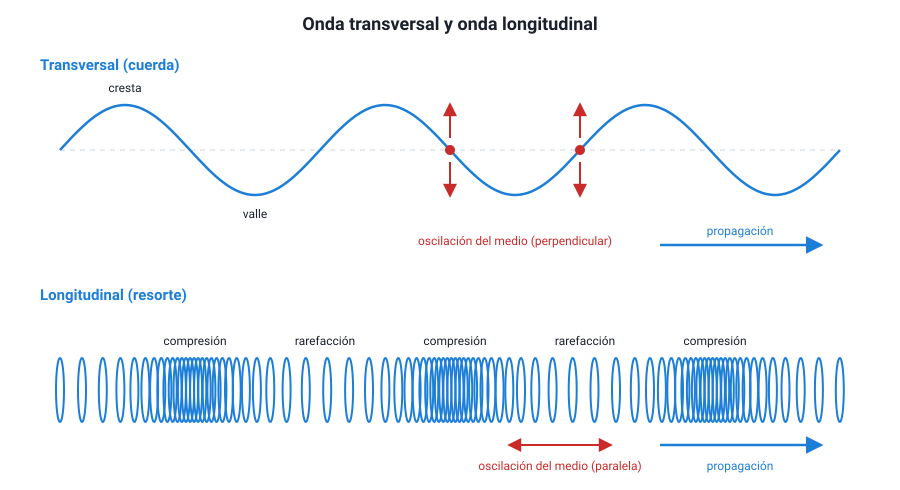

## 3. Clasificación de las ondas

Las ondas se pueden ordenar con varios criterios distintos. Conviene tenerlos separados, porque una misma onda recibe un nombre en cada uno: el sonido en el aire, por ejemplo, es una onda **mecánica**, **longitudinal**, **tridimensional** y, si la fuente vibra con ritmo constante, **periódica**.

| Criterio | Tipos | Ejemplos |
|---|---|---|
| Según el **medio** que necesitan | Mecánicas · Electromagnéticas | Sonido, olas, ondas sísmicas · Luz, ondas de radio, rayos X |
| Según la **dirección de oscilación** | Transversales · Longitudinales | Cuerda de guitarra, luz · Sonido, resorte comprimido |
| Según las **dimensiones** en que se propagan | Unidimensionales · Bidimensionales · Tridimensionales | Cuerda · Superficie del agua · Sonido, luz |
| Según su **periodicidad** | Pulso · Onda periódica | Un aplauso · El sonido de un diapasón |

### a. Según el medio: mecánicas y electromagnéticas

**Ondas mecánicas.** Necesitan un **medio material** —sólido, líquido o gas— porque lo que oscila son las partículas de ese medio. Sin medio no hay nada que se perturbe. Son mecánicas el sonido, las olas del mar, las ondas en una cuerda y las ondas sísmicas.

**Ondas electromagnéticas.** Lo que oscila en ellas no son partículas, sino un **campo eléctrico y un campo magnético**, perpendiculares entre sí y perpendiculares a la dirección de propagación. Como no necesitan partículas, **se propagan también en el vacío**, y allí todas viajan con la misma rapidez: la rapidez de la luz, *c* ≈ 3 × 108 m/s. Son electromagnéticas la luz visible, las ondas de radio, las microondas, el infrarrojo, el ultravioleta, los rayos X y los rayos gamma.

::: nota
**La prueba decisiva es el vacío.** Si pones un timbre sonando dentro de una campana de vidrio y le extraes el aire con una bomba, el sonido se va apagando hasta dejar de oírse, aunque sigas **viendo** el martillo golpear. La luz atraviesa el vacío; el sonido no. Así se sabe que la luz no es una onda mecánica. Por la misma razón, la luz del Sol llega a la Tierra atravesando 150 millones de kilómetros de espacio casi vacío, y ningún sonido del Sol llega hasta aquí.
:::

<figure><figcaption>Figura 2. Onda transversal (arriba) y onda longitudinal (abajo). Diagrama propio.</figcaption></figure>

### b. Según la dirección de oscilación: transversales y longitudinales

Este criterio compara dos direcciones: **hacia dónde oscila el medio** y **hacia dónde avanza la onda**.

- **Transversales**: la oscilación es **perpendicular** a la propagación. En una cuerda horizontal, cada punto sube y baja mientras la onda avanza hacia el lado. Tienen **crestas** (puntos más altos) y **valles** (puntos más bajos). Las ondas electromagnéticas son transversales, porque sus campos oscilan perpendicularmente a la dirección de avance.
- **Longitudinales**: la oscilación es **paralela** a la propagación. Si empujas y tiras del extremo de un resorte largo (un *slinky*), las espiras van y vienen en la misma dirección en que avanza la onda, y se forman **compresiones** (espiras juntas) y **rarefacciones** (espiras separadas). El sonido en el aire es longitudinal: el parlante empuja y tira del aire, y las capas de aire se comprimen y se enrarecen.

| | Transversal | Longitudinal |
|---|---|---|
| Oscilación respecto de la propagación | Perpendicular | Paralela |
| Zonas características | Crestas y valles | Compresiones y rarefacciones |
| Ejemplos | Cuerda, luz, ondas S de un sismo | Sonido, resorte comprimido, ondas P de un sismo |

::: tip
**Dos confusiones frecuentes.** (1) Creer que «transversal» significa que la onda viaja de lado a lado: no, lo que es transversal es la **oscilación**, no el viaje. (2) Creer que toda onda mecánica es longitudinal: la cuerda y las ondas S son mecánicas **y** transversales. Los dos criterios son independientes.
:::

**Un caso que conviene conocer: los sismos.** Un terremoto genera a la vez ondas **P** (primarias, longitudinales) y ondas **S** (secundarias, transversales). Las P viajan más rápido y llegan primero; las S llegan después y suelen sacudir más. Además, las ondas S **no atraviesan líquidos**, porque un líquido no resiste que se lo deforme de lado. Que las ondas S no crucen el núcleo externo de la Tierra fue, justamente, la evidencia de que ese núcleo es líquido. Esta idea se retoma en el capítulo 4.

**Las olas del mar** son un caso mixto: las partículas de agua de la superficie describen trayectorias casi circulares, con un componente vertical y otro horizontal.

### c. Según las dimensiones en que se propagan

- **Unidimensionales**: avanzan en una sola dirección, como la onda en una cuerda o en un resorte.
- **Bidimensionales**: se extienden sobre una superficie, como los anillos en el agua de un estanque o la vibración de la membrana de un tambor.
- **Tridimensionales**: se propagan en todas las direcciones del espacio, como el sonido de un parlante o la luz de una ampolleta.

Para describirlas se usa el **frente de onda**: la línea (en dos dimensiones) o la superficie (en tres) que une los puntos que están en el mismo estado de oscilación, por ejemplo, todas las crestas de un anillo. Cerca de una fuente pequeña, los frentes son **circulares o esféricos**; muy lejos de la fuente se ven prácticamente **planos**, como la luz del Sol al llegar a la Tierra.

::: ejemplo
**Clasificar una onda con todos los criterios.** Una antena de radio emite una señal que se propaga en todas direcciones.

- Medio: **electromagnética** (llega también a un satélite en el espacio).
- Oscilación: **transversal** (todas las electromagnéticas lo son).
- Dimensiones: **tridimensional** (se propaga en todas direcciones).
- Periodicidad: **periódica** (la antena oscila a una frecuencia fija, por ejemplo 100 MHz).

Hacer este ejercicio con cada onda nueva es la mejor forma de no mezclar criterios.
:::
