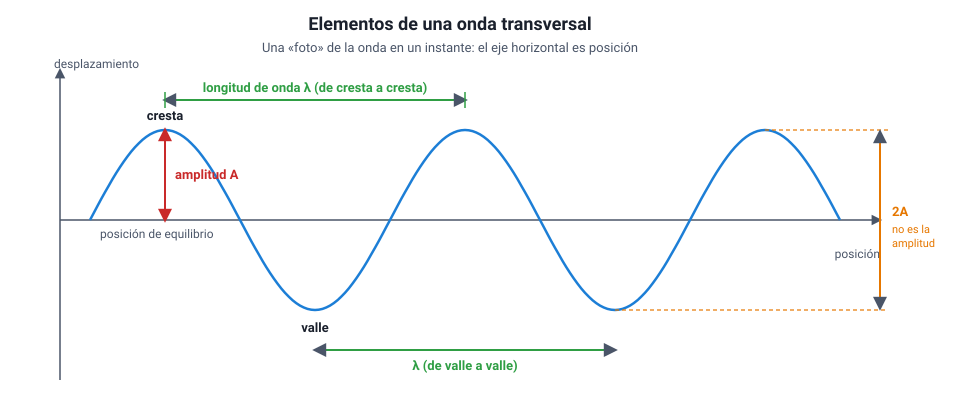
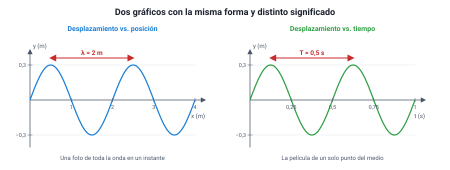

## 4. Elementos de una onda periódica

<figure><figcaption>Figura 3. Elementos de una onda transversal en un instante dado. Diagrama propio.</figcaption></figure>

### a. Amplitud

La **amplitud (A)** es el máximo desplazamiento de un punto del medio respecto de su **posición de equilibrio** (la que tendría si no pasara la onda). En la figura se mide desde la línea central hasta una cresta, **no** de cresta a valle.

La amplitud está relacionada con la **energía** que transporta la onda: a mayor amplitud, más energía. En el sonido se percibe como intensidad (un sonido más fuerte); en la luz, como brillo. Lo importante para la prueba es lo que la amplitud **no** hace: no cambia la rapidez de propagación ni la longitud de onda.

::: tip
**Error típico.** Medir la amplitud de cresta a valle. Esa distancia es el doble de la amplitud. Si un gráfico muestra que la cuerda va de −3 cm a +3 cm, la amplitud es **3 cm**, no 6 cm.
:::

### b. Longitud de onda

La **longitud de onda (λ**, la letra griega lambda) es la distancia entre dos puntos consecutivos que están en el mismo estado de oscilación: de cresta a cresta, de valle a valle, o de compresión a compresión en una onda longitudinal. Se mide en metros (o en sus submúltiplos: cm, mm, µm, nm). Es la **longitud de un ciclo completo** del patrón.

Las longitudes de onda cubren escalas enormes: desde kilómetros en algunas ondas de radio hasta menos que el tamaño de un átomo en los rayos gamma. La luz visible va aproximadamente de 400 a 700 nanómetros (1 nm = 10−9 m).

### c. Período y frecuencia

El **período (T)** es el tiempo que tarda un punto del medio en completar **una oscilación completa** (subir, bajar y volver al estado inicial). También es el tiempo que tarda la onda en avanzar una longitud de onda. Se mide en segundos.

La **frecuencia (f)** es el número de oscilaciones que ocurren en cada segundo. Su unidad es el **hertz (Hz)**: 1 Hz equivale a una oscilación por segundo, es decir, 1 Hz = 1 s−1.

Período y frecuencia son **inversos**: si una fuente oscila 4 veces por segundo (*f* = 4 Hz), cada oscilación dura un cuarto de segundo (*T* = 0,25 s).

<strong><em>f</em> = 1 / <em>T</em></strong> &nbsp;&nbsp;&nbsp;&nbsp; <strong><em>T</em> = 1 / <em>f</em></strong>

| Prefijo | Valor | Ejemplo |
|---|---|---|
| kilohertz (kHz) | 103 Hz | Un silbido agudo: unos 5 kHz |
| megahertz (MHz) | 106 Hz | Radio FM: de 88 a 108 MHz |
| gigahertz (GHz) | 109 Hz | Wi-Fi: 2,4 y 5 GHz; horno microondas: 2,45 GHz |
| terahertz (THz) | 1012 Hz | Luz visible: de unos 430 a 750 THz |

::: tip
**Mucha frecuencia significa poco período.** Si te preguntan qué pasa con el período cuando la frecuencia se duplica, la respuesta es que se reduce a la mitad. Y cuidado con las unidades: el hertz no es «hertz por segundo»; ya es «por segundo».
:::

### d. Dos gráficos que parecen iguales y no lo son

La PAES usa dos tipos de gráfico que tienen la misma forma de sinusoide, pero que muestran cosas distintas. Confundirlos es uno de los errores más caros de la prueba.

<figure><figcaption>Figura 4. El mismo tipo de curva con dos significados: a la izquierda se lee λ, a la derecha se lee T. Diagrama propio.</figcaption></figure>

| Gráfico | Qué muestra | Qué se lee entre dos crestas |
|---|---|---|
| **Desplazamiento vs. posición** (*y* – *x*) | Una «foto» de toda la onda en un instante | La **longitud de onda** λ |
| **Desplazamiento vs. tiempo** (*y* – *t*) | La «película» de un solo punto del medio | El **período** *T* |

En ambos, la altura máxima de la curva es la **amplitud**. Antes de responder cualquier pregunta con un gráfico de onda, **lee el eje horizontal**: si dice metros, estás frente a λ; si dice segundos, frente a *T*.

::: ejemplo
**Leer los dos gráficos de la figura 4.** Con el gráfico de la izquierda, la distancia entre dos crestas es de 2 m: λ = 2 m. Con el de la derecha, entre dos crestas pasan 0,5 s: *T* = 0,5 s, y por lo tanto *f* = 1 / 0,5 s = 2 Hz. La amplitud, en los dos, es de 0,3 m.

Si ambos gráficos describen la misma onda, ya se puede calcular su rapidez con lo que viene en la sección siguiente: *v* = λ · *f* = 2 m · 2 Hz = 4 m/s.
:::

### e. Ciclo y fase

Un **ciclo** es una oscilación completa. Dos puntos del medio están **en fase** cuando hacen lo mismo al mismo tiempo (por ejemplo, dos crestas), y en **oposición de fase** cuando uno está en una cresta mientras el otro está en un valle. Los puntos en fase están separados por un número entero de longitudes de onda (λ, 2λ, 3λ…); los que están en oposición, por media longitud de onda más un número entero (λ/2, 3λ/2…). Esta idea es la base de la interferencia (sección 7).
