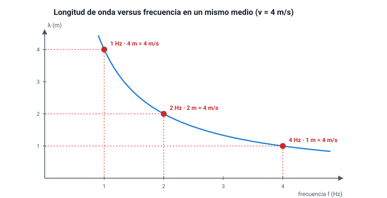

## 5. Rapidez de propagación

### a. La relación fundamental: *v* = λ · *f*

En un período *T*, la fuente completa una oscilación y la onda avanza exactamente una longitud de onda λ. Como la rapidez es distancia dividida por tiempo:

<strong><em>v</em> = λ / <em>T</em> = λ · <em>f</em></strong>

| Símbolo | Magnitud | Unidad SI |
|---|---|---|
| *v* | Rapidez de propagación | m/s |
| λ | Longitud de onda | m |
| *f* | Frecuencia | Hz (= 1/s) |
| *T* | Período | s |

Es la ecuación más usada del área Ondas. Se despeja fácilmente: λ = *v* / *f* y *f* = *v* / λ.

::: ejemplo
**Tres cálculos típicos.**

1. **Una radio FM** transmite a 100 MHz. ¿Cuál es su longitud de onda? Las ondas de radio viajan a *c* = 3 × 108 m/s. Entonces λ = *c* / *f* = (3 × 108 m/s) / (1 × 108 Hz) = **3 m**.
2. **Una ola** tiene crestas separadas por 12 m y pasa una cresta frente a un muelle cada 4 s. Entonces λ = 12 m, *T* = 4 s y *v* = λ / *T* = **3 m/s**.
3. **Un horno microondas** funciona a 2,45 GHz. Su λ = (3 × 108 m/s) / (2,45 × 109 Hz) ≈ 0,12 m = **12 cm**.

En los tres casos el método es el mismo: identificar qué magnitudes da el enunciado, convertirlas a unidades del SI y recién entonces reemplazar.
:::

### b. De qué depende la rapidez: del medio, no de la fuente

Esta es la segunda idea central del capítulo:

::: nota
**La rapidez de una onda la determina el medio** (su rigidez, su densidad, su temperatura), no la frecuencia ni la amplitud. **La frecuencia la determina la fuente.** La longitud de onda es lo que se «acomoda» para que se cumpla *v* = λ · *f*.
:::

Consecuencia directa: en un mismo medio, si la fuente oscila más rápido (mayor *f*), la rapidez no cambia, así que la longitud de onda **disminuye** en la misma proporción. *f* y λ son **inversamente proporcionales** cuando *v* es constante: si *f* se duplica, λ se reduce a la mitad.

<figure><figcaption>Figura 5. En un mismo medio (aquí, <em>v</em> = 4 m/s), λ y <em>f</em> son inversamente proporcionales: el producto λ · <em>f</em> se mantiene constante. Diagrama propio.</figcaption></figure>

Rapideces típicas, para tener una escala:

| Onda y medio | Rapidez aproximada |
|---|---|
| Sonido en el aire a 20 °C | 343 m/s |
| Sonido en el agua | 1 480 m/s |
| Sonido en el acero | 5 000 – 6 000 m/s |
| Ondas sísmicas P en la corteza | 5 000 – 8 000 m/s |
| Luz en el vacío (*c*) | 299 792 458 m/s ≈ 3 × 108 m/s |
| Luz en el agua | ≈ 2,25 × 108 m/s |
| Luz en el vidrio | ≈ 2 × 108 m/s |

Fíjate en el contraste: el sonido va **más rápido** en los sólidos que en los gases, mientras que la luz va **más rápido en el vacío** y se frena al entrar en la materia.

::: tip
**Distractor clásico.** «Si aumenta la frecuencia, la onda viaja más rápido.» Es falso en un medio dado: todas las notas de una orquesta, graves y agudas, te llegan al mismo tiempo, y todas las ondas electromagnéticas viajan a *c* en el vacío. Lo que cambia con la frecuencia es la longitud de onda.
:::

### c. Qué pasa cuando la onda cambia de medio

Cuando una onda pasa de un medio a otro, la fuente sigue siendo la misma, así que:

| Magnitud | ¿Cambia al pasar a otro medio? | Por qué |
|---|---|---|
| Frecuencia *f* | **No** | La fija la fuente; cada oscilación que llega a la frontera produce una oscilación en el otro lado |
| Rapidez *v* | **Sí** | Depende del medio |
| Longitud de onda λ | **Sí**, en la misma proporción que *v* | λ = *v* / *f*, con *f* fija |

::: ejemplo
**La luz entra al agua.** Una luz roja de frecuencia 4,6 × 1014 Hz tiene en el aire λ ≈ 650 nm. Al entrar en el agua su rapidez baja a unos 2,25 × 108 m/s, es decir, al 75 % aproximadamente. La frecuencia no cambia, así que la longitud de onda también baja al 75 %: λagua ≈ 0,75 · 650 nm ≈ **490 nm**.

Aun así, un buzo sigue viendo la luz **roja**: el color que percibimos depende de la frecuencia, y la frecuencia no cambió.
:::

### d. Cómo lo pregunta la PAES

Las preguntas sobre esta relación casi nunca piden solo reemplazar números. Lo habitual es:

- entregar una **tabla de datos** (varias frecuencias y sus longitudes de onda) y pedir la relación o la tendencia que muestra (habilidad *Procesar y analizar la evidencia*);
- describir un **experimento** con una cubeta de ondas o una cuerda y pedir cuál es la variable independiente, cuál la dependiente y cuál se mantuvo controlada (*Planificar y conducir una investigación*);
- pedir una **predicción**: qué ocurrirá con λ si se duplica *f*, o con *v* si se cambia de medio.

La herramienta para todas ellas es la misma: *v* = λ · *f* y la regla de que el medio fija *v* y la fuente fija *f*.
