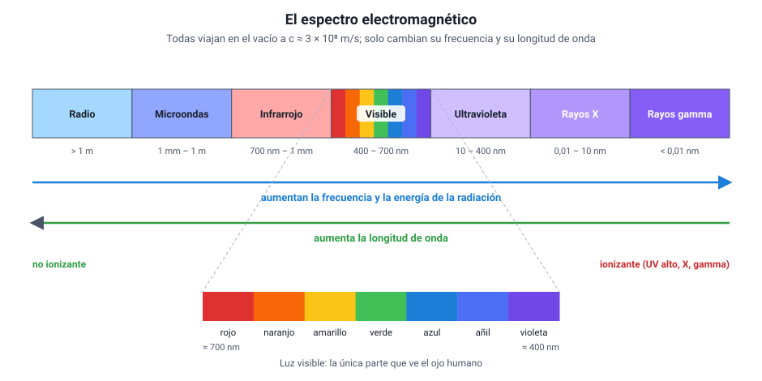

## 6. Las ondas electromagnéticas y su espectro

### a. Qué tienen en común todas las ondas electromagnéticas

La luz, las ondas de radio y los rayos X parecen cosas muy distintas, pero son el **mismo fenómeno** con distinta frecuencia. Todas las ondas electromagnéticas:

- se producen cuando **cargas eléctricas oscilan o se aceleran** (los electrones en una antena, los átomos de un filamento caliente, los núcleos de un átomo radiactivo);
- están formadas por un **campo eléctrico y un campo magnético** que oscilan perpendiculares entre sí y a la dirección de avance: son **transversales**;
- **no necesitan medio** y en el vacío viajan todas a la misma rapidez, *c* ≈ 3 × 108 m/s;
- cumplen *c* = λ · *f*: por eso, **a mayor frecuencia, menor longitud de onda**.

Lo único que las distingue es su frecuencia (o, lo que es lo mismo, su longitud de onda). Y con ella cambian dos cosas importantes: **la energía que transporta cada «paquete» de radiación** (mayor a mayor frecuencia) y **la forma en que interactúa con la materia** (qué atraviesa, qué absorbe, qué daña).

### b. El espectro ordenado

El **espectro electromagnético** es el conjunto de todas estas ondas, ordenadas por frecuencia. No tiene fronteras nítidas: los límites entre rangos son convenciones aproximadas.

<figure><figcaption>Figura 6. El espectro electromagnético, de menor a mayor frecuencia. Los límites entre rangos son aproximados. Diagrama propio.</figcaption></figure>

| Rango | Longitud de onda aproximada | Frecuencia aproximada | Usos y fuentes |
|---|---|---|---|
| **Ondas de radio** | Mayor que 1 m | Menor que 300 MHz | Radio AM y FM, televisión abierta, radiotelescopios, comunicación con barcos y aviones |
| **Microondas** | 1 mm – 1 m | 300 MHz – 300 GHz | Horno microondas, telefonía móvil, Wi-Fi, Bluetooth, GPS, radar, enlaces satelitales |
| **Infrarrojo** | 700 nm – 1 mm | 300 GHz – 430 THz | Controles remotos, cámaras térmicas, visión nocturna, calefactores, fibra óptica |
| **Luz visible** | 400 – 700 nm | 430 – 750 THz | Visión humana, fotografía, láser, iluminación |
| **Ultravioleta** | 10 – 400 nm | 750 THz – 30 PHz | Esterilización de agua y superficies, detección de billetes falsos, síntesis de vitamina D, bronceado y quemaduras |
| **Rayos X** | 0,01 – 10 nm | 30 PHz – 30 EHz | Radiografías, tomografía computarizada (escáner), control de equipaje |
| **Rayos gamma** | Menor que 0,01 nm | Mayor que 30 EHz | Radioterapia contra el cáncer, esterilización de material médico, astronomía de alta energía |

(1 PHz = 1015 Hz; 1 EHz = 1018 Hz.)

Dentro de la luz visible, el orden de los colores de menor a mayor frecuencia es **rojo, naranjo, amarillo, verde, azul, añil y violeta**. El rojo tiene la mayor longitud de onda del visible (≈ 700 nm) y el violeta la menor (≈ 400 nm). Por eso el rango que queda «debajo del rojo» en frecuencia se llama **infra**rrojo y el que queda «más allá del violeta», **ultra**violeta.

::: tip
**Una regla mnemotécnica para el orden.** De menor a mayor frecuencia: **R**adio, **M**icroondas, **I**nfrarrojo, **V**isible, **U**ltravioleta, **X**, **G**amma. Si te piden ordenar por longitud de onda de menor a mayor, el orden es exactamente el inverso. Y recuerda que **toda** la tabla viaja a la misma rapidez en el vacío: el orden por frecuencia **no** es un orden de rapidez.
:::

### c. Energía y riesgo: radiación ionizante y no ionizante

Cuanto mayor es la frecuencia, más energía transporta cada paquete de radiación. A partir de cierta frecuencia —la parte alta del ultravioleta, los rayos X y los rayos gamma— esa energía alcanza para **arrancar electrones de los átomos**: es la **radiación ionizante**, que puede dañar el ADN de las células. Por eso las radiografías se toman con la mínima exposición y el personal que las opera se protege con plomo, y por eso el ultravioleta del Sol produce quemaduras y aumenta el riesgo de cáncer de piel.

Las ondas de radio, las microondas, el infrarrojo y la luz visible son **no ionizantes**: pueden calentar un material (el horno microondas agita las moléculas de agua de los alimentos), pero no rompen los átomos.

::: nota
**Intensidad y frecuencia no son lo mismo.** Una lámpara roja muy potente emite mucha energía en total, pero cada paquete de luz roja tiene poca energía; no puede producir lo que sí produce el ultravioleta, aunque sea débil. Lo que decide si una radiación es ionizante es su **frecuencia**, no su intensidad.
:::

### d. Dispositivos que funcionan con ondas electromagnéticas

El temario menciona varios artefactos. Todos se entienden con las ideas de este capítulo:

| Dispositivo | Rango que usa | Idea física |
|---|---|---|
| **Radio** | Radio (AM: 535–1 705 kHz; FM: 88–108 MHz) | Cada emisora transmite en su frecuencia; el receptor se «sintoniza» para captar solo esa |
| **Teléfono móvil y comunicación inalámbrica** | Microondas (de unos 700 MHz a varios GHz; Wi-Fi a 2,4 y 5 GHz) | El teléfono es a la vez emisor y receptor; la información va codificada en la onda |
| **Televisor** | Radio y microondas (señal abierta o satelital); luz visible (pantalla) | Recibe la señal por antena y la convierte en imagen formada por puntos de luz de colores |
| **Radar** | Microondas | Emite pulsos que se **reflejan** en un objeto; el tiempo de ida y vuelta da la distancia y el **efecto Doppler** da la velocidad |
| **Radiotelescopio** | Radio | Una gran antena parabólica **refleja** y concentra ondas de radio débiles del espacio. En Chile opera ALMA, en el desierto de Atacama |
| **Rayo láser** | Visible o infrarrojo | Luz de una sola frecuencia, muy concentrada y que se propaga casi sin abrirse |
| **Fibra óptica** | Infrarrojo cercano (y visible) | La luz queda atrapada dentro de un hilo de vidrio por **reflexión total interna** y viaja kilómetros con muy poca pérdida |

Los dispositivos ópticos (prismáticos, telescopios reflector y refractor) se estudian en el capítulo 3, junto con espejos y lentes.

::: ejemplo
**Un radar que mide distancia.** Un radar de aeropuerto emite un pulso de microondas que vuelve reflejado desde un avión 2 × 10−4 s después. La onda viaja a *c* = 3 × 108 m/s. En ese tiempo recorre *d* = *c* · *t* = 3 × 108 m/s · 2 × 10−4 s = 6 × 104 m = 60 km. Pero ese es el camino de **ida y vuelta**: el avión está a la mitad, **30 km**. Olvidar dividir por dos es el error de cálculo típico en este tipo de pregunta.
:::
