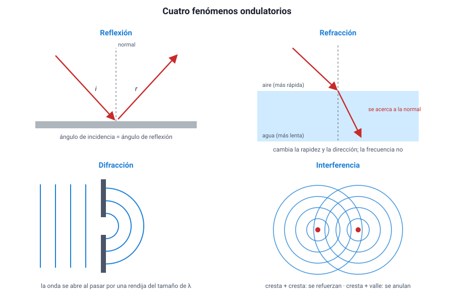
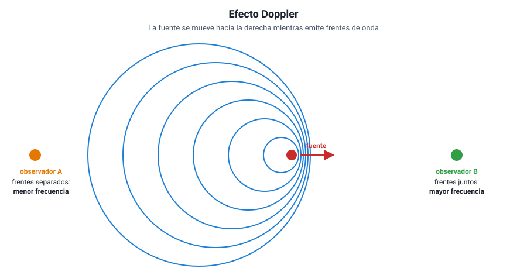

## 7. Fenómenos ondulatorios

Cuando una onda llega a la frontera con otro medio, encuentra un obstáculo o se cruza con otra onda, le ocurren cosas que no le ocurrirían a una pelota. Estos comportamientos son la **firma** de lo ondulatorio: si algo los muestra, es una onda. El temario los pide **en términos cualitativos**: hay que saber reconocerlos, explicarlos y predecir qué pasa, no calcularlos con ecuaciones.

<figure><figcaption>Figura 7. Reflexión, refracción, difracción e interferencia. Diagrama propio.</figcaption></figure>

### a. Reflexión

La **reflexión** ocurre cuando una onda llega a la frontera con otro medio y **rebota**, volviendo al medio del que venía. La onda reflejada tiene la **misma rapidez, la misma frecuencia y la misma longitud de onda** que la incidente, porque sigue en el mismo medio.

Su ley es simple: **el ángulo de incidencia es igual al ángulo de reflexión**, medidos ambos respecto de la **normal** (la línea perpendicular a la superficie en el punto donde llega la onda).

Ejemplos: el eco (sonido reflejado en una pared o un cerro), la imagen en un espejo (luz reflejada), el radar (microondas reflejadas en un avión) y las antenas parabólicas, que reflejan las ondas hacia un receptor ubicado en su foco.

### b. Refracción

La **refracción** ocurre cuando una onda **pasa** de un medio a otro y cambia su rapidez. Si llega de forma oblicua, ese cambio de rapidez hace que **cambie de dirección**: la onda se «quiebra» en la frontera.

- Al pasar a un medio donde viaja **más lento**, la onda se acerca a la normal.
- Al pasar a un medio donde viaja **más rápido**, se aleja de la normal.
- Si llega **perpendicular** a la frontera, cambia de rapidez pero no de dirección.

Como vimos en la sección 5, en la refracción **la frecuencia se mantiene**, mientras que la rapidez y la longitud de onda cambian.

Ejemplos: una bombilla dentro de un vaso de agua parece quebrada; una piscina parece menos profunda de lo que es; las olas giran al acercarse a la playa y terminan llegando casi paralelas a la orilla, porque se frenan en el agua poco profunda.

::: nota
**Reflexión total interna.** Cuando la luz va de un medio donde es lenta (vidrio) a uno donde es rápida (aire), se aleja de la normal. Si el ángulo de llegada es suficientemente grande, la luz ya no puede salir y **se refleja completa** hacia adentro. Así funciona la **fibra óptica**: la luz rebota de pared en pared a lo largo del hilo de vidrio sin escaparse.
:::

### c. Absorción

La **absorción** ocurre cuando el medio o el objeto sobre el que incide la onda **se queda con parte de su energía**, que casi siempre se transforma en energía térmica. Una onda que se absorbe pierde amplitud a medida que avanza.

Cada material absorbe de manera distinta según la frecuencia:

| Material | Qué absorbe | Consecuencia |
|---|---|---|
| Capa de ozono | Gran parte del ultravioleta del Sol | Protege a los seres vivos de la radiación más dañina |
| Agua de los alimentos | Microondas | El horno microondas calienta la comida |
| Huesos (calcio) | Rayos X, más que los tejidos blandos | En la radiografía los huesos se ven claros |
| Ropa oscura | Luz visible | Se calienta más al sol que la ropa clara |
| Vidrio común | Ultravioleta (parcialmente) | Es difícil broncearse detrás de una ventana |

Reflexión, refracción y absorción suelen ocurrir **a la vez**: cuando la luz llega al agua de un lago, una parte se refleja (por eso ves el cielo en la superficie), otra se refracta hacia adentro y, a medida que avanza, se va absorbiendo (por eso el fondo de un lago profundo está oscuro).

### d. Difracción

La **difracción** es la capacidad de una onda de **rodear un obstáculo** o de **abrirse** al pasar por una rendija. Una pelota que pasa por una puerta sigue derecho; una onda que pasa por la misma puerta se desparrama hacia los lados.

La regla que manda es la comparación entre **la longitud de onda y el tamaño del obstáculo o la abertura**:

- Si λ es **comparable o mayor** que la abertura, la difracción es **muy notoria**.
- Si λ es **mucho menor** que la abertura, la difracción es **casi imperceptible** y la onda sigue en línea recta.

Esto explica un hecho cotidiano: **oyes** a alguien que habla detrás de una esquina, pero **no lo ves**. El sonido de la voz tiene longitudes de onda de centímetros a metros, como una puerta; la luz, de menos de una milésima de milímetro. El sonido se difracta en la puerta y dobla la esquina; la luz prácticamente no, y por eso **se propaga en línea recta** y forma sombras nítidas.

::: tip
**La difracción en las comunicaciones.** Las ondas de radio largas (AM, cientos de metros) rodean cerros y edificios y llegan a lugares sin línea directa con la antena. Las de longitud corta (FM, unos 3 m; telefonía, centímetros) se difractan mucho menos y necesitan antenas más cercanas o en lugares altos. Si una pregunta compara la cobertura de dos señales en un valle, la clave suele estar aquí.
:::

### e. Interferencia

Cuando dos ondas coinciden en el mismo lugar al mismo tiempo, **sus efectos se suman**: es el **principio de superposición**. Después de cruzarse, cada onda sigue su camino como si nada hubiera pasado.

- **Interferencia constructiva**: las ondas llegan **en fase** (cresta con cresta). Se refuerzan y la amplitud resultante es mayor.
- **Interferencia destructiva**: las ondas llegan **en oposición de fase** (cresta con valle). Se debilitan y, si tienen la misma amplitud, se anulan en ese punto.

Ejemplos: los colores de una pompa de jabón o de una mancha de aceite (interferencia de luz reflejada en las dos caras de una película delgada); los audífonos con cancelación de ruido, que emiten una onda en oposición de fase con el ruido exterior; las zonas de mala señal dentro de una casa, donde se cruzan la señal directa y la reflejada.

::: nota
**Por qué la interferencia y la difracción importan tanto.** Son los comportamientos que **ninguna partícula** muestra. En 1801, Thomas Young hizo pasar luz por dos rendijas muy juntas y obtuvo en una pantalla franjas claras y oscuras alternadas: interferencia. Fue la evidencia experimental de que la luz se comporta como una onda.
:::

### f. Efecto Doppler

El **efecto Doppler** es el cambio en la **frecuencia percibida** cuando la fuente y el observador se **acercan o se alejan** entre sí.

- Si se **acercan**, los frentes de onda llegan más juntos: la frecuencia percibida es **mayor** (la longitud de onda percibida, menor).
- Si se **alejan**, los frentes llegan más separados: la frecuencia percibida es **menor** (la longitud de onda percibida, mayor).

La fuente no cambia su frecuencia: lo que cambia es la que **recibe** el observador.

<figure><figcaption>Figura 8. Efecto Doppler: delante de la fuente en movimiento los frentes se apretujan; detrás se separan. Diagrama propio.</figcaption></figure>

Con el sonido se percibe a diario: la sirena de una ambulancia suena más aguda mientras se acerca y más grave después de pasar. Con las ondas electromagnéticas tiene aplicaciones que el temario destaca:

| Aplicación | Cómo usa el efecto Doppler |
|---|---|
| **Radar de velocidad** (carabineros, meteorología) | Compara la frecuencia emitida con la reflejada en un auto o en una nube: la diferencia indica su velocidad y si se acerca o se aleja |
| **Ecografía Doppler** | Mide la rapidez de la sangre en los vasos con ultrasonido reflejado en los glóbulos rojos |
| **Astronomía** | La luz de una galaxia que se aleja llega con menor frecuencia, desplazada hacia el rojo (**corrimiento al rojo**); si se acerca, hacia el azul. El corrimiento al rojo de casi todas las galaxias es una de las evidencias de que el universo se expande (capítulo 13) |

::: tip
**Lo que el efecto Doppler no es.** No es un cambio de **intensidad** (que la sirena suene más fuerte al acercarse es otro efecto, la distancia). Tampoco cambia la **rapidez** de la onda en el medio. Lo que cambia es la **frecuencia percibida**. Y el «corrimiento al rojo» no significa que la galaxia se vea roja: significa que todas sus líneas del espectro se desplazaron hacia frecuencias menores.
:::

### g. Resumen de los fenómenos

| Fenómeno | Qué ocurre | ¿Cambia *f*? | ¿Cambia *v*? | Ejemplo con ondas electromagnéticas |
|---|---|---|---|---|
| Reflexión | La onda rebota en la frontera | No | No | Espejo, radar |
| Refracción | La onda pasa a otro medio y se desvía | No | Sí | Lentes, bombilla «quebrada» |
| Absorción | El medio se queda con energía | No | No | Ozono y UV, horno microondas |
| Difracción | La onda rodea obstáculos o se abre en rendijas | No | No | Radio AM que cubre valles |
| Interferencia | Dos ondas se suman o se anulan | No | No | Colores de una pompa de jabón |
| Efecto Doppler | Cambia la *f* percibida por el movimiento relativo | Sí, la percibida | No | Radar de velocidad, corrimiento al rojo |
