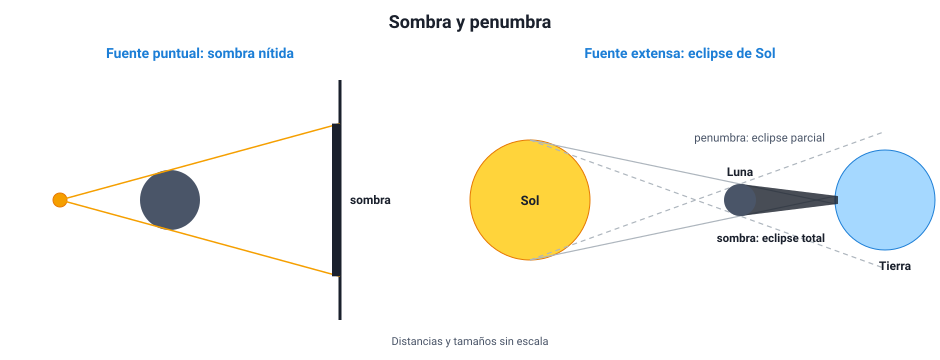

## 2. Cómo se propaga la luz

### a. Qué es la luz: dos modelos

Durante siglos se discutió qué es la luz. **Newton** (fines del siglo XVII) propuso el **modelo corpuscular**: la luz sería un chorro de partículas diminutas que salen de la fuente en línea recta. **Huygens**, en la misma época, propuso el **modelo ondulatorio**: la luz sería una onda. Cada modelo explicaba bien algunas cosas:

| Fenómeno | Modelo corpuscular | Modelo ondulatorio |
|---|---|---|
| Propagación en línea recta y sombras nítidas | Lo explica con facilidad | Lo explica si λ es muy pequeña |
| Reflexión | Lo explica (rebote de partículas) | Lo explica |
| Refracción | Predecía que la luz iría **más rápido** en el agua | Predecía que iría **más lento** en el agua |
| Interferencia y difracción | No las explica | Las explica |

La decisión la dieron los experimentos. En 1801, Young obtuvo franjas de interferencia con luz. En 1850, Foucault midió la rapidez de la luz en el agua y resultó **menor** que en el aire, como predecía el modelo ondulatorio. A fines del siglo XIX quedó claro que la luz es una **onda electromagnética** (capítulo 1). En el siglo XX se vio que en ciertos fenómenos, como el efecto fotoeléctrico, la luz también se comporta como paquetes de energía llamados **fotones**. Hoy se acepta que la luz tiene un comportamiento **dual**.

::: tip
**Cómo se usa esto en la PAES.** Es un ejemplo clásico de cómo se ponen a prueba dos modelos: se busca un fenómeno en que **predigan cosas distintas** y se mide. Si una pregunta te da dos modelos y un resultado experimental, identifica qué predecía cada uno sobre ese fenómeno exacto. Un modelo que falla en una predicción no «se vuelve falso» en todo: sigue siendo útil donde funciona.
:::

### b. Fuentes, cuerpos iluminados y materiales

Vemos un objeto cuando **llega luz desde él a nuestros ojos**. Esa luz puede ser propia o prestada:

- **Fuentes luminosas**: emiten luz propia. El Sol, una llama, una ampolleta encendida, la pantalla de un celular.
- **Cuerpos iluminados**: reflejan la luz que les llega. La Luna, las personas, casi todo lo que nos rodea.

Según cómo dejan pasar la luz, los materiales se clasifican en:

| Tipo | Qué hace con la luz | Ejemplos |
|---|---|---|
| **Transparente** | La deja pasar casi sin desviarla: se ve con nitidez a través de él | Vidrio de ventana, agua limpia, aire |
| **Translúcido** | La deja pasar, pero la desvía en muchas direcciones: se ve luz, no formas | Vidrio esmerilado, papel mantequilla, piel de la mano frente a una linterna |
| **Opaco** | No la deja pasar: la refleja o la absorbe | Madera, metal, un libro |

### c. La propagación rectilínea

En un medio homogéneo, la luz viaja en **línea recta**. Por eso se la representa con **rayos**: líneas rectas con una flecha que indica hacia dónde va. Un rayo es un modelo; en la realidad hay haces de luz, pero dibujar rayos permite predecir con mucha precisión dónde habrá luz y dónde no.

Tres consecuencias de la propagación rectilínea:

1. **Las sombras.** Un objeto opaco bloquea los rayos que lo alcanzan, y detrás de él queda una zona sin luz con la misma forma que el objeto.
2. **La cámara oscura.** Una caja cerrada con un agujero pequeño forma, en la pared opuesta, una imagen **invertida** de lo que está afuera: los rayos que vienen de arriba cruzan el agujero y llegan abajo, y los que vienen de abajo llegan arriba. Es el principio de la cámara fotográfica.
3. **Los eclipses.** Se explican por la sombra que proyectan la Luna o la Tierra.

### d. Sombra y penumbra

Si la fuente de luz es muy pequeña (una **fuente puntual**), la sombra tiene bordes nítidos. Si la fuente es **extensa** (el Sol, un tubo fluorescente), aparecen dos zonas:

- **Sombra** (o umbra): no llega luz de **ningún** punto de la fuente.
- **Penumbra**: llega luz de **una parte** de la fuente, pero no de toda. Es una zona más clara que la sombra.

<figure><figcaption>Figura 1. Una fuente puntual da sombra nítida; una fuente extensa, como el Sol, da sombra y penumbra. En un eclipse de Sol, quien está en la sombra de la Luna ve un eclipse total, y quien está en la penumbra, uno parcial. Diagrama propio.</figcaption></figure>

En un **eclipse de Sol**, la Luna se interpone entre el Sol y la Tierra. Quien está dentro de la sombra de la Luna ve un eclipse **total**; quien está en la penumbra lo ve **parcial**. En un **eclipse de Luna**, es la Tierra la que se interpone y la Luna entra en la sombra de la Tierra. Aun así, la Luna no desaparece: se ve tenue y **rojiza**, porque la atmósfera terrestre refracta hacia ella un poco de luz solar, de la que ya se dispersó casi todo el azul (sección 7). En julio de 2019 y en diciembre de 2020 hubo eclipses totales de Sol visibles desde Chile, en La Serena y en la Araucanía.

::: ejemplo
**Predecir el tamaño de una sombra.** Una ampolleta pequeña está a 1 m de una pared. A 0,25 m de la ampolleta se pone un disco de 10 cm de diámetro, paralelo a la pared. ¿Qué diámetro tiene la sombra?

Los rayos salen de la ampolleta en línea recta y rozan el borde del disco. Por semejanza de triángulos, el tamaño crece en proporción a la distancia desde la fuente: la pared está 4 veces más lejos que el disco (1 m / 0,25 m = 4), así que la sombra mide 4 · 10 cm = **40 cm**. Si el disco se acerca a la pared, la sombra se achica; si se acerca a la ampolleta, se agranda.
:::

### e. La rapidez de la luz

La luz es tan rápida que por siglos se creyó que se propagaba de forma instantánea. En 1676, **Rømer** estimó por primera vez su rapidez observando que los eclipses de la luna Ío de Júpiter se atrasaban cuando la Tierra estaba más lejos de Júpiter. Hoy se sabe que en el vacío es *c* = 299 792 458 m/s, es decir, unos **300 000 km/s**. La luz del Sol tarda unos **8 minutos y 20 segundos** en llegar a la Tierra.

En cualquier material la luz va **más lento** que en el vacío. Cuánto más lento depende del material, y eso es lo que mide el índice de refracción (sección 5).
