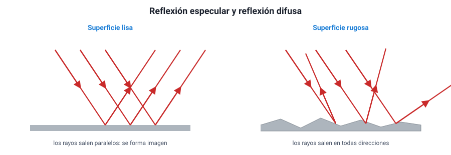
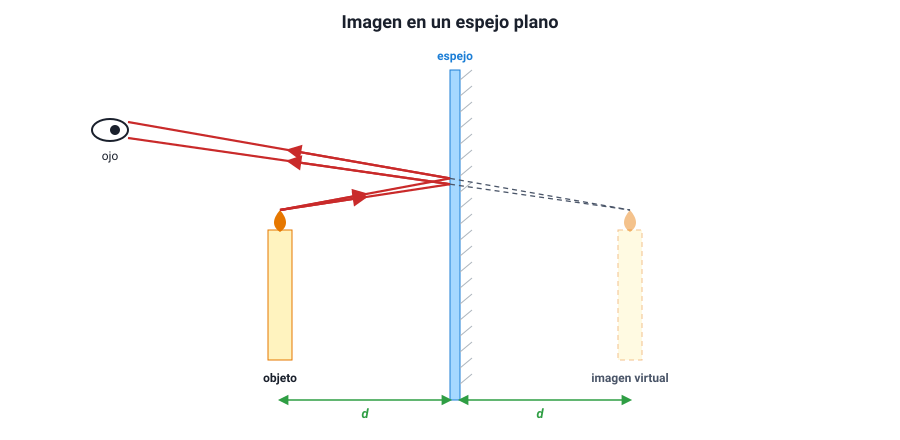

## 3. Reflexión de la luz y espejos planos

### a. Las leyes de la reflexión

Cuando la luz llega a una superficie, una parte **se refleja**: vuelve al medio del que venía. La reflexión cumple dos leyes:

1. **El ángulo de incidencia es igual al ángulo de reflexión** (*i* = *r*). Ambos se miden desde la **normal**, la recta perpendicular a la superficie en el punto donde llega el rayo, y **no** desde la superficie.
2. **El rayo incidente, la normal y el rayo reflejado están en un mismo plano.**

::: tip
**El error más común con los ángulos.** Si un enunciado dice que el rayo forma 30° **con la superficie del espejo**, el ángulo de incidencia es 90° − 30° = **60°**, porque se mide desde la normal. Antes de usar un ángulo, fíjate desde dónde está medido.
:::

### b. Reflexión especular y reflexión difusa

La ley de la reflexión se cumple en **cada punto** de cualquier superficie. Lo que cambia es la forma de la superficie:

- **Reflexión especular**: la superficie es lisa (un espejo, agua quieta, metal pulido). Todas las normales son paralelas, así que un haz de rayos paralelos sale **paralelo**. Se forma una imagen.
- **Reflexión difusa**: la superficie es rugosa a escala microscópica (papel, pared, ropa). Cada pequeña zona tiene su normal en otra dirección, así que los rayos salen **en todas direcciones**. No hay imagen, pero el objeto se ve desde cualquier lugar.

<figure><figcaption>Figura 2. Reflexión especular (superficie lisa) y difusa (superficie rugosa). En ambas se cumple <em>i</em> = <em>r</em> en cada punto. Diagrama propio.</figcaption></figure>

Gracias a la reflexión difusa podemos ver casi todos los objetos. Un camino mojado de noche se ve oscuro y encandila: el agua convierte la reflexión difusa del asfalto en especular, y la luz de los focos rebota en una sola dirección, lejos de tus ojos o directo a ellos.

### c. La imagen en un espejo plano

Frente a un espejo plano, los rayos que salen de un objeto se reflejan y llegan al ojo como si vinieran de **detrás del espejo**. El cerebro supone que la luz viaja en línea recta y «ve» el objeto donde se cruzan las **prolongaciones** de esos rayos.

<figure><figcaption>Figura 3. En un espejo plano, la imagen está detrás del espejo, a la misma distancia que el objeto, y se forma con las prolongaciones de los rayos reflejados. Diagrama propio.</figcaption></figure>

Características de la imagen en un espejo plano:

| Característica | Qué significa |
|---|---|
| **Virtual** | Se forma con las prolongaciones de los rayos: no se puede proyectar en una pantalla |
| **Derecha** | No está invertida de arriba abajo |
| **Del mismo tamaño** que el objeto | El espejo plano no aumenta ni reduce |
| **Simétrica** respecto del espejo | Está a la **misma distancia** detrás del espejo que el objeto delante |
| **Con inversión lateral** | Lo que es derecha en el objeto aparece como izquierda en la imagen, y viceversa |

La inversión lateral es la razón por la que la palabra AMBULANCIA se pinta **al revés** en el capó de las ambulancias: en el espejo retrovisor del auto de adelante se lee al derecho.

::: ejemplo
**Distancias en un espejo plano.** Una persona está a 2 m de un espejo plano. ¿A qué distancia de ella está su imagen? Si se acerca 0,5 m al espejo, ¿cuánto se acerca a su imagen?

La imagen está 2 m **detrás** del espejo, así que la distancia persona–imagen es 2 m + 2 m = **4 m**. Al acercarse 0,5 m, la persona queda a 1,5 m del espejo y la imagen también, a 1,5 m detrás: la distancia entre ambas es 3 m. Se acercó **1 m** a su imagen, el doble de lo que se movió ella.
:::

::: nota
**¿Qué tamaño debe tener un espejo para verse de cuerpo entero?** Basta con un espejo plano de la **mitad de tu estatura**, colgado a la altura adecuada, y la distancia a la que te pongas no importa. Es una consecuencia directa de *i* = *r*: el rayo que va de tus pies a tus ojos se refleja justo a mitad de camino en altura.
:::

### d. Dos espejos y muchas imágenes

Si se ponen dos espejos planos formando un ángulo, la luz rebota de uno a otro y aparecen **varias imágenes**. Con dos espejos a 90° se ven 3 imágenes; al cerrar el ángulo aparecen más, y con dos espejos **paralelos**, en teoría infinitas, cada vez más tenues porque en cada reflexión se pierde algo de luz. Así funciona un caleidoscopio y así se «multiplican» las luces en un ascensor con espejos enfrentados.

Otra aplicación de la reflexión es el **periscopio**: dos espejos paralelos inclinados en 45° desvían la luz dos veces y permiten ver por encima de un obstáculo.
