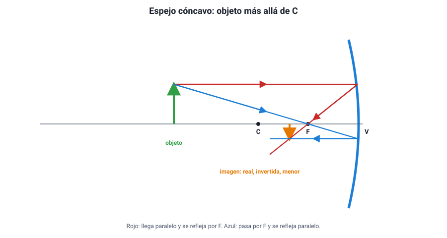

## 4. Espejos curvos: cóncavos y convexos

### a. Elementos de un espejo esférico

Un espejo esférico es un trozo de una esfera espejada. Si la cara que refleja es la **interior**, el espejo es **cóncavo** (como el interior de una cuchara). Si es la **exterior**, es **convexo** (como el dorso de la cuchara).

| Elemento | Qué es |
|---|---|
| **Vértice (V)** | Centro del espejo |
| **Eje principal** | Recta que pasa por el vértice y el centro de curvatura |
| **Centro de curvatura (C)** | Centro de la esfera de la que forma parte el espejo |
| **Radio de curvatura (R)** | Distancia entre C y el vértice |
| **Foco (F)** | Punto donde se juntan (cóncavo) o de donde parecen salir (convexo) los rayos que llegan paralelos al eje |
| **Distancia focal (f)** | Distancia entre F y el vértice. Vale la mitad del radio: *f* = *R* / 2 |

::: nota
**Cóncavo concentra, convexo abre.** Un espejo **cóncavo** hace **converger** los rayos paralelos en el foco, que está delante del espejo: es un foco **real**. Un espejo **convexo** los hace **diverger**, como si salieran de un foco ubicado detrás del espejo: es un foco **virtual**.
:::

### b. Los rayos notables

Para encontrar la imagen de un objeto basta con dibujar **dos** de estos rayos, que salen de la punta del objeto, y ver dónde se cruzan (o dónde se cruzan sus prolongaciones):

1. Un rayo que llega **paralelo al eje** se refleja **pasando por el foco** (en el convexo, alejándose como si viniera del foco).
2. Un rayo que pasa **por el foco** se refleja **paralelo al eje** (en el convexo, el que va dirigido hacia el foco).
3. Un rayo que pasa **por el centro de curvatura** se refleja **sobre sí mismo**, porque llega perpendicular al espejo.
4. Un rayo que llega **al vértice** se refleja con el mismo ángulo al otro lado del eje.

<figure><figcaption>Figura 4. Formación de la imagen en un espejo cóncavo con el objeto más allá de C. Diagrama propio.</figcaption></figure>

### c. Las imágenes de un espejo cóncavo

La imagen depende de **dónde esté el objeto**. Es la tabla más preguntada del tema:

| Posición del objeto | Imagen | Ubicación de la imagen | Ejemplo |
|---|---|---|---|
| Muy lejos (en el «infinito») | Real, invertida, un punto | En el foco | Telescopio, horno solar |
| Más allá de C | Real, invertida, **menor** | Entre F y C | Telescopio que proyecta una imagen |
| En C | Real, invertida, **igual** tamaño | En C | — |
| Entre C y F | Real, invertida, **mayor** | Más allá de C | Proyector |
| En F | **No se forma** (los rayos salen paralelos) | — | Foco de un auto, linterna |
| Entre F y el espejo | **Virtual, derecha, mayor** | Detrás del espejo | Espejo de maquillaje o de afeitar |

Una regla que ordena la tabla: **mientras el objeto está más allá de F, la imagen es real e invertida; cuando está dentro de F, pasa a ser virtual, derecha y aumentada.** Y a medida que el objeto se acerca desde lejos hacia F, la imagen real se aleja del espejo y crece.

::: tip
**Qué hay detrás de un foco de auto.** Si pones una ampolleta **en el foco** de un espejo cóncavo, los rayos salen **paralelos**: es el principio de las linternas y los faros. Es la regla 2 al revés. Si una pregunta dice que el haz sale paralelo, la fuente está en F.
:::

### d. Las imágenes de un espejo convexo

El convexo es más simple: para cualquier posición del objeto, la imagen es **virtual, derecha y menor**, y está detrás del espejo, entre el vértice y el foco. Como achica la imagen, **abarca un campo de visión más amplio**. Por eso se usa en:

- los **espejos laterales** de los autos (que advierten que los objetos están más cerca de lo que parecen: se ven más pequeños y el cerebro los interpreta como más lejanos);
- las esquinas de calles sin visibilidad y las cajas de supermercados;
- los espejos de seguridad en estacionamientos.

| Espejo | Imagen | Usos típicos |
|---|---|---|
| Plano | Virtual, derecha, igual tamaño | Espejo de baño, periscopio |
| Cóncavo | Depende de la posición del objeto | Linternas, telescopios, maquillaje, antenas parabólicas, hornos solares |
| Convexo | Siempre virtual, derecha y menor | Retrovisores laterales, seguridad |

### e. Para profundizar: la ecuación de los espejos

La posición de la imagen también se puede calcular. Si *p* es la distancia del objeto al espejo y *q* la de la imagen:

<strong>1 / <em>f</em> = 1 / <em>p</em> + 1 / <em>q</em></strong> &nbsp;&nbsp;&nbsp;&nbsp; <strong>aumento: <em>A</em> = − <em>q</em> / <em>p</em></strong>

Con la convención habitual, *f* es positiva en el cóncavo y negativa en el convexo; *q* positiva indica imagen real (delante del espejo) y negativa, virtual. Un aumento negativo indica imagen invertida.

::: ejemplo
**Un objeto entre C y F.** Un espejo cóncavo tiene *R* = 40 cm, así que *f* = 20 cm. Un objeto está a 30 cm del espejo (entre C, a 40 cm, y F, a 20 cm).

1/*q* = 1/20 − 1/30 = 3/60 − 2/60 = 1/60, así que *q* = **60 cm** (positiva: imagen real, delante del espejo).
*A* = −60/30 = **−2**: la imagen es invertida y del doble del tamaño.

Coincide con la tabla: objeto entre C y F → imagen real, invertida, mayor y más allá de C.
:::
