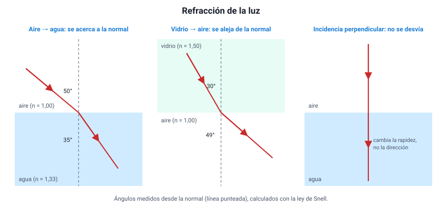
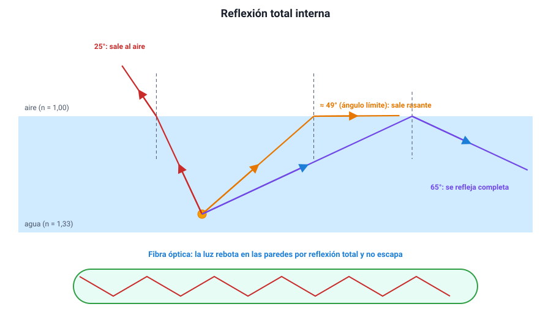

## 5. Refracción de la luz

### a. El índice de refracción

Cuando la luz entra en un material, se propaga **más lento** que en el vacío. El **índice de refracción** mide cuánto más lento:

<strong><em>n</em> = <em>c</em> / <em>v</em></strong>

donde *c* es la rapidez de la luz en el vacío y *v* su rapidez en el medio. Como la luz nunca va más rápido que en el vacío, **n ≥ 1**, y no tiene unidad (es un cociente de dos rapideces).

| Medio | Índice de refracción *n* | Rapidez de la luz (km/s) |
|---|---|---|
| Vacío | 1 (exacto) | 300 000 |
| Aire | 1,0003 (≈ 1) | ≈ 300 000 |
| Agua | 1,33 | ≈ 225 000 |
| Vidrio común | ≈ 1,5 | ≈ 200 000 |
| Diamante | 2,42 | ≈ 124 000 |

Se dice que un medio es **más refringente** (o, a veces, ópticamente más denso) cuando tiene mayor índice: en él la luz va más lento.

::: tip
**No confundas.** Un índice **mayor** significa una rapidez **menor**. Y «ópticamente más denso» no es lo mismo que «más denso» en masa: el aceite es menos denso que el agua (flota), pero tiene mayor índice de refracción.
:::

### b. Por qué la luz se desvía

Cuando un haz llega **oblicuo** a la frontera entre dos medios, un borde del frente de onda entra primero al nuevo medio y cambia de rapidez antes que el otro. El frente «gira», y el rayo cambia de dirección. Una imagen útil es la de una fila de personas que marchan del pasto a la arena en diagonal: las primeras en pisar la arena se frenan y la fila entera gira.

Las reglas, medidas siempre desde la **normal**:

- Al pasar a un medio de **mayor** índice (más lento), el rayo **se acerca a la normal**: el ángulo de refracción es menor que el de incidencia.
- Al pasar a un medio de **menor** índice (más rápido), el rayo **se aleja de la normal**.
- Si llega **perpendicular** a la frontera (ángulo de incidencia 0°), **no se desvía**, aunque sí cambia su rapidez.

<figure><figcaption>Figura 5. Refracción: al entrar en un medio de mayor índice, la luz se acerca a la normal; al salir a uno de menor índice, se aleja. Diagrama propio.</figcaption></figure>

La relación exacta es la **ley de Snell**: *n*1 · sen θ1 = *n*2 · sen θ2. Para la PAES basta con usarla de forma cualitativa: el lado con mayor *n* tiene el ángulo menor.

Además, en la refracción:

| Magnitud | ¿Cambia? |
|---|---|
| Frecuencia (y por lo tanto el color) | **No** |
| Rapidez | **Sí**: disminuye si *n* aumenta |
| Longitud de onda | **Sí**, en la misma proporción que la rapidez |
| Dirección | Sí, salvo que la luz llegue perpendicular |

Y en toda frontera, **parte de la luz se refleja** y parte se refracta: por eso ves tu reflejo en una ventana y a la vez ves a través de ella.

### c. Efectos cotidianos de la refracción

- **Profundidad aparente.** El fondo de una piscina parece más cerca de lo que está. La luz que sale del agua al aire se aleja de la normal, y el ojo prolonga los rayos en línea recta hasta un punto más alto. Mirando en vertical, la profundidad aparente es la real dividida por 1,33: una piscina de 2 m parece de 1,5 m.
- **La bombilla quebrada.** La parte sumergida de una bombilla parece desplazada por la misma razón.
- **Los espejismos.** En un día caluroso, el aire junto al asfalto está más caliente y tiene un índice algo menor que el aire de arriba. La luz del cielo que baja hacia el camino se va curvando hacia arriba y llega al ojo como si viniera del suelo: parece que hay agua en la carretera.
- **El Sol en el horizonte.** La atmósfera refracta la luz del Sol, de modo que al atardecer lo seguimos viendo unos minutos después de que geométricamente ya se ocultó.

### d. Reflexión total interna

Cuando la luz va de un medio de **mayor** índice a uno de **menor** índice (del agua al aire, del vidrio al aire), se aleja de la normal. Si se aumenta el ángulo de incidencia, el rayo refractado se acerca cada vez más a la superficie, hasta que, para un cierto **ángulo límite** o **crítico**, sale rasante (a 90°). Con ángulos **mayores** que el límite, la luz **ya no sale**: se refleja completa hacia adentro. Es la **reflexión total interna**.

<figure><figcaption>Figura 6. Por encima del ángulo límite, la luz se refleja por completo. Así viaja la luz por una fibra óptica. Diagrama propio.</figcaption></figure>

Condiciones para que ocurra: **(1)** la luz debe ir hacia un medio de **menor** índice, y **(2)** el ángulo de incidencia debe **superar el ángulo límite**. Si falta una de las dos, no hay reflexión total.

| Frontera | Ángulo límite aproximado |
|---|---|
| Agua → aire | 49° |
| Vidrio → aire | 42° |
| Diamante → aire | 24° |

Aplicaciones:

- **Fibra óptica.** Un hilo de vidrio muy puro, recubierto por otro vidrio de menor índice. La luz entra por un extremo y rebota en las paredes por reflexión total, sin escaparse, a lo largo de kilómetros. Transporta internet y telefonía con pulsos de luz infrarroja, y en medicina se usa en los endoscopios para ver el interior del cuerpo.
- **Prismas de los prismáticos.** Un prisma de vidrio con ángulos de 45° refleja la luz por completo, mejor que un espejo metálico (sección 8).
- **El brillo del diamante.** Su ángulo límite es tan pequeño que la luz que entra rebota muchas veces adentro antes de salir.

::: ejemplo
**¿Sale o no sale?** Un buzo apunta una linterna hacia la superficie del agua. En el primer intento el haz llega a la superficie con un ángulo de 30° respecto de la normal; en el segundo, con 60°. El ángulo límite agua–aire es de unos 49°.

- Con **30°** (menor que 49°), la luz **sale** al aire, alejándose de la normal, y una parte se refleja.
- Con **60°** (mayor que 49°), la luz **no sale**: se refleja completa y vuelve al agua.

Si en cambio alguien desde el bote apunta la linterna hacia el agua, la luz **siempre** entra, con cualquier ángulo: va hacia un medio de mayor índice, y ahí nunca hay reflexión total.
:::
