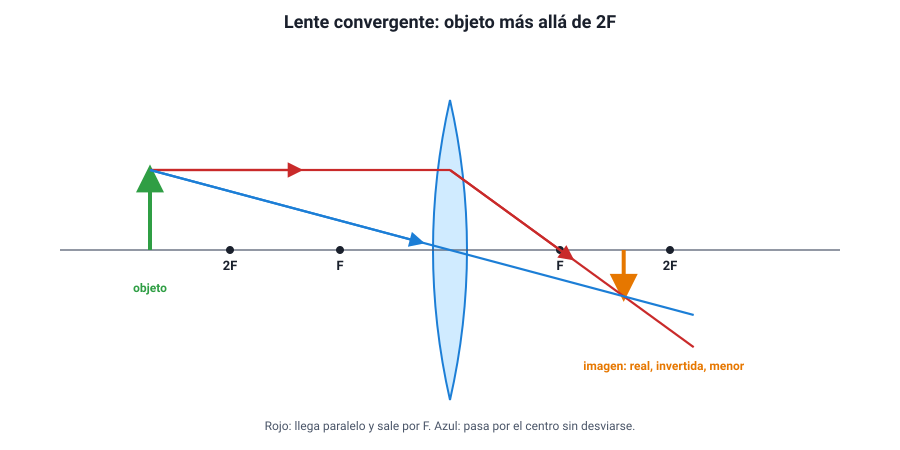
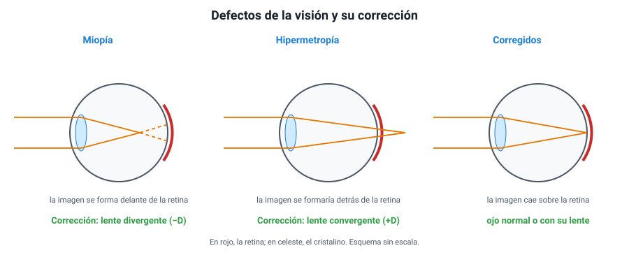

## 6. Lentes

### a. Qué es una lente y qué tipos hay

Una **lente** es un cuerpo transparente, normalmente de vidrio o plástico, limitado por dos superficies de las cuales al menos una es curva. La luz se **refracta dos veces**, al entrar y al salir, y cambia de dirección. Según su forma, hay dos grandes tipos:

| | Lente convergente | Lente divergente |
|---|---|---|
| Forma | **Más gruesa en el centro** que en los bordes (biconvexa, planoconvexa) | **Más delgada en el centro** que en los bordes (bicóncava, planocóncava) |
| Qué hace con rayos paralelos | Los junta en un **foco real**, al otro lado | Los separa; parecen salir de un **foco virtual**, del mismo lado |
| Distancia focal | Positiva | Negativa |
| Ejemplos | Lupa, lente de cámara, cristalino del ojo, lentes para hipermetropía | Mirilla de puerta, lentes para miopía |

Una lente tiene **dos focos**, uno a cada lado y a la misma distancia *f* del **centro óptico** (el centro de la lente). La distancia 2*f* se usa como referencia, igual que el centro de curvatura en los espejos.

::: tip
**La lupa y el vaso con agua.** Una lupa concentra la luz del Sol en un punto que puede quemar un papel: ese punto es su foco. Si pones la lupa a esa distancia del papel, estás midiendo su distancia focal. Una lente divergente nunca puede hacer eso, porque separa los rayos.
:::

### b. Los rayos notables

1. Un rayo que llega **paralelo al eje** sale **pasando por el foco** del otro lado (en la divergente, alejándose como si viniera del foco del mismo lado).
2. Un rayo que pasa **por el centro óptico** sigue **sin desviarse**.
3. Un rayo que pasa **por el foco** del lado del objeto sale **paralelo al eje**.

<figure><figcaption>Figura 7. Imagen en una lente convergente con el objeto más allá de 2F: así forma la imagen una cámara fotográfica y el ojo humano. Diagrama propio.</figcaption></figure>

### c. Las imágenes de una lente convergente

La tabla es paralela a la del espejo cóncavo, cambiando C por 2F y con la imagen real **al otro lado** de la lente:

| Posición del objeto | Imagen | Ubicación de la imagen | Ejemplo |
|---|---|---|---|
| Más allá de 2F | Real, invertida, **menor** | Entre F y 2F, al otro lado | Cámara fotográfica, ojo |
| En 2F | Real, invertida, **igual** tamaño | En 2F, al otro lado | Fotocopiadora a escala 1:1 |
| Entre 2F y F | Real, invertida, **mayor** | Más allá de 2F, al otro lado | Proyector |
| En F | **No se forma** (los rayos salen paralelos) | — | Faro, colimador |
| Entre F y la lente | **Virtual, derecha, mayor** | Del mismo lado que el objeto | **Lupa** |

Una **lente divergente**, en cambio, siempre forma una imagen **virtual, derecha y menor**, del mismo lado del objeto.

La ecuación es la misma que la de los espejos: 1/*f* = 1/*p* + 1/*q*, con *q* positiva para imágenes reales (al otro lado de la lente).

::: tip
**¿Qué pasa si tapas media lente?** Mucha gente cree que desaparece media imagen. No es así: **cada punto** de la lente recibe luz de **todo** el objeto, así que la otra mitad sigue formando la imagen completa. Lo que cambia es que llega la mitad de la luz: la imagen se ve **completa pero más tenue**.
:::

### d. La potencia de una lente

Los ópticos no hablan de distancia focal sino de **potencia** (*P*), que es su inverso con *f* en metros:

<strong><em>P</em> = 1 / <em>f</em></strong> &nbsp;&nbsp; (unidad: dioptría, D = 1/m)

Una lente convergente de *f* = 0,5 m tiene +2 D; una divergente de *f* = −0,25 m tiene −4 D. En una receta médica, los números **negativos** corresponden a lentes **divergentes** (miopía) y los **positivos** a lentes **convergentes** (hipermetropía y presbicia). Una lente más curva desvía más la luz, tiene menor distancia focal y más dioptrías.

### e. El ojo humano, una lente viva

El ojo funciona como una cámara: la **córnea** y el **cristalino** forman un sistema **convergente** que proyecta sobre la **retina** una imagen **real, invertida y menor** de lo que miramos. El cerebro se encarga de «darla vuelta».

Para enfocar objetos a distintas distancias, el ojo no mueve la lente como una cámara: los músculos ciliares **cambian la curvatura del cristalino**. Esta capacidad se llama **acomodación**. Un ojo sano enfoca desde unos 25 cm (punto cercano) hasta el infinito.

<figure><figcaption>Figura 8. En la miopía la imagen se forma delante de la retina y se corrige con una lente divergente; en la hipermetropía se formaría detrás y se corrige con una lente convergente. Diagrama propio.</figcaption></figure>

| Defecto | Qué pasa | Qué ve mal | Corrección |
|---|---|---|---|
| **Miopía** | El ojo es muy largo o converge demasiado: la imagen se forma **delante** de la retina | De lejos | Lente **divergente** (dioptrías negativas) |
| **Hipermetropía** | El ojo es muy corto o converge poco: la imagen se formaría **detrás** de la retina | De cerca | Lente **convergente** (dioptrías positivas) |
| **Presbicia** | Con la edad el cristalino pierde flexibilidad y acomoda menos | De cerca | Lente **convergente** para leer |
| **Astigmatismo** | La córnea tiene distinta curvatura en distintas direcciones | Imagen distorsionada | Lente cilíndrica |

::: ejemplo
**Razonar la corrección.** El ojo de un miope forma la imagen de un objeto lejano delante de la retina: converge **demasiado**. Para corregirlo hay que **quitarle** convergencia, y eso lo hace una lente **divergente**, que abre un poco los rayos antes de que entren al ojo. Así el punto de enfoque retrocede hasta la retina. El razonamiento para la hipermetropía es el opuesto. La PAES suele preguntar así: te describe dónde se forma la imagen y te pide qué tipo de lente corrige el problema.
:::
