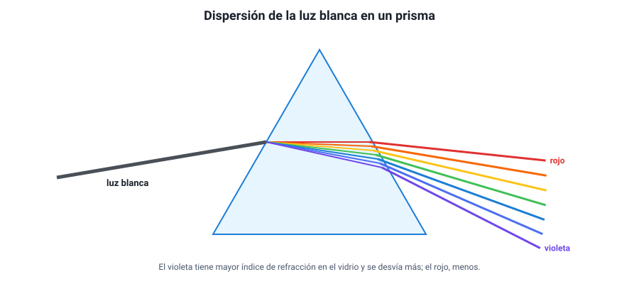
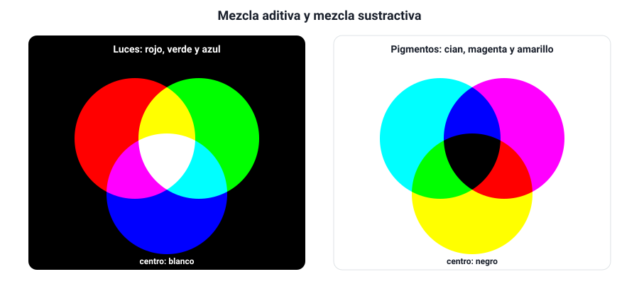

## 7. El color y la dispersión

### a. La luz blanca es una mezcla

En 1666, **Newton** hizo pasar un haz de luz del Sol por un **prisma** de vidrio y obtuvo en la pared una franja de colores: rojo, naranjo, amarillo, verde, azul, añil y violeta. Muchos pensaban entonces que el prisma «teñía» la luz. Newton hizo la prueba decisiva: aisló un solo color, por ejemplo el rojo, y lo pasó por un **segundo prisma**. El rojo se desvió, pero **siguió siendo rojo**: el prisma no creaba colores. Y al juntar todos los colores con una lente, obtuvo de nuevo luz blanca. La conclusión: **la luz blanca es una mezcla de todos los colores**, y el prisma solo los separa.

::: nota
**Por qué es un buen experimento.** Newton no se conformó con ver los colores: diseñó una prueba en la que las dos hipótesis predecían cosas distintas. Si el prisma creara los colores, el segundo prisma debería cambiar otra vez el color del haz rojo. No lo cambió. Este tipo de razonamiento —qué resultado esperaría cada hipótesis— es el que la PAES pide en la habilidad *Observar y plantear preguntas*.
:::

### b. Qué es la dispersión

El prisma separa los colores porque el **índice de refracción del vidrio depende de la longitud de onda**: es un poco mayor para el violeta que para el rojo. El violeta se frena más dentro del vidrio y **se desvía más**; el rojo se desvía menos. A esto se le llama **dispersión**.

<figure><figcaption>Figura 9. Dispersión en un prisma: el violeta se desvía más que el rojo. Diagrama propio.</figcaption></figure>

| Color | Longitud de onda aproximada | Índice en un vidrio típico | Desviación en el prisma |
|---|---|---|---|
| Rojo | ≈ 700 nm | Menor (≈ 1,51) | La menor |
| Verde | ≈ 530 nm | Intermedio | Intermedia |
| Violeta | ≈ 400 nm | Mayor (≈ 1,53) | La mayor |

::: tip
**Qué se conserva y qué no.** Cada color mantiene su **frecuencia** al entrar al vidrio (capítulo 1): por eso sigue siendo del mismo color. Lo que cambia es su rapidez, y como cambia un poco distinto para cada color, cada uno toma un camino distinto. En el vacío no hay dispersión, porque todos los colores viajan exactamente a *c*.
:::

### c. El arcoíris

Un arcoíris es dispersión en gotas de lluvia. La luz del Sol **se refracta** al entrar en la gota, **se refleja** en su pared interior y **se refracta** otra vez al salir. Como el agua desvía distinto cada color, los colores salen en direcciones algo distintas: el rojo, a unos **42°** respecto de la dirección opuesta al Sol, y el violeta, a unos **40°**.

Consecuencias que se pueden preguntar:

- Solo se ve arcoíris con el **Sol a la espalda** y la lluvia al frente.
- El **rojo** queda en la parte **exterior** del arco y el **violeta** en la interior.
- Cada persona ve **su propio** arcoíris, formado por gotas distintas: por eso nunca se llega a él.
- A veces aparece un arco secundario, más tenue y con los colores **invertidos**, por luz que se reflejó dos veces dentro de las gotas.

### d. El color de los objetos

Un objeto no tiene color «en sí mismo»: **refleja algunos colores y absorbe los demás**, y lo que vemos es la luz que refleja.

- Un tomate se ve **rojo** porque refleja sobre todo el rojo y absorbe el resto.
- Una hoja se ve **verde** porque refleja el verde y absorbe el rojo y el azul (que usa para la fotosíntesis).
- Un objeto **blanco** refleja todos los colores; uno **negro** los absorbe casi todos. Por eso la ropa negra se calienta más al sol.

Consecuencia importante: el color que vemos **depende también de la luz que ilumina**. Un tomate iluminado solo con luz **verde** se ve **negro**: absorbe el verde y no hay rojo que pueda reflejar. Por eso la ropa se ve distinta bajo la luz amarilla de algunos focos de la calle.

Un **filtro** de color funciona igual, pero por transmisión: un filtro rojo deja pasar el rojo y absorbe los demás. Si se mira a través de él un objeto azul, se ve negro.

### e. Mezclar luces y mezclar pinturas

Hay dos formas de mezclar colores, y dan resultados opuestos:

| | Mezcla **aditiva** (luces) | Mezcla **sustractiva** (pigmentos y filtros) |
|---|---|---|
| Qué se hace | Se **suman** luces de colores sobre una pantalla o en el ojo | Cada pigmento **resta** (absorbe) una parte de la luz blanca |
| Colores primarios | **Rojo, verde y azul** (RGB) | **Cian, magenta y amarillo** (CMY) |
| Los tres primarios juntos | **Blanco** | Casi **negro** |
| Ejemplos de mezcla | Rojo + verde = amarillo; rojo + azul = magenta; verde + azul = cian | Cian + amarillo = verde; magenta + amarillo = rojo |
| Dónde se usa | Pantallas de celular, televisor y proyectores | Impresoras (CMYK, con K = negro), pinturas |

<figure><figcaption>Figura 10. Mezcla aditiva de luces (izquierda) y sustractiva de pigmentos (derecha). Diagrama propio.</figcaption></figure>

Si miras con una lupa la pantalla de un celular que muestra un fondo blanco, verás pequeños puntos rojos, verdes y azules encendidos a la vez: el ojo los suma y percibe blanco.

### f. Por qué el cielo es azul y el atardecer rojo

Las moléculas del aire (nitrógeno y oxígeno) **dispersan** la luz del Sol en todas direcciones, y lo hacen mucho más con las longitudes de onda **cortas** (azul, violeta) que con las largas (rojo). A esto se le llama **dispersión de Rayleigh** (aquí «dispersión» significa desviar en todas direcciones, no separar colores como el prisma).

- De día, la luz azul dispersada nos llega **desde todo el cielo**: por eso se ve azul. No se ve violeta, en parte porque el Sol emite menos violeta y el ojo es menos sensible a él.
- Al atardecer, la luz del Sol atraviesa **mucha más atmósfera** para llegar a nosotros. En el camino pierde casi todo el azul, que se dispersa hacia otros lados, y llega sobre todo la luz **roja y anaranjada**.
- En la Luna, sin atmósfera, el cielo es negro aunque sea de día.
