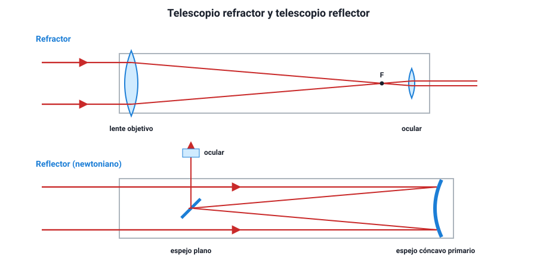

## 8. Instrumentos y dispositivos ópticos

El temario pide comprender el **funcionamiento y la utilidad** de varios dispositivos. Todos combinan las piezas de este capítulo: espejos, lentes, prismas y reflexión total. La clave para entender cualquiera es preguntarse **qué pieza forma la primera imagen y qué pieza la amplía o la desvía**.

### a. La lupa y el microscopio

- La **lupa** es una lente **convergente**. El objeto se pone **entre el foco y la lente**, y se ve una imagen **virtual, derecha y mayor** (sección 6).
- El **microscopio** usa **dos lentes convergentes**. El **objetivo**, de distancia focal muy corta, forma una imagen **real, invertida y mayor** del objeto, que está apenas más allá de su foco. El **ocular** actúa como una lupa y amplía esa primera imagen. El aumento total es el **producto** de los dos: un objetivo de 40× con un ocular de 10× da 400×.

### b. Telescopios refractores y reflectores

Un telescopio junta la luz de objetos lejanos y forma de ellos una imagen que luego se amplía con un ocular. Hay dos tipos, según la pieza que recoge la luz:

| | Telescopio **refractor** | Telescopio **reflector** |
|---|---|---|
| Qué recoge la luz | Una **lente convergente** grande (objetivo) | Un **espejo cóncavo** grande (espejo primario) |
| Fenómeno principal | Refracción | Reflexión |
| Primer constructor | Galileo (1609) apuntó uno al cielo | Newton (1668) |
| Ventajas | Tubo cerrado, poco mantenimiento | Sin aberración cromática; el espejo se sostiene por detrás; más barato en tamaños grandes |
| Limitaciones | Las lentes grandes pesan, se deforman y separan los colores (aberración cromática) | El espejo necesita realuminizarse y alinearse |
| El más grande | Yerkes (EE. UU.), 1,02 m, de 1897 | Varios de 8 a 10 m; el ELT, en construcción en Chile, tendrá 39 m |

<figure><figcaption>Figura 11. Telescopio refractor (arriba) y reflector newtoniano (abajo). Diagrama propio.</figcaption></figure>

¿Por qué todos los grandes telescopios modernos son reflectores? Porque el **poder de captar luz** depende del área del objetivo, y una lente de más de un metro sería tan pesada que se deformaría con su propio peso, solo puede sostenerse por el borde y además separa los colores. Un espejo, en cambio, puede sostenerse por detrás y hacerse de segmentos. Así se construyen los telescopios del norte de Chile: el **VLT** en Cerro Paranal, con cuatro espejos de 8,2 m; **Gemini Sur** y el **Observatorio Vera C. Rubin** en Cerro Pachón; y el **ELT** en Cerro Armazones, cuyo espejo de 39 m estará formado por 798 segmentos hexagonales.

**Radiotelescopios.** Funcionan como un telescopio reflector, pero para **ondas de radio**: una antena parabólica refleja las ondas hacia un receptor ubicado en su foco. Como las longitudes de onda de radio son mucho mayores que las de la luz, necesitan antenas enormes o muchas antenas combinadas. **ALMA**, en el llano de Chajnantor (a 5 000 m de altura, región de Antofagasta), usa 66 antenas que trabajan como un solo instrumento y observan longitudes de onda milimétricas y submilimétricas.

### c. Los prismáticos

Unos prismáticos son, en esencia, **dos telescopios refractores pequeños**, uno por ojo. Un telescopio refractor simple entrega la imagen **invertida**, lo que da igual al mirar estrellas pero no al mirar un paisaje. Los prismáticos lo resuelven con **dos prismas** en cada tubo que reflejan la luz por **reflexión total interna** (sección 5): enderezan la imagen y, al hacer que la luz vaya y vuelva, acortan el largo del instrumento.

::: tip
**Por qué prismas y no espejos.** La reflexión total interna refleja prácticamente el 100 % de la luz, sin capa metálica que se oxide. Un espejo común absorbe una parte en cada reflexión. Si una pregunta te pregunta qué fenómeno permite el funcionamiento de los prismas de unos prismáticos, la respuesta es la reflexión total interna, no la dispersión.
:::

### d. La cámara fotográfica

Una cámara funciona como el ojo y como la cámara oscura. Su **lente convergente** forma en el sensor una imagen **real, invertida y menor** de un objeto lejano (objeto más allá de 2F). Para enfocar objetos a distinta distancia, la cámara **mueve la lente**, acercándola o alejándola del sensor; el ojo, en cambio, cambia la curvatura del cristalino.

### e. La fibra óptica

Una fibra óptica guía la luz por **reflexión total interna**: la luz rebota en la frontera entre el núcleo de vidrio y un recubrimiento de menor índice, y no se escapa aunque la fibra se curve. Los datos viajan como pulsos de luz, normalmente infrarroja, con muy pocas pérdidas y sin interferencias eléctricas. En Chile, el proyecto **Fibra Óptica Austral** tendió un cable submarino de unos 3 000 km entre Puerto Montt y Puerto Williams para llevar internet de alta velocidad al extremo sur. En medicina, los **endoscopios** usan haces de fibras para llevar luz al interior del cuerpo y traer de vuelta la imagen.

### f. El rayo láser

La palabra **láser** es una sigla en inglés que significa amplificación de luz por emisión estimulada de radiación. Su luz se distingue de la de una ampolleta en tres propiedades:

| Propiedad | Luz láser | Luz de una ampolleta |
|---|---|---|
| **Monocromática** | Una sola longitud de onda (un solo color) | Mezcla de muchas longitudes de onda |
| **Coherente** | Todas las ondas en fase | Ondas desfasadas al azar |
| **Direccional** | El haz casi no se abre, aun a grandes distancias | Se abre en todas direcciones |

Gracias a esas propiedades, el láser concentra mucha energía en un punto pequeño. Se usa en lectores de códigos de barra, en cirugía ocular (para corregir miopía remodelando la córnea), en punteros, en la transmisión por fibra óptica, en cortes industriales y para medir distancias con enorme precisión, como la distancia a la Luna usando los reflectores que dejaron allí las misiones Apolo.

::: ejemplo
**Evaluar una elección tecnológica.** Un observatorio decide construir un telescopio reflector de 8 m en vez de un refractor del mismo diámetro. ¿Qué argumento físico apoya esa decisión?

- Una lente de 8 m debería sostenerse solo por el borde y se deformaría con su peso; un espejo se sostiene por toda su cara posterior.
- La lente separaría los colores por **dispersión** (aberración cromática); el espejo refleja todos los colores con el mismo ángulo, porque la ley de la reflexión no depende de la longitud de onda.

Ambos argumentos vienen del capítulo: el primero es mecánico, el segundo sale de comparar reflexión y refracción. Nota que «el espejo capta más luz» **no** es un buen argumento aquí: con el mismo diámetro, ambos captan la misma cantidad de luz.
:::
