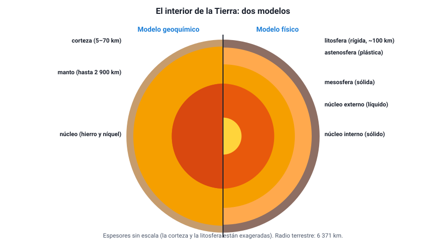
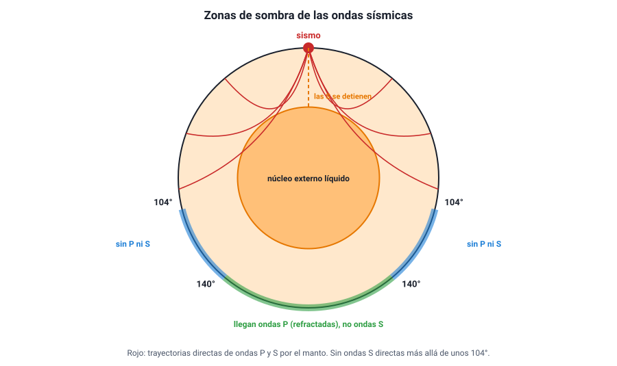

## 2. El interior de la Tierra

### a. Un lugar al que nadie ha llegado

El pozo más profundo jamás perforado, en la península de Kola (Rusia), alcanzó unos **12 km**. El radio de la Tierra es de **6 371 km**. Es decir, la perforación más profunda apenas arañó la cáscara del planeta. Todo lo que sabemos del interior se ha deducido de manera **indirecta**:

- **Las ondas sísmicas**: cómo viajan, se desvían y a veces desaparecen al atravesar la Tierra (la evidencia principal).
- **La densidad media de la Tierra** (unos 5,5 g/cm³), mucho mayor que la de las rocas de la superficie (unos 2,7 g/cm³): tiene que haber material mucho más denso en el centro.
- **Los meteoritos**, restos de la formación del sistema solar, muchos de hierro y níquel.
- **El campo magnético terrestre**, que requiere un núcleo metálico líquido en movimiento.
- **Las rocas del manto** que llegan a la superficie en algunos volcanes.

Es un ejemplo claro de cómo la ciencia construye **modelos** a partir de evidencias indirectas, y de cómo esos modelos se aceptan porque explican de manera coherente muchas observaciones distintas.

### b. Dos modelos de la misma Tierra

El interior se describe con dos modelos complementarios. Ninguno es «el correcto»: miran la Tierra con criterios distintos.

<figure><figcaption>Figura 1. El interior de la Tierra según el modelo geoquímico (izquierda) y el modelo físico (derecha). Espesores aproximados, sin escala. Diagrama propio.</figcaption></figure>

**Modelo geoquímico (o estático): según la composición**

| Capa | Profundidad aproximada | Composición y características |
|---|---|---|
| **Corteza** | 0 a 5–10 km (oceánica) · 0 a 30–70 km (continental) | Rocas ricas en silicio y aluminio (continental) o en silicio y magnesio (oceánica); la continental es más gruesa y menos densa |
| **Manto** | Hasta unos 2 900 km | Rocas silicatadas ricas en hierro y magnesio; el 84 % del volumen de la Tierra |
| **Núcleo** | 2 900 a 6 371 km | Hierro y níquel; muy denso |

**Modelo físico (o dinámico): según el comportamiento mecánico**

| Capa | Profundidad aproximada | Estado y comportamiento |
|---|---|---|
| **Litosfera** | 0 a unos 100 km | **Rígida**; formada por la corteza y la parte superior del manto. Está fragmentada en **placas** |
| **Astenosfera** | Desde unos 100 km hasta unos 350 km (algunas fuentes la extienden hasta 670 km) | Sólida, pero **plástica**: fluye lentamente, como una plastilina muy caliente. Sobre ella se mueven las placas |
| **Mesosfera** (manto inferior) | Hasta unos 2 900 km | Sólida y más rígida por la enorme presión |
| **Núcleo externo** | 2 900 a 5 150 km | **Líquido**; su movimiento genera el campo magnético |
| **Núcleo interno** | 5 150 a 6 371 km | **Sólido**, pese a estar a unos 5 000 – 6 000 °C, por la presión inmensa |

::: tip
**El error clásico: «la litosfera es la corteza».** No: la litosfera incluye la corteza **y** la parte más superficial del manto. Las placas tectónicas son trozos de **litosfera**, no solo de corteza. Otro error frecuente es pensar que el manto es de roca fundida: casi todo el manto es **sólido**; la astenosfera fluye porque está cerca de fundirse, no porque sea líquida. El magma de los volcanes se forma solo en zonas puntuales.
:::

### c. La relación con la tectónica de placas

El modelo físico es el que permite entender la tectónica: una **litosfera rígida** partida en placas que se desplazan sobre una **astenosfera plástica**. Y el motor del movimiento está más abajo: el calor del interior (en parte, calor remanente de la formación de la Tierra y, en parte, producido por elementos radiactivos) genera **corrientes de convección** muy lentas en el manto. El material caliente sube, se enfría cerca de la superficie y vuelve a bajar, arrastrando las placas. Además, el peso de las placas oceánicas frías que se hunden en las zonas de subducción **tira** del resto de la placa.

### d. Cómo se sabe: las ondas sísmicas

En el capítulo 1 vimos que un sismo genera dos tipos de ondas internas:

| Onda | Tipo | Rapidez en la corteza | ¿Atraviesa líquidos? |
|---|---|---|---|
| **P** (primaria) | Longitudinal: comprime y estira el material | Unos 6 – 8 km/s | **Sí** |
| **S** (secundaria) | Transversal: sacude el material de lado | Unos 3,5 – 4,5 km/s | **No** |

Al atravesar la Tierra, las ondas **cambian de rapidez** según el material, y por eso **se refractan** (se curvan) como la luz al pasar del aire al agua. En algunas profundidades el cambio es brusco: son las **discontinuidades**, que marcan los límites entre capas:

| Discontinuidad | Profundidad | Separa | Descubierta por |
|---|---|---|---|
| **Mohorovičić** (Moho) | 5 – 70 km | Corteza y manto | Andrija Mohorovičić, 1909 |
| **Gutenberg** | Unos 2 900 km | Manto y núcleo | Beno Gutenberg, 1914 |
| **Lehmann** | Unos 5 150 km | Núcleo externo e interno | Inge Lehmann, 1936 |

<figure><figcaption>Figura 2. Las ondas S no atraviesan el núcleo externo líquido y dejan una gran zona de sombra; las ondas P se refractan en el núcleo y dejan una zona de sombra entre unos 104° y 140°. Diagrama propio.</figcaption></figure>

**La evidencia de que el núcleo externo es líquido.** Cuando ocurre un gran sismo, las estaciones sismológicas ubicadas a más de unos **104°** de distancia angular del epicentro, del otro lado del planeta, **no registran ondas S directas**. Como las ondas S no se propagan en líquidos, la explicación más simple es que hay una capa líquida en el camino: el **núcleo externo**. Las ondas P, en cambio, sí llegan, pero se refractan al entrar y salir del núcleo, y dejan una franja sin ondas P directas entre unos 104° y 140°. El análisis de ondas P débiles que aparecían en esa franja fue lo que llevó a Inge Lehmann a proponer un **núcleo interno sólido**.

::: ejemplo
**Razonar con la evidencia.** Una estación sismológica en el lado opuesto del planeta registra ondas P de un sismo en Chile, pero no ondas S. ¿Qué se puede concluir? Que en el camino entre el sismo y la estación hay material en estado **líquido**, porque las ondas S (transversales) no se propagan en líquidos y las P (longitudinales) sí. No se puede concluir, en cambio, que las ondas S «se agotaron» por la distancia: las P, que recorrieron un camino similar, sí llegaron.
:::
