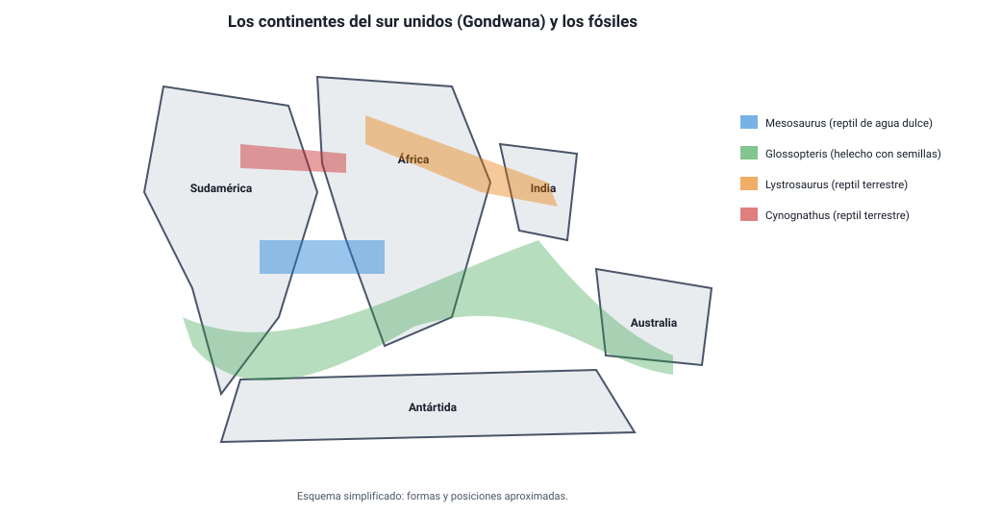

## 3. La deriva continental

### a. La idea de Wegener

Cualquiera que mire un mapa nota que la costa este de Sudamérica y la costa oeste de África parecen piezas de un rompecabezas. Varios pensadores lo habían comentado, pero fue el meteorólogo alemán **Alfred Wegener** quien, en **1912**, propuso una hipótesis completa y la defendió con evidencias en su libro *El origen de los continentes y los océanos* (1915).

Su propuesta: hace unos 300 millones de años, todos los continentes estaban unidos en un solo supercontinente, **Pangea** («toda la tierra»), rodeado por un océano único, **Pantalasa**. Pangea se fragmentó y los continentes **derivaron** lentamente hasta sus posiciones actuales.

<figure><figcaption>Figura 3. Al juntar los continentes del sur, los fósiles de las mismas especies forman franjas continuas. Esquema simplificado. Diagrama propio.</figcaption></figure>

### b. Las evidencias

Wegener reunió evidencias de disciplinas muy distintas. Su fuerza estaba en que **todas apuntaban a lo mismo**:

| Tipo de evidencia | Qué se observa | Por qué apoya la deriva |
|---|---|---|
| **Geográfica** | Las costas de Sudamérica y África encajan; el ajuste es aún mejor si se usa el borde de la plataforma continental, bajo el mar | Encajan como piezas que estuvieron unidas |
| **Paleontológica** (fósiles) | Fósiles de las mismas especies en continentes separados por océanos: el reptil acuático ***Mesosaurus*** (en Brasil y en el sur de África), el helecho con semillas ***Glossopteris*** (en Sudamérica, África, India, Antártida y Australia), los reptiles terrestres ***Lystrosaurus*** y ***Cynognathus*** | Esos organismos no podían cruzar un océano: los continentes tenían que estar unidos |
| **Geológica** | Rocas del mismo tipo y edad, y cadenas montañosas antiguas, que continúan de un continente a otro al juntarlos (por ejemplo, entre Brasil y África occidental, o entre los Apalaches y las montañas de Escocia) | Son partes de una misma formación que se separó |
| **Paleoclimática** | Huellas de glaciares antiguos en zonas hoy tropicales (India, sur de África, Brasil) y depósitos de carbón —formado en climas cálidos y húmedos— en la Antártida | Esos continentes estuvieron en otras latitudes, y juntos |

::: tip
**Cómo se usa una evidencia paleontológica.** Lo que prueba la deriva no es que haya fósiles antiguos en varios continentes, sino que haya fósiles de la **misma especie** que **no podía cruzar el mar**: un reptil de agua dulce, como *Mesosaurus*, o una planta con semillas grandes y pesadas, como *Glossopteris*. Si una pregunta ofrece como evidencia un animal que vuela o nada en mar abierto, ese dato no sirve para apoyar la hipótesis.
:::

### c. Por qué fue rechazada

A pesar de sus evidencias, la comunidad científica —sobre todo los geólogos— rechazó la deriva continental durante décadas. La principal objeción no era contra las evidencias, sino contra el **mecanismo**:

- Wegener propuso que los continentes «araban» el fondo del océano, empujados por fuerzas relacionadas con la rotación terrestre y las mareas.
- Los físicos calcularon que esas fuerzas eran **demasiado débiles** para mover continentes, y que las rocas del fondo oceánico eran demasiado rígidas para ser atravesadas.

Wegener murió en 1930 en una expedición a Groenlandia, sin ver aceptada su idea.

::: nota
**Una lección sobre la ciencia.** La hipótesis de Wegener era correcta en lo esencial —los continentes se mueven—, pero su explicación del **cómo** era equivocada. Una hipótesis necesita, además de evidencias de que algo ocurre, un **mecanismo** plausible que explique por qué ocurre. La deriva continental fue aceptada cuando, en los años sesenta, la tectónica de placas aportó ese mecanismo, gracias a datos nuevos que Wegener no tenía: los del fondo del océano.
:::

### d. De la deriva a la tectónica de placas

La tectónica de placas **conserva** la idea central de Wegener y la **corrige**:

| | Deriva continental (Wegener) | Tectónica de placas |
|---|---|---|
| Qué se mueve | Los continentes, que «navegan» a través del fondo oceánico | Las **placas litosféricas**, que incluyen continentes y fondo oceánico juntos |
| Sobre qué | Sobre la corteza oceánica | Sobre la **astenosfera** |
| Qué lo mueve | Rotación terrestre y mareas (incorrecto) | **Convección del manto** y el hundimiento de las placas en la subducción |
| Evidencias principales | Continentales: costas, fósiles, rocas, clima | Además: dorsales, bandas magnéticas, edad del fondo oceánico, distribución de sismos y volcanes |
