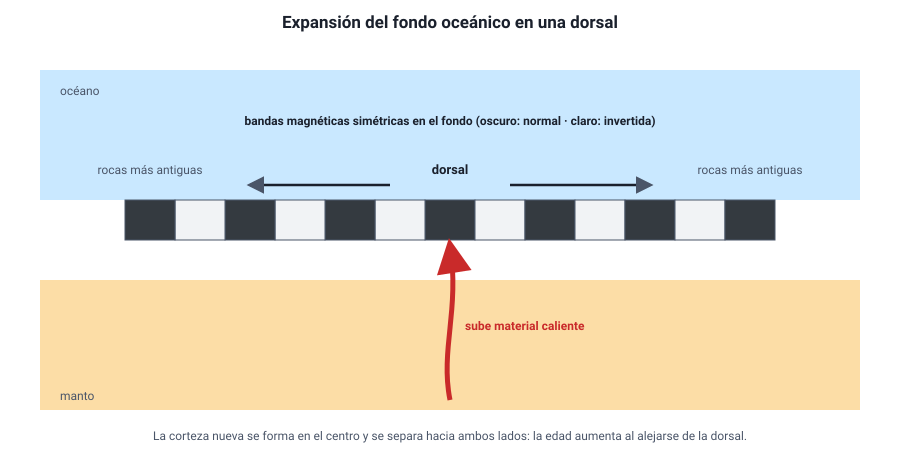

## 4. La tectónica de placas

### a. Lo que reveló el fondo del océano

Después de la Segunda Guerra Mundial, con sonares y magnetómetros desarrollados para detectar submarinos, se exploró el fondo marino como nunca antes. Aparecieron tres descubrimientos que cambiaron la geología:

1. **Las dorsales oceánicas.** Una cordillera submarina de decenas de miles de kilómetros recorre todos los océanos, como la costura de una pelota. En su centro hay un valle con volcanes y un flujo de calor elevado.
2. **La edad del fondo oceánico.** Las rocas del fondo marino son **más jóvenes cerca de las dorsales** y **más antiguas lejos de ellas**. Y ninguna tiene más de unos **200 millones de años**, mientras que hay rocas continentales de más de 4 000 millones de años.
3. **Las bandas magnéticas.** El campo magnético terrestre **se invierte** cada cierto tiempo (el norte magnético pasa a estar en el sur). Las rocas volcánicas registran la orientación del campo cuando se enfrían. A ambos lados de las dorsales, el fondo marino muestra **bandas de magnetización normal e invertida, simétricas**, como un código de barras reflejado en un espejo.

### b. La expansión del fondo oceánico

En 1962, **Harry Hess** (y, de forma independiente, Robert Dietz) propuso una explicación que unía los tres descubrimientos: en las dorsales **sube material caliente del manto**, se enfría y forma **nueva corteza oceánica**, que se va separando hacia ambos lados. A medida que el fondo se expande, las rocas nuevas registran el campo magnético del momento; como el campo se invierte cada cierto tiempo, se forman bandas simétricas. En 1963, Vine y Matthews mostraron que el patrón magnético calzaba exactamente con esa predicción.

<figure><figcaption>Figura 4. En la dorsal se crea nueva corteza que se separa hacia ambos lados. Las bandas magnéticas son simétricas y las rocas son más antiguas cuanto más lejos de la dorsal. Diagrama propio.</figcaption></figure>

Pero si se crea corteza nueva en las dorsales y la Tierra no crece, en algún otro lugar tiene que **destruirse**. Ese lugar son las **fosas oceánicas**, donde el fondo marino se hunde de vuelta al manto: la **subducción**. Por eso el fondo oceánico es tan joven: se recicla continuamente.

::: tip
**Qué demuestran las bandas magnéticas.** Su **simetría** respecto de la dorsal es la clave: indica que la corteza se forma en el centro y se reparte hacia ambos lados. Si una pregunta te pide la evidencia que apoya la expansión del fondo oceánico, busca la simetría de las bandas, la edad creciente de las rocas al alejarse de la dorsal o la ausencia de fondo oceánico muy antiguo.
:::

### c. La teoría de la tectónica de placas

Hacia fines de los años sesenta, todas estas ideas se integraron en la **teoría de la tectónica de placas**:

- La **litosfera** está dividida en unas **quince placas grandes** y varias pequeñas, que encajan como las piezas de un balón de fútbol.
- Las placas son **rígidas** y se desplazan sobre la **astenosfera**, a velocidades de **unos pocos centímetros por año** (del orden de lo que crecen las uñas).
- El motor es el **calor interno**: la convección del manto y el peso de las placas que se hunden en la subducción.
- Casi toda la actividad geológica —sismos, volcanes, formación de montañas— ocurre en los **bordes** entre placas, donde interactúan.

La prueba más directa de que las placas se mueven hoy la dan las mediciones con **GPS**: estaciones fijas en distintos continentes registran cómo cambian sus posiciones año a año.

::: ejemplo
**Qué tan rápido es «lento».** La placa de Nazca converge con la placa Sudamericana a unos **7 cm/año** (entre 6,5 y 9 cm/año según la zona y la fuente). A 7 cm/año, en 1 000 años son 70 m; en 1 millón de años, **70 km**; en 10 millones de años, 700 km. Movimientos imperceptibles en una vida humana construyen océanos y cordilleras en tiempos geológicos. Y el Atlántico, que se abre a unos 2 a 3 cm/año, necesitó unos 150 millones de años para alcanzar su ancho actual.
:::

### d. Las placas que afectan a Chile

Chile está sobre la **placa Sudamericana**, que avanza hacia el oeste. Frente a sus costas, la **placa de Nazca** (en el norte y centro) y la **placa Antártica** (en el extremo sur) se mueven hacia el este y se **hunden bajo el continente**. Esa subducción es la causa directa de:

- la **fosa de Atacama** (o fosa de Chile–Perú), que supera los 8 000 m de profundidad frente al norte de Chile;
- la **cordillera de los Andes**, levantada por la compresión;
- los **volcanes** chilenos;
- los **grandes terremotos** y **tsunamis** que han marcado la historia del país.
