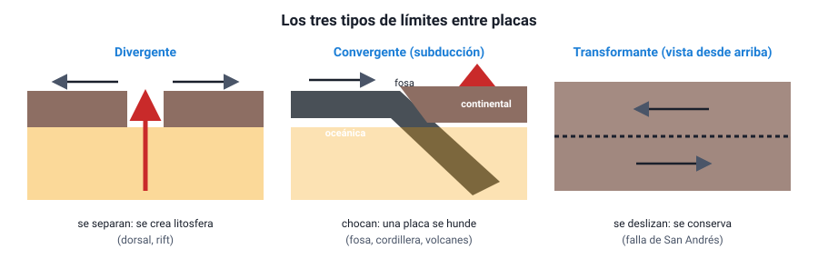

## 5. Los límites entre placas

Lo que ocurre en un borde depende de **cómo se mueven** las placas una respecto de la otra. Hay tres tipos de límites:

<figure><figcaption>Figura 5. Los tres tipos de límites entre placas. Diagrama propio.</figcaption></figure>

### a. Límites divergentes

Las placas **se separan**. El material del manto sube, se funde parcialmente y forma **nueva litosfera**. Por eso se llaman también **constructivos**.

- **En el océano** forman las **dorsales**, como la dorsal Mesoatlántica, que separa América de Europa y África. **Islandia** es un trozo de dorsal que sobresale del mar, y allí se puede caminar entre dos placas.
- **En un continente** forman un **rift** o valle de fractura, que puede terminar abriendo un océano nuevo: es lo que está ocurriendo en el **Valle del Rift** de África oriental.

Consecuencias: sismos **poco profundos** y en general de magnitud moderada, y volcanismo con lava fluida (basáltica).

### b. Límites convergentes

Las placas **chocan**. Lo que ocurre depende del tipo de litosfera que se encuentra, porque la **oceánica es más densa** que la continental:

| Tipo de convergencia | Qué ocurre | Relieve y consecuencias | Ejemplo |
|---|---|---|---|
| **Oceánica–continental** | La placa oceánica, más densa, **subduce** bajo la continental | Fosa oceánica, cordillera con volcanes en el continente, sismos de todas las profundidades y los más grandes del planeta | **Nazca bajo Sudamérica**: fosa de Atacama y cordillera de los Andes |
| **Oceánica–oceánica** | Una placa oceánica (la más antigua y densa) subduce bajo la otra | Fosa y un **arco de islas volcánicas** | Japón, Aleutianas, fosa de las Marianas (la más profunda del mundo, unos 11 000 m) |
| **Continental–continental** | Ninguna subduce con facilidad (ambas son poco densas); la corteza se pliega y se engrosa | Grandes **cordilleras** de plegamiento, sismos, poco o nada de volcanismo | India contra Asia: el **Himalaya** y el monte Everest |

Los límites convergentes se llaman **destructivos** cuando hay subducción, porque la litosfera oceánica vuelve al manto.

::: nota
**Cómo se reconoce una zona de subducción en los datos.** Si se grafican los hipocentros de los sismos de una zona de subducción según su profundidad y su distancia a la fosa, forman un plano inclinado que se hunde bajo el continente (la **zona de Wadati–Benioff**): son superficiales cerca de la fosa y cada vez más profundos tierra adentro. En Chile, los sismos cerca de la costa son superficiales, y bajo la cordillera ocurren a 100 km o más de profundidad. Es una de las evidencias más claras de que la placa de Nazca se está hundiendo.
:::

### c. Límites transformantes

Las placas **se deslizan lateralmente** una junto a la otra, en sentidos opuestos, a lo largo de una gran falla. **No se crea ni se destruye** litosfera, por eso se llaman **conservativos**.

- El ejemplo más conocido es la **falla de San Andrés**, en California, entre las placas del Pacífico y Norteamericana.
- También hay muchas fallas transformantes cortas que cortan las dorsales oceánicas en segmentos.

Consecuencias: sismos **superficiales**, a veces muy destructivos, y casi sin volcanismo.

### d. Resumen

| Límite | Movimiento | Litosfera | Relieve típico | Sismos | Volcanismo |
|---|---|---|---|---|---|
| Divergente | Se separan | Se crea | Dorsal, rift | Superficiales, moderados | Sí (lava fluida) |
| Convergente con subducción | Chocan, una se hunde | Se destruye | Fosa, cordillera o arco de islas | Superficiales a profundos; los más grandes | Sí (explosivo) |
| Convergente continental | Chocan | Se pliega | Cordillera de plegamiento | Frecuentes | Escaso |
| Transformante | Se deslizan lateralmente | Se conserva | Falla | Superficiales | Casi nulo |

::: tip
**Un error típico sobre los Andes y el Himalaya.** Ambas son cordilleras de límites convergentes, pero de tipos distintos. Los **Andes** se deben a **subducción** (oceánica bajo continental) y por eso tienen muchos volcanes. El **Himalaya** se debe a un **choque de continentes** y casi no tiene volcanes. Si un ítem asocia el Himalaya con subducción o con volcanismo, está equivocado.
:::
