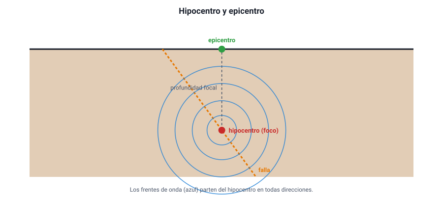
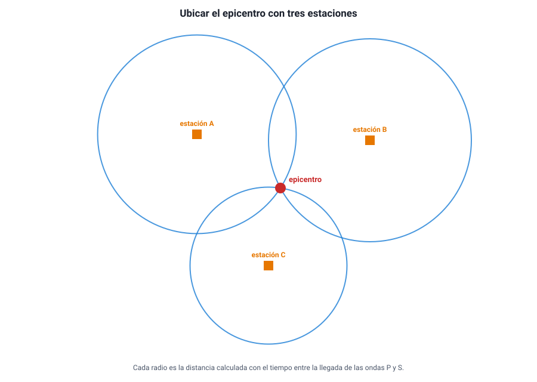

## 6. Los sismos

### a. Cómo se produce un sismo

En los bordes de las placas, las rocas están sometidas a enormes esfuerzos. Mientras el roce entre dos bloques de roca los mantiene trabados, las rocas **se deforman y acumulan energía**, como un resorte que se comprime (capítulo 6). Cuando el esfuerzo supera la resistencia de la roca o el roce en la **falla**, los bloques se deslizan de golpe y la energía acumulada se libera, en parte, como **ondas sísmicas**. Eso es un **sismo**.

<figure><figcaption>Figura 6. El hipocentro es el punto donde comienza la ruptura; el epicentro, el punto de la superficie justo encima. Diagrama propio.</figcaption></figure>

- **Hipocentro** o **foco**: punto del interior donde comienza la ruptura.
- **Epicentro**: punto de la **superficie** ubicado directamente sobre el hipocentro.
- **Profundidad focal**: distancia entre ambos. Los sismos se clasifican en superficiales (menos de 70 km), intermedios (70 a 300 km) y profundos (más de 300 km). Los profundos solo ocurren en zonas de subducción.

En Chile, además de los sismos en el contacto entre las placas de Nazca y Sudamericana (**interplaca**), hay sismos **dentro** de la placa de Nazca que se hunde (**intraplaca de profundidad intermedia**) y sismos **corticales** en fallas superficiales del continente, que pueden ser muy destructivos aunque sean de magnitud menor, por estar cerca de la superficie.

### b. Las ondas sísmicas

| Onda | Cómo mueve el suelo | Rapidez | Qué atraviesa | Llega… |
|---|---|---|---|---|
| **P** (primaria) | Compresión y expansión en la dirección de avance (**longitudinal**) | La más rápida: 6 – 8 km/s en la corteza | Sólidos, líquidos y gases | **Primero** |
| **S** (secundaria) | Sacudida perpendicular a la dirección de avance (**transversal**) | Unos 3,5 – 4,5 km/s | Solo **sólidos** | Después de la P |
| **Superficiales** (Love y Rayleigh) | Movimientos de lado a lado y ondulaciones como olas en el suelo | Las más lentas | Viajan por la superficie | Al final; suelen causar el mayor daño |

Muchas personas perciben primero un golpe seco o un «ruido» (ondas P) y después el movimiento fuerte (ondas S y superficiales). Los sistemas de **alerta temprana** aprovechan esa diferencia: detectan las ondas P cerca del epicentro y emiten una alerta que viaja casi a la rapidez de la luz, antes de que lleguen las ondas destructivas.

### c. Cómo se ubica el epicentro

Un **sismógrafo** registra el movimiento del suelo en un gráfico llamado **sismograma**. Como las ondas P y S parten juntas del hipocentro pero viajan a distinta rapidez, **cuanto más lejos está la estación, mayor es el tiempo entre la llegada de la P y la de la S**.

::: ejemplo
**Calcular la distancia.** En una estación, las ondas P llegan 20 s antes que las S. Supón *v*P = 8 km/s y *v*S = 4 km/s. Si *d* es la distancia al hipocentro:

*d* / 4 − *d* / 8 = 20 s → *d* / 8 = 20 s → *d* = **160 km**.

Con una sola estación se conoce la distancia, pero no la dirección: el sismo está en algún punto de una circunferencia de 160 km de radio. Con **tres estaciones**, las tres circunferencias se cortan en un solo punto: el epicentro. Es la **triangulación**.
:::

<figure><figcaption>Figura 7. Con las distancias medidas desde tres estaciones se ubica el epicentro. Diagrama propio.</figcaption></figure>

### d. Magnitud e intensidad

Son dos formas distintas de medir un sismo, y la PAES las pone a competir:

| | Magnitud | Intensidad |
|---|---|---|
| Qué mide | La **energía liberada** en el hipocentro | Los **efectos** percibidos en un lugar: cómo lo sintieron las personas, daños en construcciones |
| ¿Cuántos valores tiene un sismo? | **Uno solo** | **Muchos**: uno en cada lugar |
| Cómo se obtiene | Con los registros de sismógrafos | Con encuestas y observación de daños |
| Escala | **Magnitud de momento** (*M*w), heredera de la de **Richter**; es logarítmica y sin tope teórico | **Mercalli modificada**, de I a XII (en números romanos) |

La escala de magnitud es **logarítmica**: cada punto más de magnitud significa unas **32 veces más energía** liberada. Un sismo de magnitud 8 libera unas 32 veces más energía que uno de 7, y unas 1 000 veces (32 × 32) más que uno de 6.

::: tip
**«El terremoto fue grado 8 en Santiago y grado 6 en Concepción.»** Si se habla de lugares distintos, se trata de **intensidades** (y deberían escribirse VIII y VI). La **magnitud** es una sola para todo el sismo. La intensidad depende de la distancia al epicentro, de la profundidad del hipocentro, del tipo de suelo (los suelos blandos y rellenos amplifican el movimiento) y de la calidad de las construcciones.
:::

### e. Los grandes sismos de Chile

| Fecha | Nombre | Magnitud (*M*w) | Observaciones |
|---|---|---|---|
| 22 de mayo de 1960 | Terremoto de Valdivia | **9,5** | El más grande registrado en el mundo; tsunami que cruzó el Pacífico y llegó a Hawái y Japón |
| 27 de febrero de 2010 | Terremoto del Maule | 8,8 | Tsunami en la costa del centro-sur |
| 1 de abril de 2014 | Terremoto de Iquique | 8,2 | |
| 16 de septiembre de 2015 | Terremoto de Illapel | 8,3 | |

En Chile, el **Centro Sismológico Nacional** (Universidad de Chile) registra y localiza los sismos; el **Servicio Hidrográfico y Oceanográfico de la Armada** (SHOA) evalúa la amenaza de tsunami; y el **Servicio Nacional de Prevención y Respuesta ante Desastres** (SENAPRED, que en 2023 reemplazó a la ONEMI) coordina las alertas y la respuesta. La **norma sísmica** de construcción obliga a diseñar los edificios para resistir sismos severos, y es una de las razones por las que grandes terremotos causan en Chile menos víctimas que sismos menores en otros países.

### f. Los tsunamis

Cuando un gran sismo de subducción **desplaza verticalmente el fondo marino**, levanta o hunde toda la columna de agua sobre él y genera un **tsunami**: una serie de olas de **longitud de onda enorme** (cientos de kilómetros). En mar abierto viajan a más de 700 km/h con una altura de apenas unos centímetros o decímetros; al llegar a la costa, la profundidad disminuye, las olas se frenan y **crecen en altura** (su energía se concentra), inundando la costa. La primera ola no siempre es la mayor, y el peligro puede durar horas.

::: nota
**La regla de autoprotección en Chile.** Si en la costa un sismo **impide mantenerse en pie**, hay que evacuar de inmediato hacia zonas altas, sin esperar una alarma oficial. El propio sismo es la alerta.
:::
