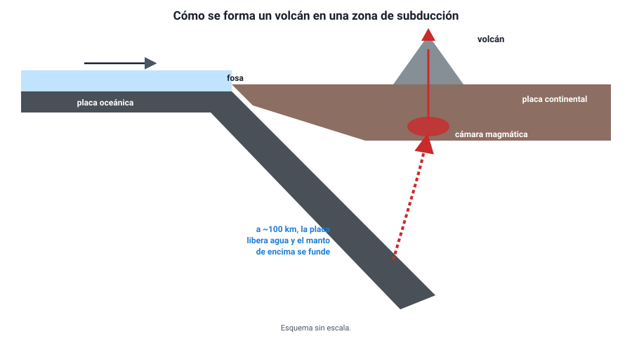

## 7. El volcanismo

### a. Qué es un volcán

Un **volcán** es una abertura de la corteza por la que sale material del interior: **magma** (roca fundida con gases disueltos), gases y fragmentos de roca. Cuando el magma sale a la superficie se llama **lava**. El magma se acumula en una **cámara magmática**, a pocos kilómetros de profundidad, y asciende por una **chimenea** hasta el **cráter**.

<figure><figcaption>Figura 8. Cómo se forman los volcanes en una zona de subducción, como en los Andes. Diagrama propio.</figcaption></figure>

### b. Dónde se forman los volcanes y por qué

El manto es casi todo sólido, así que para que haya magma algo tiene que fundir las rocas. Eso ocurre en tres situaciones, las tres relacionadas con la dinámica interna:

| Lugar | Por qué se funde el manto | Tipo de magma y erupción | Ejemplos |
|---|---|---|---|
| **Zonas de subducción** (límites convergentes) | La placa que se hunde libera **agua** a unos 100 km de profundidad; el agua **baja la temperatura de fusión** del manto que está encima | Magma viscoso y con muchos gases: erupciones **explosivas** | Volcanes de los Andes, Japón, Indonesia |
| **Dorsales** (límites divergentes) | El manto que sube **pierde presión** y se funde parcialmente | Magma fluido (basáltico): erupciones **efusivas**, con coladas de lava | Islandia, dorsal Mesoatlántica |
| **Puntos calientes** (en medio de las placas) | Una columna de material muy caliente sube desde el manto profundo | Magma fluido | Hawái; **Isla de Pascua** (Rapa Nui), en la placa de Nazca |

Por eso los volcanes no están repartidos al azar: la mayoría se concentra en los bordes de las placas, sobre todo en el **Cinturón de Fuego del Pacífico**, que rodea ese océano y que concentra también la mayoría de los grandes sismos.

::: tip
**Viscosidad y explosividad.** Lo que decide si una erupción es explosiva no es la temperatura del magma, sino su **viscosidad** y la cantidad de **gases**. Un magma viscoso atrapa los gases, la presión aumenta y la erupción es violenta (como una bebida con gas agitada). Un magma fluido deja escapar los gases con facilidad y la lava corre. Los volcanes de subducción, como los chilenos, suelen ser **explosivos**.
:::

### c. Tipos de volcanes

| Tipo | Forma | Magma | Ejemplo |
|---|---|---|---|
| **Escudo** | Muy ancho y de pendientes suaves | Fluido, capas de lava | Mauna Loa (Hawái) |
| **Estratovolcán** (compuesto) | Cónico y alto, de pendientes empinadas, con capas alternadas de lava y cenizas | Viscoso, erupciones explosivas | **Villarrica**, **Osorno**, **Llaima**, **Calbuco**; el Fuji en Japón |
| **Cono de escoria** | Pequeño, de pendientes empinadas | Fragmentos expulsados en una sola erupción | Conos en las laderas de volcanes mayores |

### d. Los volcanes de Chile

Chile tiene una de las cadenas volcánicas más activas del mundo, a lo largo de la cordillera de los Andes, alimentada por la subducción de las placas de Nazca y Antártica. Se reconocen alrededor de **90 volcanes geológicamente activos**. El **Servicio Nacional de Geología y Minería** (**Sernageomin**) vigila en tiempo real unos **45** de ellos, los de mayor peligro, a través de su Red Nacional de Vigilancia Volcánica (creada tras la erupción del Chaitén), y emite alertas técnicas.

Algunas erupciones recientes: **Chaitén** (2008), que obligó a evacuar el pueblo; **Puyehue–Cordón Caulle** (2011), cuyas cenizas cruzaron hasta Argentina y afectaron el tráfico aéreo; y **Calbuco** y **Villarrica** (2015).

**Riesgos volcánicos**: caída de **cenizas** (daña cultivos, techos y motores de aviones, y afecta la respiración), **flujos piroclásticos** (avalanchas de gas y roca incandescente a gran velocidad, las más mortíferas), **lahares** (flujos de barro formados cuando la erupción derrite el hielo y la nieve de la cumbre, muy peligrosos en los volcanes nevados del sur de Chile) y **coladas de lava**.

**Beneficios**: suelos fértiles, energía **geotérmica** (en Chile opera la central Cerro Pabellón, en la región de Antofagasta), aguas termales y turismo.
