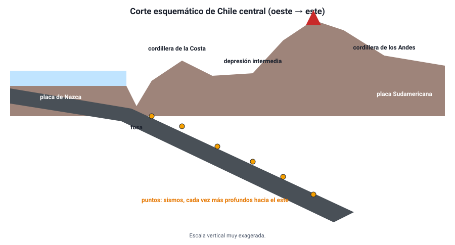

## 8. La tectónica de placas y el relieve

### a. El relieve como resultado de dos fuerzas

El relieve de la Tierra es el resultado de un tira y afloja entre dos tipos de procesos:

- **Internos** (endógenos): la tectónica de placas y el volcanismo **levantan** montañas, abren océanos y forman fosas. Su energía viene del calor del interior.
- **Externos** (exógenos): la erosión del agua, el viento y el hielo **desgastan** el relieve y transportan los sedimentos a zonas bajas. Su energía viene del Sol y de la gravedad.

Una cordillera alta y de picos agudos, como los Andes, indica que los procesos internos todavía la están levantando más rápido de lo que la erosión la desgasta. Montañas bajas y redondeadas, como los Apalaches en Estados Unidos, indican cordilleras antiguas cuya actividad tectónica terminó hace mucho.

### b. Las grandes formas del relieve y su origen

| Forma del relieve | Tipo de límite | Cómo se forma | Ejemplo |
|---|---|---|---|
| **Dorsal oceánica** | Divergente (océano) | El material del manto sube y forma nueva litosfera | Dorsal Mesoatlántica, dorsal del Pacífico oriental |
| **Valle de rift** | Divergente (continente) | El continente se estira y se hunde por el centro | Valle del Rift (África oriental) |
| **Fosa oceánica** | Convergente con subducción | La placa oceánica se dobla y se hunde | Fosa de Atacama (más de 8 000 m), fosa de las Marianas |
| **Cordillera volcánica** | Convergente oceánica–continental | Compresión, engrosamiento de la corteza y volcanismo | Cordillera de los Andes |
| **Arco de islas volcánicas** | Convergente oceánica–oceánica | Volcanes que emergen del mar sobre la zona de subducción | Japón, Aleutianas |
| **Cordillera de plegamiento** | Convergente continental–continental | La corteza se pliega, se fractura y se engrosa | Himalaya, Alpes |
| **Islas volcánicas de punto caliente** | Interior de placa | La placa se mueve sobre una fuente fija de magma y deja una cadena de volcanes de edad creciente | Hawái, Isla de Pascua |

### c. El relieve de Chile, visto desde la tectónica

Un corte de Chile de oeste a este, a la latitud de Santiago, cruza las huellas de la subducción:

<figure><figcaption>Figura 9. Corte esquemático de Chile central. La subducción de la placa de Nazca explica la fosa, las cordilleras y los volcanes. Escala vertical exagerada. Diagrama propio.</figcaption></figure>

1. **Fosa**: frente a la costa, donde la placa de Nazca empieza a hundirse.
2. **Cordillera de la Costa**: relieve antiguo levantado por la compresión.
3. **Depresión intermedia**: valle central, rellenado con sedimentos erosionados de las cordilleras.
4. **Cordillera de los Andes**: formada por la compresión y el engrosamiento de la corteza, y coronada por volcanes, que aparecen donde la placa de Nazca alcanza unos 100 km de profundidad.

Los sismos grafican la placa que se hunde: superficiales cerca de la costa y cada vez más profundos hacia la cordillera y Argentina.

::: nota
**Una cordillera que sigue creciendo.** Los terremotos no solo sacuden: también **deforman** el terreno. En el terremoto del Maule de 2010, algunos sectores de la costa, como la isla Santa María, se levantaron más de 2 m en segundos, y otros se hundieron. Miles de estos eventos, sumados durante millones de años, son los que han construido el relieve de Chile.
:::

::: tip
**Tiempo geológico y tiempo humano.** Las placas se mueven unos centímetros al año y las cordilleras tardan millones de años en formarse. Pero la liberación de energía acumulada ocurre de golpe, en segundos: eso es un terremoto. Un error frecuente es pensar que un gran sismo «mueve el continente» de un lugar a otro: lo que hace es liberar en un instante la deformación acumulada durante décadas o siglos, desplazando el terreno algunos metros.
:::
