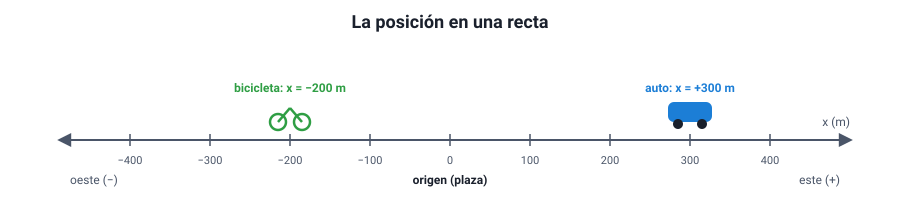

## 2. Sistema de referencia, posición y trayectoria

### a. Todo movimiento es relativo

Decir que algo «se mueve» no tiene sentido si no se dice **respecto de qué**. Una pasajera sentada en un bus está **en reposo respecto del bus** y, a la vez, **en movimiento respecto de la calle**. Las dos afirmaciones son verdaderas: describen el mismo hecho desde dos observadores distintos.

Un **sistema de referencia** es el cuerpo u observador desde el cual se describe el movimiento, junto con tres cosas que permiten medirlo:

1. un **origen** (el punto cero),
2. **ejes** con un sentido positivo (por ejemplo, hacia el este es positivo),
3. un **reloj** para medir el tiempo.

::: nota
**Reposo y movimiento dependen del observador.** Un cuerpo está en movimiento respecto de un sistema de referencia si su posición en ese sistema cambia con el tiempo. No existe un reposo «absoluto»: la calle misma gira con la Tierra y viaja alrededor del Sol. En la vida cotidiana se usa casi siempre el suelo como sistema de referencia, pero es una elección, no una verdad.
:::

### b. La posición

En un movimiento en línea recta, la **posición** (*x*) de un cuerpo es su ubicación medida desde el origen, con signo:

<figure><figcaption>Figura 1. La posición se mide desde un origen y su signo indica de qué lado está el cuerpo. Diagrama propio.</figcaption></figure>

- *x* = +300 m significa 300 m **hacia el lado positivo** del origen.
- *x* = −200 m significa 200 m **hacia el lado negativo**.
- Una posición negativa no es «menos que nada»: solo indica el lado.

La posición depende de dónde se ponga el origen. Si en la figura se pusiera el origen en la bicicleta, el auto estaría en *x* = +500 m. Lo que **no** cambia al mover el origen son las distancias entre cuerpos ni los desplazamientos.

### c. La trayectoria

La **trayectoria** es la línea formada por todas las posiciones que ocupa un cuerpo. Puede ser recta (**rectilínea**), circular, parabólica o de cualquier forma. En este capítulo se estudian movimientos **rectilíneos**.

La forma de la trayectoria **también depende del sistema de referencia**:

| Situación | Trayectoria vista desde el vehículo | Trayectoria vista desde el suelo |
|---|---|---|
| Un pasajero deja caer una llave dentro de un tren que avanza con velocidad constante | Recta vertical | Curva (parábola) |
| Un punto del borde de la rueda de una bicicleta que avanza | Circunferencia (visto desde el eje de la rueda) | Una curva con arcos llamada cicloide |

::: tip
**Error típico.** Pensar que la llave «se queda atrás» dentro del tren porque el tren avanza. Si el tren va con velocidad constante, la llave ya tenía la velocidad del tren al soltarse y cae **a los pies** del pasajero. Desde el andén, en cambio, se ve avanzar mientras cae y describir una curva. Ninguna de las dos descripciones está equivocada.
:::

### d. El modelo de partícula

Para describir el movimiento de un auto en una carretera de 300 km no importa su tamaño ni cómo giran sus ruedas: basta con saber dónde está. En esos casos se modela el cuerpo como una **partícula**, un punto que tiene la posición del cuerpo. Es un modelo útil **cuando el tamaño del cuerpo es pequeño comparado con las distancias que recorre**. No sirve, por ejemplo, para estudiar cómo se estaciona el mismo auto en un espacio estrecho.
