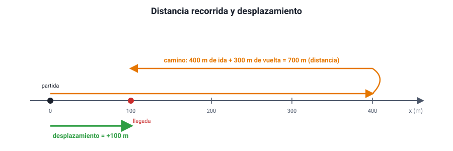

## 3. Distancia y desplazamiento; rapidez y velocidad

### a. Distancia recorrida y desplazamiento

Son dos magnitudes distintas que la prueba pone a competir con frecuencia:

| | Distancia recorrida (*d*) | Desplazamiento (Δ*x*) |
|---|---|---|
| Qué mide | El largo total del camino seguido | El cambio neto de posición: Δ*x* = *x*final − *x*inicial |
| Tipo de magnitud | Escalar | Vectorial (tiene sentido: signo en una recta) |
| Puede ser negativa | Nunca | Sí, si el cuerpo termina del lado negativo de donde partió |
| Puede ser cero con el cuerpo moviéndose | No | Sí, si vuelve al punto de partida |

<figure><figcaption>Figura 2. Ida hasta 400 m y vuelta hasta 100 m: la distancia recorrida es 700 m y el desplazamiento, +100 m. Diagrama propio.</figcaption></figure>

::: ejemplo
**Una vuelta a la pista.** Una atleta da una vuelta completa a una pista de 400 m y termina en la línea de partida. Distancia recorrida: **400 m**. Desplazamiento: **0 m**, porque su posición final coincide con la inicial.

**Ida y vuelta parcial.** Un corredor va desde *x* = 0 hasta *x* = 400 m y luego vuelve hasta *x* = 100 m. Distancia: 400 m + 300 m = **700 m**. Desplazamiento: 100 m − 0 m = **+100 m**.
:::

La magnitud del desplazamiento **nunca es mayor** que la distancia recorrida. Son iguales solo si el cuerpo se mueve en línea recta **sin devolverse**.

### b. Rapidez media y velocidad media

Con las dos magnitudes anteriores se definen dos formas de medir «qué tan rápido»:

<strong>rapidez media = <em>d</em> / Δ<em>t</em></strong> &nbsp;&nbsp;&nbsp;&nbsp; <strong>velocidad media = Δ<em>x</em> / Δ<em>t</em></strong>

La unidad del SI es el **metro por segundo** (m/s). En la vida diaria se usa el kilómetro por hora (km/h).

::: nota
**Cómo convertir.** 1 m/s = 3,6 km/h. Para pasar de km/h a m/s se **divide** por 3,6; para pasar de m/s a km/h se **multiplica** por 3,6. Así, 72 km/h = 20 m/s y 10 m/s = 36 km/h. La razón: 1 km/h = 1 000 m / 3 600 s.
:::

::: ejemplo
**El corredor de la figura 2** tardó 200 s en todo el recorrido.

- Rapidez media = 700 m / 200 s = **3,5 m/s**.
- Velocidad media = +100 m / 200 s = **+0,5 m/s**.

La velocidad media es mucho menor porque la vuelta «deshizo» parte del avance. Si hubiera terminado en el punto de partida, su velocidad media sería cero, aunque su rapidez media seguiría siendo 3,5 m/s.
:::

::: tip
**La rapidez media no es el promedio de las rapideces.** Un auto va de Santiago a Rancagua (unos 90 km) a 90 km/h y vuelve a 60 km/h. La rapidez media **no** es 75 km/h. La ida dura 1 h y la vuelta 1,5 h: 180 km / 2,5 h = **72 km/h**. Como pasa más tiempo yendo lento, el resultado queda más cerca de 60 km/h. Hay que calcular siempre distancia total entre tiempo total.
:::

### c. Rapidez y velocidad instantáneas

La rapidez media dice poco de lo que pasó en cada momento. Un bus que hace un recorrido urbano con rapidez media de 20 km/h pudo ir a 50 km/h en algunos tramos y estar detenido en otros. La **velocidad instantánea** es la velocidad en un instante determinado: la que se obtiene con intervalos de tiempo cada vez más pequeños. Su magnitud es la **rapidez instantánea**, la que muestra el **velocímetro** de un auto.

Diferencia clave:

- La **rapidez** es un escalar: solo dice cuánto.
- La **velocidad** es un vector: dice cuánto, en qué dirección y en qué sentido. Dos autos que se cruzan a 60 km/h en una carretera recta tienen la **misma rapidez** pero **velocidades opuestas**: +60 km/h y −60 km/h.

Un cuerpo que gira en una rotonda con rapidez constante **cambia su velocidad**, porque cambia la dirección del movimiento. Por eso, «velocidad constante» exige a la vez rapidez constante **y** trayectoria recta.

### d. Cómo se mide

Para medir una rapidez media en el laboratorio o en la calle se necesitan dos instrumentos: uno de **longitud** (huincha, regla, marcas en el suelo) y uno de **tiempo** (cronómetro, video con marca de tiempo, sensores fotoeléctricos). Para acercarse a la velocidad instantánea se usan intervalos muy cortos: sensores de movimiento, radares o el video en cámara lenta.

::: ejemplo
**Diseñar una medición.** Un curso quiere saber si los autos respetan el límite de 50 km/h frente al colegio. Marca dos líneas separadas por 25 m en la vereda y cronometra el tiempo que tarda cada auto en pasar de una a otra. Si un auto tarda 1,5 s, su rapidez media en ese tramo es 25 m / 1,5 s ≈ 16,7 m/s ≈ **60 km/h**: iba sobre el límite.

¿Qué limita la confiabilidad de la medición? El tiempo de reacción de quien cronometra (unas décimas de segundo) es comparable con el tiempo medido. Una mejora: separar más las líneas, o grabar en video y contar los cuadros.
:::
