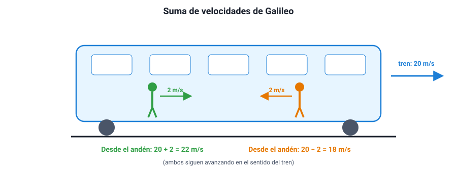

## 5. La relatividad de Galileo

### a. El principio

A comienzos del siglo XVII, **Galileo Galilei** propuso un experimento mental: un barco que navega por un mar tranquilo a velocidad constante. Bajo cubierta, sin ventanas, las gotas que caen de una botella caen verticalmente, los peces nadan igual en todas direcciones y una pelota lanzada llega al compañero como en tierra firme. **Ningún experimento hecho dentro del barco permite saber si el barco se mueve o está detenido.**

Ese es el **principio de relatividad de Galileo**: las leyes del movimiento son **las mismas** para todos los observadores que se mueven entre sí con **velocidad constante** en línea recta. Esos sistemas se llaman **sistemas de referencia inerciales**. Por eso no sentimos que la Tierra se mueve, y por eso en un avión que vuela sin turbulencia se puede servir un café sin que se derrame.

::: nota
**Hasta dónde vale.** El principio se cumple entre sistemas con velocidad constante entre sí (en MRU). Si el sistema **acelera** —un bus que frena de golpe— sí se nota desde adentro: los pasajeros se van hacia adelante. Por eso el temario lo pide en «movimientos rectilíneos uniformes».
:::

### b. La suma de velocidades

Si un cuerpo se mueve con velocidad *v*' respecto de un sistema (un tren, un río, una escalera mecánica) y ese sistema se mueve con velocidad *V* respecto del suelo, la velocidad del cuerpo respecto del suelo es:

<strong><em>v</em> = <em>v</em>' + <em>V</em></strong>

con los signos que correspondan en una recta.

<figure><figcaption>Figura 3. La velocidad de un pasajero depende de quién lo mire: se suma o se resta la del tren. Diagrama propio.</figcaption></figure>

::: ejemplo
**Cuatro casos típicos.**

1. **Tren.** Un tren va a 20 m/s. Un pasajero camina hacia la parte delantera a 2 m/s respecto del tren. Respecto del andén: 20 + 2 = **22 m/s**. Si camina hacia atrás: 20 − 2 = **18 m/s**, siempre en el sentido del tren.
2. **Escalera mecánica.** Una escalera sube a 0,5 m/s y una persona sube caminando sobre ella a 1 m/s. Respecto del suelo sube a **1,5 m/s**. Si bajara caminando a 1 m/s por la escalera que sube, bajaría a 0,5 m/s respecto del suelo.
3. **Río.** Un bote avanza a 5 m/s respecto del agua en un río cuya corriente va a 2 m/s. A favor de la corriente: **7 m/s** respecto de la orilla; contra la corriente: **3 m/s**.
4. **Dos autos.** Dos autos van por la misma carretera en sentidos opuestos, a 80 km/h y 100 km/h respecto del suelo. Cada conductor ve acercarse al otro a 80 + 100 = **180 km/h**. Si van en el mismo sentido, el más rápido se aleja del otro a 100 − 80 = **20 km/h**.
:::

::: tip
**Una forma de no confundirse.** Escribe siempre quién se mueve **respecto de quién**: «velocidad del pasajero respecto del tren», «velocidad del tren respecto del suelo». La suma encadena esas frases: pasajero-tren + tren-suelo = pasajero-suelo. Y elige un sentido positivo antes de sumar.
:::

### c. Lo que cambia y lo que no cambia de un sistema a otro

| Magnitud | ¿Depende del sistema de referencia inercial? |
|---|---|
| Posición | Sí (depende del origen y del movimiento del observador) |
| Velocidad | Sí (se suma o resta la del sistema) |
| Trayectoria | Sí (recta en un sistema, curva en otro) |
| Aceleración | **No**: si los sistemas se mueven entre sí con velocidad constante, todos miden la misma aceleración |
| Intervalos de tiempo y distancias entre dos cuerpos | No, en la física de Galileo |

La última fila tiene una salvedad importante: a velocidades cercanas a la de la luz, la suma de Galileo deja de funcionar y hace falta la relatividad de Einstein. Para todo lo cotidiano —autos, trenes, aviones—, la suma de velocidades de Galileo es excelente.
