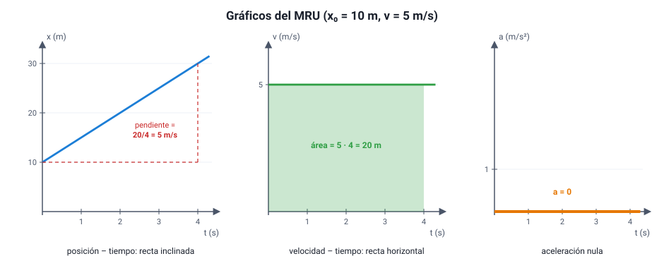

## 6. Movimiento rectilíneo uniforme (MRU)

### a. Qué lo define

Un cuerpo tiene **movimiento rectilíneo uniforme** cuando se mueve en **línea recta** con **velocidad constante**: recorre **distancias iguales en tiempos iguales** y nunca cambia de sentido. Su aceleración es **cero**.

Ejemplos aproximados: un auto con control de crucero en una carretera recta, una escalera mecánica, un objeto en una cinta transportadora, la luz en el vacío. En la realidad casi ningún movimiento es exactamente uniforme, pero muchos lo son durante un tramo.

### b. La ecuación de itinerario

Si en *t* = 0 el cuerpo está en la posición *x*0 y se mueve con velocidad constante *v*, su posición en cualquier instante es:

<strong><em>x</em>(<em>t</em>) = <em>x</em>0 + <em>v</em> · <em>t</em></strong>

| Símbolo | Significado | Unidad |
|---|---|---|
| *x*(*t*) | Posición en el instante *t* | m |
| *x*0 | Posición inicial (en *t* = 0) | m |
| *v* | Velocidad (con signo según el sentido) | m/s |
| *t* | Tiempo transcurrido | s |

::: ejemplo
**Leer una ecuación de itinerario.** La posición de un ciclista está dada por *x*(*t*) = 50 − 4*t* (en metros y segundos).

- Parte en *x*0 = **50 m**.
- Su velocidad es *v* = **−4 m/s**: se mueve en sentido negativo, hacia el origen.
- En *t* = 5 s está en *x* = 50 − 20 = **30 m**.
- Pasa por el origen cuando 0 = 50 − 4*t*, es decir, en *t* = **12,5 s**.
:::

### c. Los gráficos del MRU

<figure><figcaption>Figura 4. Gráficos de un MRU con <em>x</em>0 = 10 m y <em>v</em> = 5 m/s. Diagrama propio.</figcaption></figure>

| Gráfico | Forma | Qué se lee |
|---|---|---|
| Posición – tiempo (*x*–*t*) | **Recta inclinada** | La **pendiente** es la velocidad. El punto donde corta el eje vertical es *x*0. Más inclinada = más rápido; pendiente negativa = sentido negativo |
| Velocidad – tiempo (*v*–*t*) | **Recta horizontal** | El valor es la velocidad. El **área** bajo la recta es el **desplazamiento** |
| Aceleración – tiempo (*a*–*t*) | Recta sobre el eje (*a* = 0) | No hay aceleración |

::: ejemplo
**Pendiente y área.** En la figura 4, entre *t* = 0 y *t* = 4 s:

- En el gráfico *x*–*t*, la posición pasa de 10 m a 30 m: pendiente = (30 − 10) m / 4 s = **5 m/s**, que es la velocidad.
- En el gráfico *v*–*t*, el área del rectángulo es 5 m/s · 4 s = **20 m**, que es el desplazamiento (30 m − 10 m).

Las dos lecturas dicen lo mismo desde gráficos distintos: es la mejor forma de comprobar un resultado.
:::

### d. Encuentros y persecuciones

Cuando dos cuerpos se mueven con MRU por la misma recta, se encuentran cuando **están en la misma posición en el mismo instante**. Para encontrar ese instante se igualan sus ecuaciones de itinerario.

::: ejemplo
**Dos buses en la Ruta 5.** Un bus sale de Talca hacia el norte a 25 m/s. En el mismo instante, otro sale de un punto 90 km al norte de Talca hacia el sur a 20 m/s. Tomando Talca como origen y el norte como positivo:

- Bus 1: *x*1 = 25 *t*
- Bus 2: *x*2 = 90 000 − 20 *t*

Se encuentran cuando *x*1 = *x*2: 25 *t* = 90 000 − 20 *t* → 45 *t* = 90 000 → *t* = **2 000 s** (unos 33 minutos), en *x* = 25 · 2 000 = **50 000 m**, es decir, a 50 km al norte de Talca.

Atajo: como se acercan uno al otro, la rapidez con que se acorta la distancia entre ellos es 25 + 20 = 45 m/s (relatividad de Galileo). El tiempo es 90 000 m / 45 m/s = 2 000 s.
:::

En un gráfico *x*–*t*, el encuentro es el **punto donde se cruzan** las dos rectas.
