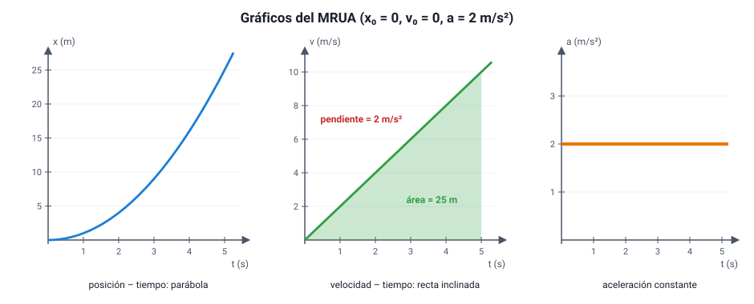

## 7. Movimiento rectilíneo uniformemente acelerado (MRUA)

### a. Qué lo define

Un cuerpo tiene **movimiento rectilíneo uniformemente acelerado** cuando se mueve en línea recta con **aceleración constante**. Su velocidad cambia **lo mismo en cada segundo**. Si la aceleración va en el mismo sentido que la velocidad, el cuerpo gana rapidez; si va en sentido contrario, la pierde (sección 4).

Ejemplos: un auto que parte en un semáforo con aceleración pareja, un tren que frena al llegar a la estación, una pelota que cae (si se desprecia el aire), un carro que baja por un plano inclinado.

### b. Las ecuaciones

Con *x*0 y *v*0 la posición y la velocidad en *t* = 0, y *a* constante:

<strong><em>v</em>(<em>t</em>) = <em>v</em>0 + <em>a</em> · <em>t</em></strong>

<strong><em>x</em>(<em>t</em>) = <em>x</em>0 + <em>v</em>0 · <em>t</em> + ½ · <em>a</em> · <em>t</em>²</strong> &nbsp;&nbsp; (ecuación de itinerario)

<strong><em>v</em>² = <em>v</em>0² + 2 · <em>a</em> · Δ<em>x</em></strong> &nbsp;&nbsp; (sin el tiempo)

Y una cuarta, muy útil: como la velocidad cambia de forma pareja, la **velocidad media** en un MRUA es el promedio de la inicial y la final, *v*media = (*v*0 + *v*) / 2, y el desplazamiento es Δ*x* = *v*media · *t*.

::: tip
**Por qué aparece *t*² en la posición.** En un MRUA la velocidad crece con el tiempo, así que en cada segundo se recorre **más** que en el anterior. Partiendo del reposo, las distancias recorridas en el primer, segundo, tercer segundo… están en la proporción **1 : 3 : 5 : 7…**, y las distancias acumuladas en la proporción **1 : 4 : 9 : 16…** (los cuadrados). Es lo que encontró Galileo al hacer rodar esferas por un plano inclinado: la distancia es proporcional al cuadrado del tiempo.
:::

::: ejemplo
**Un auto que parte del reposo.** Un auto parte desde un semáforo con aceleración constante de 2 m/s².

- A los 5 s: *v* = 0 + 2 · 5 = **10 m/s** (36 km/h).
- Posición a los 5 s (origen en el semáforo): *x* = 0 + 0 + ½ · 2 · 5² = **25 m**.
- A los 10 s: *v* = 20 m/s y *x* = ½ · 2 · 100 = **100 m**. En el doble de tiempo recorrió el **cuádruple** de distancia.
:::

::: ejemplo
**Distancia de frenado.** Un auto va a 20 m/s (72 km/h) y frena con aceleración de −5 m/s² hasta detenerse. Con la ecuación sin tiempo: 0 = 20² + 2 · (−5) · Δ*x* → Δ*x* = 400 / 10 = **40 m**. Tarda *t* = (0 − 20) / (−5) = **4 s**.

Si el auto fuera al doble de rapidez (40 m/s), la distancia de frenado sería 1 600 / 10 = **160 m**: **cuatro veces** más, porque depende del **cuadrado** de la velocidad. Por eso los límites de velocidad importan tanto.
:::

### c. Los gráficos del MRUA

<figure><figcaption>Figura 5. Gráficos de un MRUA con <em>x</em>0 = 0, <em>v</em>0 = 0 y <em>a</em> = 2 m/s². Diagrama propio.</figcaption></figure>

| Gráfico | Forma | Qué se lee |
|---|---|---|
| Posición – tiempo | **Parábola** (curva) | La pendiente en cada punto es la velocidad instantánea: si la curva se empina, el cuerpo va cada vez más rápido |
| Velocidad – tiempo | **Recta inclinada** | La **pendiente** es la aceleración. El **área** bajo la recta es el desplazamiento. El corte con el eje vertical es *v*0 |
| Aceleración – tiempo | **Recta horizontal** | El valor es la aceleración. El área es el cambio de velocidad |

::: ejemplo
**Leer el gráfico *v*–*t* de la figura 5.** Entre 0 y 5 s la velocidad sube de 0 a 10 m/s.

- Pendiente = (10 − 0) m/s / 5 s = **2 m/s²**: la aceleración.
- Área del triángulo = ½ · 5 s · 10 m/s = **25 m**: el desplazamiento. Coincide con el cálculo de la ecuación de itinerario.
:::

### d. Caída libre y lanzamiento vertical

Un cuerpo que se mueve **solo bajo la acción de la gravedad** —sin que el aire influya de forma apreciable— tiene un MRUA con una aceleración dirigida hacia abajo cuyo valor, cerca de la superficie terrestre, es

<strong><em>g</em> ≈ 9,8 m/s²</strong> &nbsp;&nbsp; (en muchos ejercicios se aproxima a 10 m/s²)

Tres ideas clave:

1. **Todos los cuerpos caen con la misma aceleración**, sin importar su masa, si no hay aire. Aristóteles sostenía que los cuerpos pesados caen más rápido; Galileo mostró que no, con sus experimentos de planos inclinados y con argumentos. (La famosa escena de Galileo soltando esferas desde la Torre de Pisa probablemente es una leyenda: no hay registro de que la haya hecho.) En 1971, en la Luna, el astronauta David Scott (Apolo 15) soltó a la vez un martillo y una pluma: llegaron juntos al suelo, porque allí no hay aire.
2. En la Tierra, el **roce con el aire** frena más a los cuerpos livianos y extendidos: una hoja de papel extendida cae más lento que una bolita, pero si arrugas la hoja, caen casi juntas. La diferencia la hace el aire, no la masa.
3. En un **lanzamiento vertical hacia arriba**, la aceleración es *g* hacia abajo **durante todo el movimiento**: al subir, la velocidad disminuye 9,8 m/s cada segundo; en el punto más alto, la velocidad es cero **pero la aceleración no**; al bajar, la rapidez aumenta 9,8 m/s cada segundo. El tiempo de subida es igual al de bajada hasta el mismo nivel.

::: ejemplo
**Una piedra lanzada hacia arriba** a 20 m/s (usando *g* = 10 m/s², con el sentido positivo hacia arriba, así que *a* = −10 m/s²):

- Tiempo de subida: 0 = 20 − 10 *t* → *t* = **2 s**.
- Altura máxima: 0 = 20² − 2 · 10 · *h* → *h* = **20 m**.
- Vuelve a la mano a los **4 s**, con rapidez de **20 m/s** hacia abajo.

El gráfico *v*–*t* de este movimiento es **una sola recta** con pendiente −10 m/s² que cruza el eje del tiempo en *t* = 2 s: la velocidad pasa de positiva a negativa sin que la pendiente (la aceleración) cambie nunca.
:::
