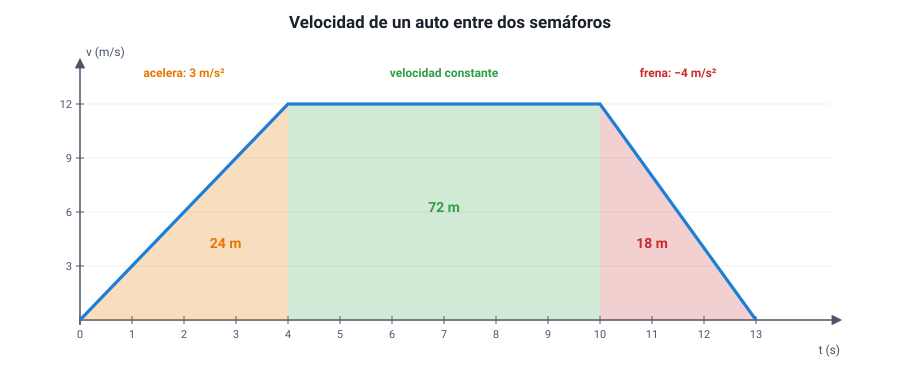
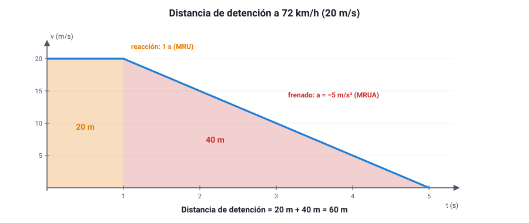

## 8. Cómo leer los gráficos de movimiento

### a. Tres preguntas antes de responder

Casi todas las preguntas de cinemática en la PAES traen un gráfico. Antes de calcular nada, conviene hacerse tres preguntas:

1. **¿Qué magnitud está en el eje vertical?** Posición, velocidad o aceleración. Un mismo dibujo significa cosas muy distintas en cada caso.
2. **¿Qué me piden: una pendiente o un área?** La **pendiente** da la magnitud «siguiente» (de *x* a *v*, de *v* a *a*). El **área** bajo la curva da la magnitud «anterior» acumulada (bajo *v*, el desplazamiento; bajo *a*, el cambio de velocidad).
3. **¿Qué pasa en cada tramo?** Los gráficos suelen tener tramos con movimientos distintos: se analizan por separado.

| Si el gráfico es… | Pendiente | Área bajo la curva |
|---|---|---|
| Posición – tiempo | Velocidad | (no tiene significado útil) |
| Velocidad – tiempo | Aceleración | Desplazamiento |
| Aceleración – tiempo | (no se usa en la PAES) | Cambio de velocidad |

### b. Un gráfico con tramos

<figure><figcaption>Figura 6. Gráfico velocidad–tiempo de un auto entre dos semáforos, con tres tramos. Diagrama propio.</figcaption></figure>

::: ejemplo
**Analizar la figura 6 tramo por tramo.**

| Tramo | Qué hace el auto | Aceleración (pendiente) | Desplazamiento (área) |
|---|---|---|---|
| 0 – 4 s | Parte y acelera (MRUA) | 12 / 4 = **3 m/s²** | ½ · 4 · 12 = **24 m** |
| 4 – 10 s | Velocidad constante (MRU) | **0** | 6 · 12 = **72 m** |
| 10 – 13 s | Frena hasta detenerse (MRUA) | −12 / 3 = **−4 m/s²** | ½ · 3 · 12 = **18 m** |

Desplazamiento total: 24 + 72 + 18 = **114 m**. Velocidad media en todo el viaje: 114 m / 13 s ≈ **8,8 m/s**.
:::

### c. Errores que la prueba aprovecha

::: tip
**1. Leer el gráfico equivocado.** En un gráfico *x*–*t*, una recta horizontal significa que el cuerpo está **detenido**. En un gráfico *v*–*t*, una recta horizontal significa que va con **velocidad constante**. Es el error más caro del tema.

**2. Confundir cruce con encuentro.** Si dos rectas se cruzan en un gráfico *x*–*t*, los cuerpos están en el mismo lugar: **se encuentran**. Si se cruzan en un gráfico *v*–*t*, solo tienen **la misma velocidad** en ese instante; pueden estar a kilómetros uno del otro.

**3. Olvidar el signo del área.** En un gráfico *v*–*t*, el área **bajo el eje** del tiempo es un desplazamiento **negativo** (el cuerpo va en sentido contrario). Para el **desplazamiento** se suman las áreas con su signo; para la **distancia recorrida** se suman todas como positivas.

**4. Creer que la curva es la trayectoria.** Un gráfico *x*–*t* con forma de colina **no** significa que el cuerpo subió un cerro: puede ser un auto en una calle recta que avanzó, se detuvo y volvió.
:::

### d. Cómo reconocer el tipo de movimiento

| Movimiento | Gráfico *x*–*t* | Gráfico *v*–*t* | Gráfico *a*–*t* |
|---|---|---|---|
| Reposo | Horizontal | Sobre el eje (*v* = 0) | Sobre el eje |
| MRU | Recta inclinada | Horizontal (≠ 0) | Sobre el eje |
| MRUA que aumenta su rapidez | Curva que se empina | Recta que se aleja del eje | Horizontal (≠ 0) |
| MRUA que disminuye su rapidez | Curva que se aplana | Recta que se acerca al eje | Horizontal (≠ 0) |

Un cuerpo **cambia de sentido** en el instante en que su velocidad pasa por cero: en el gráfico *v*–*t*, cuando la recta cruza el eje del tiempo; en el gráfico *x*–*t*, en el punto más alto o más bajo de la curva.

### e. Una aplicación: la distancia de detención

Cuando un conductor ve un peligro, el auto no empieza a frenar de inmediato. Pasa primero un **tiempo de reacción** —en promedio **1 segundo** para un conductor atento, según CONASET, y bastante más si está cansado, distraído o bebió alcohol— en el que el auto sigue en **MRU**. Después viene el frenado, que es un **MRUA**. La distancia de detención es la suma de ambas:

<figure><figcaption>Figura 7. La distancia de detención es el área bajo el gráfico <em>v</em>–<em>t</em>: reacción (MRU) más frenado (MRUA). Diagrama propio.</figcaption></figure>

::: ejemplo
**A 72 km/h (20 m/s), con 1 s de reacción y frenado de −5 m/s².**

- Reacción: 20 m/s · 1 s = **20 m** (el rectángulo).
- Frenado: 20² / (2 · 5) = **40 m** (el triángulo).
- Distancia de detención: **60 m**.

A 50 km/h (≈ 13,9 m/s), con los mismos datos: reacción ≈ 13,9 m y frenado ≈ 19,3 m, en total unos **33 m**, casi la mitad. Esta es la base física de la ley que en 2018 bajó el límite urbano en Chile de 60 a 50 km/h.
:::
