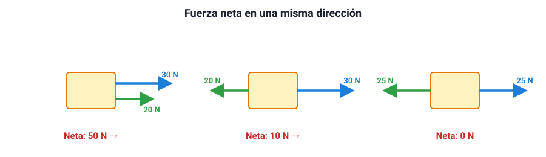

## 2. Qué es una fuerza

### a. Una interacción entre dos cuerpos

Una **fuerza** es una **interacción entre dos cuerpos**. Siempre hay dos: el que empuja y el empujado, el que atrae y el atraído. Por eso una fuerza siempre se puede nombrar como «la fuerza que A ejerce sobre B»: la fuerza que tu mano ejerce sobre la puerta, la que la Tierra ejerce sobre una manzana, la que el piso ejerce sobre tus pies.

Una fuerza puede producir dos tipos de efectos:

- **Cambiar el estado de movimiento** de un cuerpo: ponerlo en marcha, detenerlo, acelerarlo, frenarlo o cambiar su dirección.
- **Deformarlo**: estirar un resorte, abollar una lata, aplastar una pelota.

::: tip
**Lo que una fuerza no es.** Un cuerpo no «tiene» fuerza ni la «lleva» consigo. Una pelota que ya salió de la mano del lanzador **no** lleva «la fuerza del lanzamiento»: una vez en el aire, las únicas fuerzas sobre ella son su peso y el roce con el aire. Esta idea errónea, que viene de Aristóteles y de la Edad Media (la teoría del «ímpetu»), es la que más confunde en los ítems de dinámica.
:::

### b. La fuerza es un vector

Para describir una fuerza no basta con decir cuánto vale: también importa **hacia dónde** actúa. Empujar una caja hacia el norte o hacia el sur con la misma intensidad produce efectos opuestos. Por eso la fuerza es un **vector**, con:

- **magnitud** (su intensidad, en newton),
- **dirección** (horizontal, vertical, inclinada…),
- **sentido** (hacia un lado o hacia el otro de esa dirección),
- **punto de aplicación** (dónde actúa sobre el cuerpo).

Se dibuja como una **flecha**: su largo representa la magnitud y su orientación, la dirección y el sentido.

La unidad de fuerza en el SI es el **newton (N)**. Una idea de su tamaño: el peso de una manzana mediana (unos 100 g) es de aproximadamente **1 N**. Una persona de 60 kg pesa unos 590 N.

Las fuerzas se miden con un **dinamómetro**: un resorte con una escala graduada, que se estira más cuanto mayor es la fuerza (sección 7).

### c. Fuerzas de contacto y fuerzas a distancia

| Tipo | Cuándo actúan | Ejemplos |
|---|---|---|
| **De contacto** | Solo cuando los cuerpos se tocan | Normal, roce, tensión de una cuerda, empuje de una mano, fuerza elástica de un resorte, roce con el aire |
| **A distancia** | Aunque los cuerpos estén separados | Gravitacional (el peso), eléctrica, magnética |

A escala microscópica, casi todas las fuerzas de contacto son en realidad fuerzas **eléctricas** entre los átomos de las superficies que se tocan. Pero para describir el movimiento de objetos cotidianos, la clasificación de la tabla es la útil.

### d. La fuerza neta

Casi siempre, sobre un cuerpo actúan **varias** fuerzas a la vez. Lo que determina su movimiento es la **fuerza neta** (o **resultante**): la suma **vectorial** de todas ellas.

En una misma recta, sumar vectores es sumar con signo:

<figure><figcaption>Figura 1. En una misma dirección, las fuerzas en el mismo sentido se suman y las opuestas se restan. Diagrama propio.</figcaption></figure>

::: ejemplo
**Tira y afloja.** Dos equipos tiran de una cuerda. El equipo A tira hacia la izquierda con 800 N y el B hacia la derecha con 750 N. Tomando la derecha como positiva: *F*neta = 750 − 800 = **−50 N**. La neta es de 50 N hacia la izquierda: gana A, y la cuerda acelera hacia su lado.

Si ambos tiraran con 800 N, la fuerza neta sería **cero**: la cuerda quedaría quieta, o seguiría moviéndose con velocidad constante si ya se movía. Que la fuerza neta sea cero **no** significa que no haya fuerzas: significa que se compensan.
:::

Cuando las fuerzas no están en la misma recta, se suman como vectores: por ejemplo, dos fuerzas perpendiculares de 3 N y 4 N dan una resultante de **5 N** (por el teorema de Pitágoras). En la PAES, la mayoría de las situaciones se reduce a fuerzas en una o dos direcciones perpendiculares.
