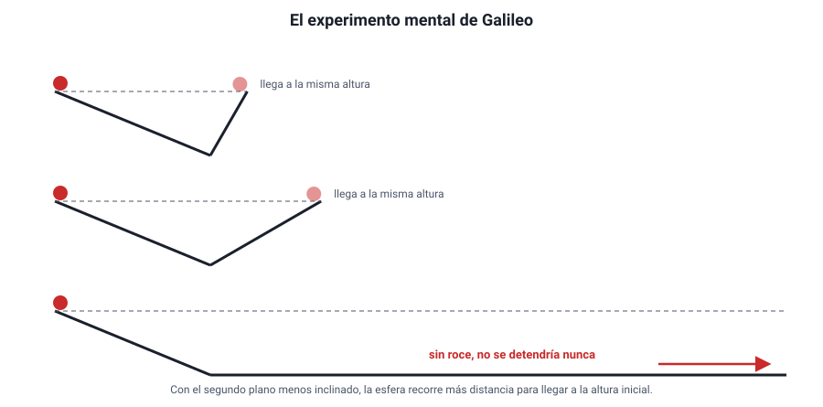

## 3. Primera ley de Newton: la inercia

### a. De Aristóteles a Galileo

Durante casi dos mil años se aceptó la idea de **Aristóteles**: el estado natural de los cuerpos es el **reposo**, y para que algo se mueva hace falta una fuerza que lo empuje todo el tiempo. Parece razonable: si dejas de pedalear, la bicicleta se detiene; si dejas de empujar un carro, se para.

**Galileo** miró el mismo fenómeno de otra manera. Hizo rodar esferas por un plano inclinado que bajaba y luego subía por otro. Observó que la esfera subía casi hasta la misma altura de la que partió, y que cuanto **menos inclinado** era el segundo plano, **más lejos** llegaba. Llevó la idea al límite: si el segundo plano fuera horizontal y no hubiera roce, la esfera **seguiría moviéndose para siempre**, porque nunca alcanzaría la altura inicial.

<figure><figcaption>Figura 2. El experimento mental de Galileo: sin roce, la esfera sube hasta la misma altura; si el segundo plano es horizontal, no se detendría nunca. Diagrama propio.</figcaption></figure>

La conclusión cambió la física: **no hace falta una fuerza para mantener un movimiento**. Lo que detiene la bicicleta no es la falta de empuje, sino el **roce** con el suelo y con el aire. Si no hubiera ninguna fuerza que se opusiera, seguiría indefinidamente.

::: nota
**Por qué es un buen ejemplo de ciencia.** Nadie puede construir un plano sin roce. Galileo usó un **experimento mental**: extrapoló una tendencia que sí observaba (menos inclinación → más distancia) hasta una situación ideal. Es un modelo, y los modelos se aceptan porque sus predicciones se cumplen, no porque se vean directamente.
:::

### b. El enunciado

Newton recogió la idea de Galileo como su **primera ley** (1687):

> **Si la fuerza neta sobre un cuerpo es cero, el cuerpo mantiene su velocidad: si estaba en reposo, sigue en reposo; si se movía, sigue en línea recta con rapidez constante (MRU).**

La propiedad de los cuerpos de mantener su estado de movimiento se llama **inercia**, y por eso a la primera ley también se la llama **ley de inercia**. La medida de la inercia de un cuerpo es su **masa**: cuanto mayor es la masa, más difícil es cambiar su velocidad.

Un cuerpo con fuerza neta cero está en **equilibrio**. Hay dos tipos:

- **Equilibrio estático**: el cuerpo está en reposo (un libro sobre la mesa).
- **Equilibrio dinámico**: el cuerpo se mueve con velocidad constante (un paracaidista que cae con rapidez terminal, un auto que va a 100 km/h constantes en una recta).

::: tip
**Dos errores simétricos.**
1. «Si un cuerpo se mueve, hay una fuerza neta en el sentido del movimiento.» Falso: un auto a velocidad constante tiene fuerza neta **cero**. El motor empuja, pero el roce compensa exactamente.
2. «Si la fuerza neta es cero, el cuerpo está quieto.» Falso: también puede estar en MRU.

La fuerza neta no está relacionada con la **velocidad**, sino con el **cambio** de velocidad (la aceleración). Eso es la segunda ley.
:::

### c. La inercia en la vida diaria

| Situación | Explicación |
|---|---|
| El bus frena de golpe y los pasajeros se van hacia adelante | Sus cuerpos tienden a seguir con la velocidad que tenían; el bus es el que se detiene, no ellos |
| El bus parte de golpe y los pasajeros se van hacia atrás | Sus cuerpos tienden a quedarse en reposo mientras el bus avanza bajo ellos |
| Se tira rápido del mantel y la vajilla queda sobre la mesa | Por su inercia, los platos casi no alcanzan a moverse en el breve tiempo que actúa el roce |
| Se golpea el mango de un martillo contra el suelo para ajustar la cabeza | El mango se detiene y la cabeza, por inercia, sigue bajando y se encaja |
| En una curva, el cuerpo parece «tirado» hacia afuera | En realidad el cuerpo tiende a seguir en línea recta, y es el auto el que dobla |

El **cinturón de seguridad** y el **apoyacabezas** existen por la primera ley. En un choque, el auto se detiene en décimas de segundo, pero el cuerpo de los ocupantes sigue avanzando a la velocidad que traía hasta que algo lo detiene: el cinturón, o el parabrisas.

### d. Sistemas de referencia inerciales

La primera ley no se cumple desde cualquier punto de vista. Dentro de un bus que frena, una pelota en el piso **rueda hacia adelante sin que nada la empuje**: desde el bus parece que la primera ley falla. Pero desde la calle todo tiene sentido: la pelota sigue con su velocidad y es el bus el que frena.

Los sistemas de referencia en que se cumple la primera ley se llaman **inerciales**: son los que están en reposo o en MRU (capítulo 5, relatividad de Galileo). Un bus que frena, acelera o dobla **no** es un sistema inercial. Las leyes de Newton se aplican siempre desde un sistema inercial, normalmente el suelo.
