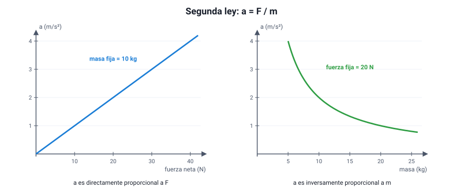

## 4. Segunda ley de Newton: fuerza, masa y aceleración

### a. El enunciado

La primera ley dice qué pasa cuando la fuerza neta es cero. La **segunda ley** dice qué pasa cuando **no** lo es:

> **La aceleración de un cuerpo es directamente proporcional a la fuerza neta que actúa sobre él e inversamente proporcional a su masa, y tiene la dirección y el sentido de la fuerza neta.**

<strong><em>F</em>neta = <em>m</em> · <em>a</em></strong> &nbsp;&nbsp;&nbsp;&nbsp; o bien &nbsp;&nbsp;&nbsp;&nbsp; <strong><em>a</em> = <em>F</em>neta / <em>m</em></strong>

| Símbolo | Magnitud | Unidad SI |
|---|---|---|
| *F*neta | Fuerza neta (suma de todas las fuerzas) | N |
| *m* | Masa | kg |
| *a* | Aceleración | m/s² |

De aquí sale la definición del newton: **1 N es la fuerza neta que le da a 1 kg una aceleración de 1 m/s²** (1 N = 1 kg · m/s²).

### b. Qué dicen las dos proporcionalidades

- **Con la misma masa**, al duplicar la fuerza neta se **duplica** la aceleración.
- **Con la misma fuerza neta**, al duplicar la masa la aceleración se reduce a la **mitad**.

<figure><figcaption>Figura 3. La aceleración es directamente proporcional a la fuerza neta (izquierda) e inversamente proporcional a la masa (derecha). Diagrama propio.</figcaption></figure>

Por eso un camión cargado necesita mucho más tiempo para acelerar y para frenar que uno vacío con el mismo motor y los mismos frenos: con la misma fuerza, más masa significa menos aceleración.

::: ejemplo
**Tres usos de la misma ecuación.**

1. **Calcular la aceleración.** Una fuerza neta de 60 N actúa sobre un carro de 20 kg: *a* = 60 / 20 = **3 m/s²**.
2. **Calcular la fuerza neta.** Un auto de 1 200 kg pasa de 0 a 20 m/s en 10 s. Su aceleración es 2 m/s², así que la fuerza neta fue *F* = 1 200 · 2 = **2 400 N**.
3. **Calcular la masa.** Una fuerza neta de 150 N produce una aceleración de 0,5 m/s²: *m* = 150 / 0,5 = **300 kg**.
:::

### c. La fuerza neta es la suma de todas

El error más frecuente al usar la segunda ley es poner en *F* **una** de las fuerzas en vez de la **neta**.

::: ejemplo
**Una caja empujada con roce.** Una persona empuja una caja de 40 kg con 200 N hacia la derecha, y el roce con el piso es de 120 N hacia la izquierda.

- Fuerza neta: 200 − 120 = **80 N** hacia la derecha.
- Aceleración: *a* = 80 / 40 = **2 m/s²** hacia la derecha.

Usar los 200 N directamente daría 5 m/s², un resultado equivocado. Y si la persona empujara con exactamente 120 N, la neta sería cero: la caja seguiría con velocidad constante si ya se movía (primera ley).
:::

### d. La segunda ley conecta la dinámica con la cinemática

La segunda ley es el puente entre este capítulo y el anterior:

- **Fuerza neta constante** → aceleración constante → **MRUA**.
- **Fuerza neta cero** → aceleración cero → **reposo o MRU**.

Así, conociendo las fuerzas se puede predecir el movimiento, y observando el movimiento se pueden deducir las fuerzas. Si un gráfico velocidad–tiempo es una recta inclinada, la fuerza neta es constante y distinta de cero; si es horizontal, la fuerza neta es cero.

::: tip
**La dirección de la aceleración es la de la fuerza neta, no la de la velocidad.** Un auto que frena se mueve hacia adelante, pero su aceleración y la fuerza neta sobre él apuntan hacia **atrás**. Una pelota lanzada hacia arriba sube, pero la fuerza neta (su peso) y su aceleración apuntan hacia **abajo** durante todo el vuelo.
:::
