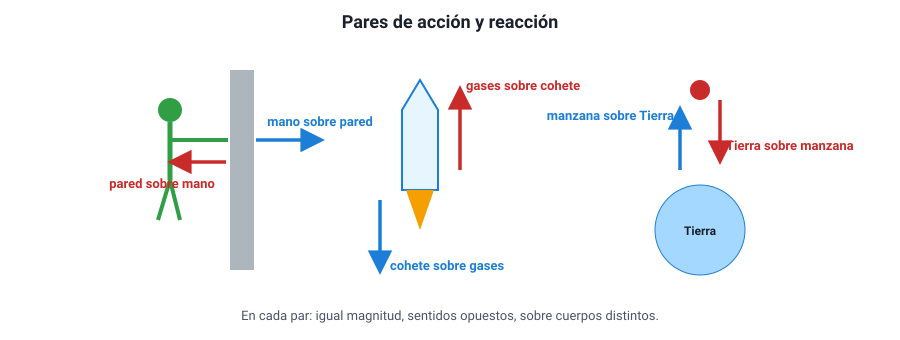

## 5. Tercera ley de Newton: acción y reacción

### a. El enunciado

> **Si un cuerpo A ejerce una fuerza sobre un cuerpo B, entonces B ejerce sobre A una fuerza de igual magnitud, en la misma dirección y en sentido opuesto.**

Las dos fuerzas forman un **par de acción y reacción**. Los nombres son convencionales: cualquiera de las dos puede llamarse «acción». Lo importante es que **siempre aparecen juntas**: no existe una fuerza aislada. Si empujas una pared, la pared te empuja a ti; si la Tierra atrae una manzana, la manzana atrae a la Tierra con la misma fuerza.

<figure><figcaption>Figura 4. En cada par, las dos fuerzas tienen igual magnitud y sentidos opuestos, y actúan sobre cuerpos distintos. Diagrama propio.</figcaption></figure>

### b. Las cuatro características de un par

| Característica | Qué significa |
|---|---|
| **Igual magnitud** | Siempre, aunque los cuerpos tengan masas muy distintas |
| **Sentidos opuestos** | Sobre la misma línea de acción |
| **Actúan sobre cuerpos distintos** | Una sobre A, la otra sobre B |
| **Son del mismo tipo** | Si una es gravitacional, la otra también; si una es de contacto, la otra también |

::: tip
**Por qué no se anulan.** Es la pregunta clásica: «si son iguales y opuestas, ¿por qué no se cancelan?». Porque **actúan sobre cuerpos distintos**. Solo se pueden sumar fuerzas que actúan sobre el **mismo** cuerpo. La fuerza que el caballo ejerce sobre la carreta actúa sobre la carreta; la que la carreta ejerce sobre el caballo actúa sobre el caballo. Para saber si la carreta se mueve, se suman las fuerzas **sobre la carreta** y nada más.
:::

### c. Igual fuerza no significa igual efecto

Si las fuerzas del par son iguales, ¿por qué la manzana cae hacia la Tierra y no la Tierra hacia la manzana? Por la **segunda ley**: la misma fuerza produce aceleraciones muy distintas en masas muy distintas. Una manzana de 0,1 kg recibe una fuerza de unos 1 N y acelera a 9,8 m/s². La Tierra recibe la misma fuerza de 1 N, pero con su masa de 6 × 1024 kg su aceleración es de unos 10−25 m/s², imposible de percibir.

::: ejemplo
**Dos patinadores.** Un patinador de 80 kg y una patinadora de 40 kg, en reposo sobre el hielo, se empujan con las manos. Durante el empujón, cada uno recibe la misma fuerza, digamos 120 N.

- Aceleración de él: 120 / 80 = **1,5 m/s²**.
- Aceleración de ella: 120 / 40 = **3 m/s²**.

Salen en sentidos opuestos, y ella con el doble de aceleración, porque tiene la mitad de masa. No importa quién «empujó primero»: las dos fuerzas existen a la vez.
:::

### d. La tercera ley nos permite movernos

Para avanzar, casi siempre hay que empujar **algo hacia atrás** para que ese algo nos empuje hacia adelante:

- **Caminar**: el pie empuja el suelo hacia atrás (con roce) y el suelo empuja el pie hacia adelante. Sobre hielo liso cuesta caminar porque hay poco roce.
- **Nadar o remar**: la mano o el remo empujan el agua hacia atrás y el agua empuja al nadador o al bote hacia adelante.
- **Un cohete**: expulsa gases hacia atrás a gran velocidad y los gases lo empujan hacia adelante. Por eso funciona en el vacío del espacio: no necesita aire para «apoyarse».
- **Un auto**: las ruedas empujan el pavimento hacia atrás y el pavimento empuja al auto hacia adelante.

### e. Cómo no confundir un par con dos fuerzas equilibradas

Un libro sobre una mesa está en equilibrio: su peso (hacia abajo) y la normal (hacia arriba) son iguales y opuestos. **Pero no son un par de acción y reacción**, porque ambas actúan sobre el **mismo cuerpo** (el libro) y son de tipos distintos (una gravitacional, la otra de contacto).

| Fuerza | Su pareja de acción y reacción |
|---|---|
| Peso del libro (la Tierra atrae al libro) | El libro atrae a la Tierra hacia arriba |
| Normal sobre el libro (la mesa empuja al libro hacia arriba) | El libro empuja a la mesa hacia abajo |

Que el peso y la normal sean iguales es consecuencia de la **primera ley** (el libro está en equilibrio), no de la tercera. Y, como se verá, no siempre son iguales.
