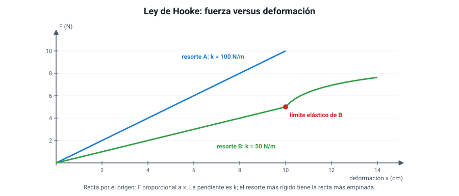

## 7. La fuerza elástica y la ley de Hooke

### a. Qué es un cuerpo elástico

Un cuerpo es **elástico** si, al deformarlo con una fuerza, **recupera su forma** cuando la fuerza deja de actuar: un resorte, un elástico de pelo, la cuerda de un arco, una cama elástica. Mientras está deformado, ejerce sobre lo que lo deforma una fuerza en sentido **contrario a la deformación**: si lo estiras, tira hacia adentro; si lo comprimes, empuja hacia afuera. Es la **fuerza elástica** o **restauradora**.

### b. La ley de Hooke

En 1678, el inglés **Robert Hooke** publicó que, para muchos materiales, **la fuerza es proporcional a la deformación**. Para un resorte:

<strong><em>F</em> = <em>k</em> · <em>x</em></strong>

| Símbolo | Significado | Unidad SI |
|---|---|---|
| *F* | Magnitud de la fuerza que estira o comprime el resorte (y de la fuerza elástica que él ejerce) | N |
| *k* | Constante elástica: la **rigidez** del resorte | N/m |
| *x* | **Deformación**: cuánto se estiró o comprimió respecto de su largo natural | m |

La fuerza que ejerce el propio resorte apunta al revés de la deformación, por eso a veces se escribe *F* = −*k* · *x*: el signo menos solo indica el sentido.

::: tip
**x no es el largo del resorte.** Es la **diferencia** entre el largo que tiene y su largo natural (sin carga). Si un resorte mide 20 cm sin carga y 26 cm con una masa colgada, *x* = 6 cm = 0,06 m, no 26 cm. Es el error de cálculo más común del tema.
:::

::: ejemplo
**Calcular *k* y usarla.** Al colgar una masa de 0,5 kg de un resorte (peso: 5 N con *g* = 10 m/s²), este se estira de 20 cm a 30 cm.

- Deformación: *x* = 10 cm = 0,10 m.
- Constante: *k* = *F* / *x* = 5 N / 0,10 m = **50 N/m**.
- Con una masa de 0,8 kg (8 N), el estiramiento sería *x* = 8 / 50 = 0,16 m = **16 cm**, y el resorte mediría 36 cm.
:::

### c. El gráfico fuerza–deformación y el límite elástico

<figure><figcaption>Figura 5. En la zona elástica, la fuerza y la deformación son proporcionales; la pendiente es <em>k</em>. Más allá del límite elástico, la ley deja de cumplirse. Diagrama propio.</figcaption></figure>

- Si la ley de Hooke se cumple, el gráfico de **fuerza versus deformación** es una **recta que pasa por el origen**.
- Su **pendiente** es la constante *k*. Un resorte más **rígido** tiene una recta **más empinada**: necesita más fuerza para estirarse lo mismo.
- La ley vale solo hasta el **límite elástico**. Si se estira más allá, el resorte **se deforma permanentemente** (ya no vuelve a su largo original) y, si se sigue, se rompe. Ahí la curva deja de ser recta.

::: nota
**Cómo se comprueba la ley en el laboratorio.** Se cuelga un resorte de un soporte, se mide su largo natural con una regla y luego se agregan masas conocidas, midiendo el largo cada vez. Con los datos se calcula la deformación y se grafica fuerza (peso de las masas) versus deformación. Si los puntos quedan alineados en una recta que pasa por el origen, se cumple la ley, y la pendiente da *k*. Variable independiente: la fuerza (las masas colgadas). Variable dependiente: la deformación. Variables controladas: el mismo resorte, la misma temperatura, no superar el límite elástico.
:::

### d. El dinamómetro

El **dinamómetro** es un instrumento para medir fuerzas basado en la ley de Hooke: un resorte dentro de un tubo con una escala. Como la deformación es proporcional a la fuerza, la escala puede graduarse directamente en newton, con marcas **equidistantes**. Las balanzas de gancho que se usan en ferias y mercados para pesar sacos son dinamómetros.

### e. Resortes en la vida diaria

Amortiguadores de autos y bicicletas, colchones y sillas de oficina, básculas, trampolines, relojes mecánicos y los resortes de los lápices retráctiles. En todos ellos se elige la constante *k* según la fuerza que deben soportar y la deformación que se quiere permitir.
