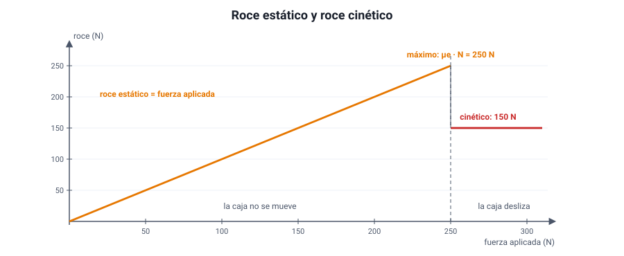
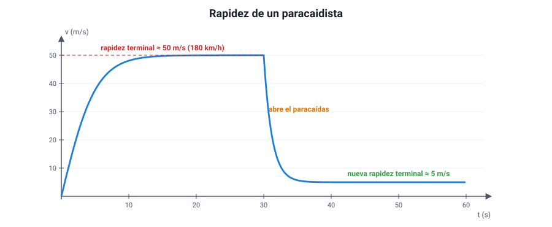

## 8. La fuerza de roce

### a. De dónde viene el roce

Cuando dos superficies están en contacto, aparece una fuerza **paralela** a ellas que se opone a que **deslicen** una sobre otra: el **roce** (o fricción). Aun las superficies que parecen lisas tienen rugosidades microscópicas que se traban, y además los átomos de ambas superficies se atraen en los puntos de contacto.

El roce **no siempre es un enemigo**: sin él no podríamos caminar, los autos no podrían partir ni frenar, los clavos no se sostendrían y los nudos se desatarían.

### b. Roce estático y roce cinético

Hay dos tipos, según si las superficies deslizan o no:

<figure><figcaption>Figura 6. Mientras la caja no se mueve, el roce estático iguala a la fuerza aplicada hasta un máximo; cuando empieza a deslizar, el roce baja al valor cinético y se mantiene constante. Diagrama propio.</figcaption></figure>

| | Roce **estático** (*f*e) | Roce **cinético** (*f*c) |
|---|---|---|
| Cuándo actúa | Mientras las superficies **no deslizan** entre sí | Cuando las superficies **ya deslizan** |
| Valor | Se **ajusta** a la fuerza aplicada, desde cero hasta un máximo: *f*e ≤ *μ*e · *N* | Prácticamente **constante**: *f*c = *μ*c · *N* |
| Ejemplo | Una caja que empujas suavemente y no se mueve | La misma caja arrastrándose por el piso |

donde *N* es la fuerza normal y *μ*e, *μ*c son los **coeficientes de roce** estático y cinético. Los coeficientes no tienen unidad y dependen **de los dos materiales** en contacto y del estado de las superficies (secas, mojadas, enceradas).

Casi siempre ***μ*e > *μ*c**: cuesta más **empezar** a mover un mueble que **mantenerlo** en movimiento. Por eso se siente un «tirón» al principio y después el mueble se desliza con menos esfuerzo.

| Materiales | *μ*e | *μ*c |
|---|---|---|
| Caucho sobre concreto seco | 1,0 | 0,7 |
| Caucho sobre concreto mojado | 0,7 | 0,5 |
| Madera sobre madera | 0,5 | 0,3 |
| Madera encerada sobre nieve húmeda | 0,14 | 0,10 |
| Acero sobre hielo | 0,04 | 0,02 |

::: ejemplo
**Mover una caja.** Una caja de 50 kg está sobre un piso de madera horizontal (*μ*e = 0,5; *μ*c = 0,3; *g* = 10 m/s²). La normal es igual al peso: *N* = 500 N.

- Roce estático máximo: 0,5 · 500 = **250 N**. Si empujas con 100 N, la caja **no se mueve** y el roce estático vale **100 N** (no 250 N): se ajusta a tu empuje.
- Si empujas con 260 N, superas el máximo y la caja empieza a deslizar.
- Ya en movimiento, el roce es cinético: 0,3 · 500 = **150 N**. Si sigues empujando con 260 N, la fuerza neta es 110 N y la caja acelera a 110 / 50 = **2,2 m/s²**. Para que avance con velocidad constante, basta empujar con **150 N**.
:::

::: tip
**Tres errores típicos.**
1. Calcular siempre el roce estático como *μ*e · *N*. Ese es el **máximo**; el valor real es el que haga falta para impedir el deslizamiento.
2. Creer que el roce depende del **área** de contacto. En el modelo escolar, no: un ladrillo apoyado de canto o de plano tiene el mismo roce, porque la normal es la misma.
3. Creer que el roce **siempre se opone al movimiento**. Se opone al **deslizamiento entre las superficies**. Al caminar, el roce sobre tu pie apunta **hacia adelante**, en el sentido en que avanzas: es la fuerza que te impulsa.
:::

### c. Por qué frenar sin bloquear las ruedas

Mientras una rueda gira sin patinar, el punto que toca el pavimento está instantáneamente quieto respecto del suelo: actúa el roce **estático**, que es mayor. Si el conductor frena tan fuerte que la rueda se bloquea y patina, pasa a actuar el roce **cinético**, menor, y el auto tarda más en detenerse y además pierde el control de la dirección. Los frenos **ABS** evitan que las ruedas se bloqueen justamente para aprovechar el roce estático.

Por eso también la distancia de frenado aumenta con el pavimento mojado: el coeficiente de roce baja (de 1,0 a 0,7 en la tabla), la fuerza de frenado máxima baja y la aceleración de frenado también.

### d. El roce con el aire

Cuando un cuerpo se mueve dentro de un fluido (aire o agua), el fluido opone una fuerza de **roce** o **resistencia**. En términos cualitativos, que es como lo pide el temario:

- **Aumenta con la rapidez** del cuerpo: a bajas velocidades casi no se nota; en una carretera es la principal fuerza que frena al auto.
- **Aumenta con el área frontal** del cuerpo: un paracaídas abierto frena mucho más que uno cerrado.
- **Depende de la forma**: las formas aerodinámicas (autos deportivos, trenes de alta velocidad, ciclistas agachados) reducen el roce.
- Depende también de la densidad del fluido: en el agua es mucho mayor que en el aire.

**La rapidez terminal.** Un cuerpo que cae parte con roce del aire nulo y acelera. A medida que gana rapidez, el roce crece, hasta que **iguala al peso**. Desde ese momento la fuerza neta es cero y el cuerpo sigue cayendo con **rapidez constante**: la **rapidez terminal** (primera ley). Un paracaidista en caída libre boca abajo llega a entre 160 y 200 km/h, según su postura y su masa; al abrir el paracaídas, el roce aumenta de golpe, el paracaidista frena y alcanza una nueva rapidez terminal mucho menor, de unos 20 km/h. Las gotas de lluvia también caen con rapidez terminal: por eso no llegan al suelo como proyectiles.

<figure><figcaption>Figura 7. Rapidez de un paracaidista: primero alcanza la rapidez terminal en caída libre y, al abrir el paracaídas, una rapidez terminal mucho menor. Valores aproximados. Diagrama propio.</figcaption></figure>
