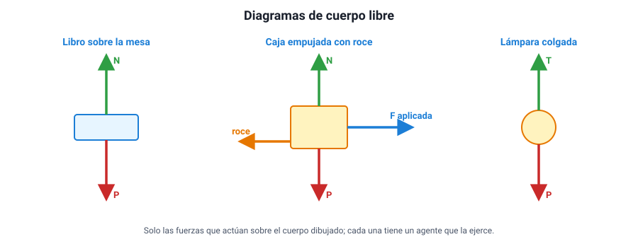
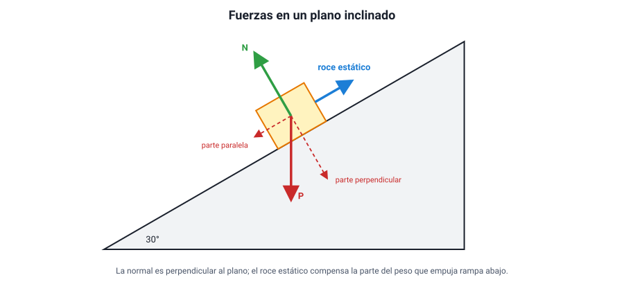

## 9. El diagrama de cuerpo libre y cómo resolver problemas

### a. Qué es un diagrama de cuerpo libre

Un **diagrama de cuerpo libre** (DCL) es un dibujo del cuerpo que se estudia, **aislado** de todo lo que lo rodea, con una flecha por **cada fuerza que actúa sobre él**. Es la herramienta central de la dinámica: casi todos los errores en los problemas de fuerzas vienen de un DCL incompleto o con fuerzas que no corresponden.

<figure><figcaption>Figura 8. Tres diagramas de cuerpo libre. Cada flecha es una fuerza que actúa sobre el cuerpo dibujado. Diagrama propio.</figcaption></figure>

### b. El procedimiento paso a paso

1. **Elegir el cuerpo** que se va a estudiar y dibujarlo como una caja o un punto.
2. **Poner el peso**: siempre, vertical hacia abajo, *P* = *m* · *g*.
3. **Buscar los contactos**: por cada cosa que **toca** al cuerpo, hay una o dos fuerzas de contacto:
   - una superficie → **normal** (perpendicular a la superficie) y, si hay deslizamiento o tendencia a deslizar, **roce** (paralelo a la superficie);
   - una cuerda → **tensión** (a lo largo de la cuerda, tirando);
   - un resorte → **fuerza elástica**;
   - una mano, un motor u otro agente → la **fuerza aplicada**;
   - el aire, si el problema lo considera → **roce con el aire**.
4. **No agregar nada más.** En particular, no dibujar las fuerzas que el cuerpo **ejerce** sobre otros (sus reacciones), ni una «fuerza del movimiento».
5. **Elegir ejes**: uno en la dirección del movimiento (o de la aceleración) y otro perpendicular. Marcar el sentido positivo.
6. **Aplicar la segunda ley en cada eje**: la suma de fuerzas en ese eje es *m* · *a* en ese eje. En el eje en que no hay movimiento, la suma es **cero**.

::: tip
**La pregunta que salva el DCL.** Para cada flecha, pregúntate: **¿qué cuerpo ejerce esta fuerza?** Si no puedes nombrarlo (la Tierra, el piso, la cuerda, la mano, el aire), esa fuerza no existe. Así se elimina la «fuerza del lanzamiento» de una pelota en el aire: después de salir de la mano, ya nada la empuja hacia arriba.
:::

### c. Cuerpos con velocidad constante o con aceleración constante

El temario pide aplicar las leyes de Newton en dos situaciones:

| El cuerpo se mueve con… | Fuerza neta | Cómo se plantea |
|---|---|---|
| **Velocidad constante** (o está en reposo) | **Cero** (primera ley) | Las fuerzas en cada eje se **compensan** |
| **Aceleración constante** | **Constante y distinta de cero** (segunda ley) | Suma de fuerzas en el eje del movimiento = *m* · *a* |

::: ejemplo
**Un trineo arrastrado con velocidad constante.** Un niño arrastra un trineo de 20 kg por la nieve tirando de una cuerda horizontal. El trineo avanza con velocidad constante y el coeficiente de roce cinético es 0,1 (*g* = 10 m/s²).

- DCL del trineo: peso (200 N, abajo), normal (arriba), tensión (horizontal, hacia adelante) y roce cinético (horizontal, hacia atrás).
- Eje vertical (no hay movimiento): *N* = *P* = 200 N.
- Roce: *f*c = 0,1 · 200 = 20 N.
- Eje horizontal (velocidad constante, fuerza neta cero): *T* = *f*c = **20 N**.

Si el niño tirara con 30 N, la fuerza neta sería 10 N y el trineo aceleraría a 10 / 20 = **0,5 m/s²**.
:::

::: ejemplo
**Dos bloques unidos por una cuerda.** Sobre una mesa sin roce, un bloque A de 3 kg y un bloque B de 2 kg están unidos por una cuerda ideal. Se tira de A con una fuerza horizontal de 20 N.

1. **Todo el sistema** (A + B, 5 kg) se mueve junto, con la misma aceleración. Fuerza neta horizontal sobre el sistema: 20 N (la tensión es interna y no cuenta). *a* = 20 / 5 = **4 m/s²**.
2. **Solo el bloque B**: la única fuerza horizontal sobre él es la tensión. *T* = *m*B · *a* = 2 · 4 = **8 N**.
3. **Comprobación con A**: 20 − *T* = 3 · 4 → *T* = 8 N. Coincide.

La tensión (8 N) es **menor** que la fuerza aplicada (20 N), porque parte de esa fuerza se usa en acelerar el bloque A.
:::

### d. Las fuerzas en un plano inclinado (cualitativo)

Sobre un cuerpo apoyado en una rampa, el peso sigue siendo vertical, pero la normal es **perpendicular a la rampa**. Conviene pensar el peso como la suma de dos partes: una **paralela** a la rampa, que tiende a hacer bajar el cuerpo, y otra **perpendicular**, que compensa la normal.

- Cuanto **más inclinada** la rampa, mayor es la parte del peso que empuja rampa abajo y **menor la normal**.
- Si el cuerpo está quieto sobre la rampa, es el **roce estático** el que compensa la parte del peso paralela a ella: apunta **rampa arriba**.
- Si la rampa se inclina lo suficiente, esa parte del peso supera el roce estático máximo y el cuerpo empieza a deslizar.

<figure><figcaption>Figura 9. Fuerzas sobre un bloque en reposo en un plano inclinado. Diagrama propio.</figcaption></figure>

### e. Errores frecuentes al resolver

| Error | Por qué está mal |
|---|---|
| Dibujar en el DCL la fuerza que el cuerpo ejerce sobre el piso | Esa fuerza actúa sobre el piso, no sobre el cuerpo |
| Suponer siempre que *N* = *P* | Solo vale en una superficie horizontal, sin otras fuerzas verticales y sin aceleración vertical |
| Poner una fuerza «en el sentido del movimiento» en un cuerpo que se mueve por inercia | Sin un agente que la ejerza, no existe |
| Usar una sola fuerza en vez de la neta en *F* = *m* · *a* | La segunda ley usa la suma de todas |
| Sumar un par de acción y reacción en el mismo DCL | Actúan sobre cuerpos distintos |
