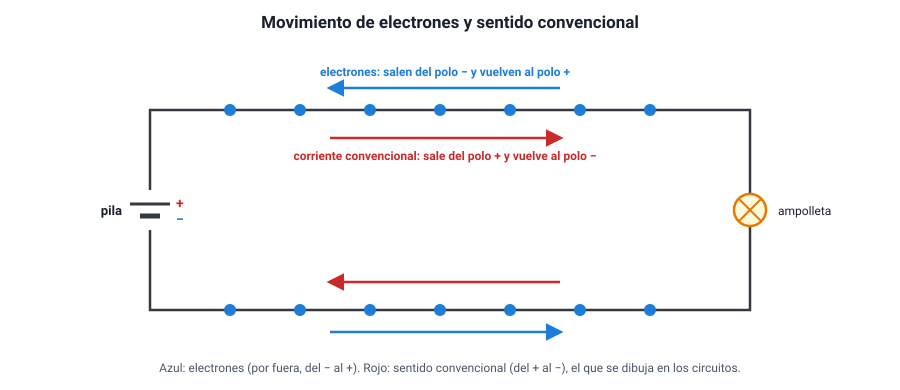

## 2. Carga eléctrica y corriente

### a. La carga eléctrica

Toda la materia está formada por átomos, y los átomos por partículas con **carga eléctrica**: los **protones**, con carga positiva, en el núcleo; y los **electrones**, con carga negativa, alrededor. Las cargas de igual signo se repelen y las de signo contrario se atraen.

La carga se mide en **coulomb (C)**. La carga de un electrón es diminuta: −1,6 × 10−19 C. Un coulomb equivale a la carga de unos 6,25 × 1018 electrones.

### b. Conductores y aislantes

| Tipo | Qué ocurre con las cargas | Ejemplos |
|---|---|---|
| **Conductores** | Tienen electrones que se mueven con facilidad de un átomo a otro («electrones libres») | Cobre, aluminio, plata, oro; también el agua con sales disueltas y el cuerpo humano |
| **Aislantes** | Sus electrones están fuertemente ligados a los átomos y casi no se mueven | Plástico, goma, vidrio, madera seca, cerámica, aire seco |
| **Semiconductores** | Conducen más o menos según la temperatura o las impurezas | Silicio y germanio: la base de chips, LED y paneles solares |

Por eso los cables son de **cobre** recubierto de **plástico**: el cobre lleva la corriente y el plástico impide que escape y que alguien la toque. Chile es el mayor productor de cobre del mundo, y buena parte de ese cobre termina en cables.

### c. Qué es la corriente eléctrica

Un cable de cobre tiene muchísimos electrones libres que se mueven al azar en todas direcciones. Cuando se conecta a una pila, la diferencia de potencial los empuja a todos a desplazarse, en promedio, en un mismo sentido. Ese **flujo ordenado de cargas** es la **corriente eléctrica**.

La **intensidad de corriente** (*I*) es la cantidad de carga que atraviesa una sección del conductor en cada segundo:

<strong><em>I</em> = <em>q</em> / <em>t</em></strong>

Su unidad es el **ampere (A)**: 1 A = 1 C/s. Una ampolleta LED consume unas centésimas de ampere; un hervidor, unos 9 A; el motor de arranque de un auto, más de 100 A.

::: ejemplo
**Contar cargas.** Por el filamento de una linterna pasa una corriente de 0,5 A durante 1 minuto. La carga que circuló es *q* = *I* · *t* = 0,5 A · 60 s = **30 C**, es decir, unos 30 · 6,25 × 1018 ≈ **1,9 × 1020 electrones**.
:::

<figure><figcaption>Figura 1. Los electrones se mueven hacia el polo positivo; la corriente convencional se dibuja en sentido contrario. Diagrama propio.</figcaption></figure>

### d. El sentido de la corriente

Cuando se estudió la electricidad por primera vez, no se sabía qué cargas se movían, y se acordó que la corriente va del polo **positivo** al **negativo** por fuera de la fuente. Es el **sentido convencional**, y es el que se usa en los diagramas. Hoy se sabe que en los metales los que se mueven son los **electrones**, que van en **sentido contrario**: del negativo al positivo. Para los cálculos da lo mismo, siempre que se use un sentido de manera coherente.

::: tip
**Tres ideas equivocadas sobre la corriente.**
1. **«La corriente se gasta en la ampolleta.»** No: la misma corriente que entra a una ampolleta sale de ella. Lo que la ampolleta transforma es **energía**, no carga. Las cargas no se pierden en ningún punto del circuito.
2. **«Los electrones viajan muy rápido.»** Avanzan apenas milímetros por segundo. Lo que es casi instantáneo es la **señal**: al cerrar el interruptor, todos los electrones del circuito empiezan a moverse casi al mismo tiempo, como el agua que ya llena una manguera.
3. **«La pila fabrica electrones.»** No: los electrones ya están en los cables. La pila los **empuja**, entregándoles energía.
:::

### e. Corriente continua y corriente alterna

- **Corriente continua (CC)**: las cargas circulan siempre en el mismo sentido. La entregan las pilas, las baterías de autos y celulares y los paneles solares. Es la que pide el temario para los cálculos de circuitos.
- **Corriente alterna (CA)**: el sentido de la corriente se invierte muchas veces por segundo. Es la de los enchufes de las casas: en Chile, con un voltaje de **220 V** y una frecuencia de **50 Hz** (cambia de sentido 100 veces por segundo). Se usa en las redes porque se transporta con menos pérdidas y su voltaje se cambia fácilmente con transformadores.

Los **cargadores** de celulares y computadores convierten la corriente alterna del enchufe en corriente continua de bajo voltaje (5 V, 9 V, 20 V).

### f. Condiciones para que haya corriente

Para que circule una corriente se necesitan dos cosas:

1. Una **fuente** que mantenga una diferencia de potencial (una pila, una batería, el enchufe).
2. Un **circuito cerrado**: un camino conductor continuo que salga de un polo de la fuente y vuelva al otro.

Si el camino se abre en cualquier punto —un interruptor apagado, un cable cortado, una ampolleta quemada—, la corriente se detiene en **todo** ese camino.
