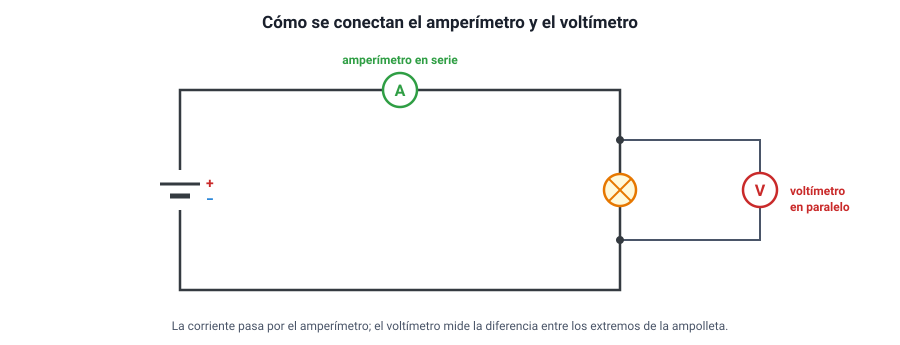

## 3. Voltaje y resistencia

### a. La diferencia de potencial

Una pila o una batería no «tiene» corriente: tiene la capacidad de **entregar energía** a las cargas que pasan por ella. Esa energía por unidad de carga es la **diferencia de potencial** o **voltaje** (*V*):

<strong><em>V</em> = <em>E</em> / <em>q</em></strong> &nbsp;&nbsp;&nbsp;&nbsp; (1 volt = 1 joule por coulomb)

Una pila de 1,5 V entrega 1,5 J a cada coulomb de carga que la atraviesa. Esas cargas luego ceden esa energía en el resto del circuito: en una ampolleta, como luz y calor; en un motor, como movimiento.

Una pila es una fuente de **voltaje** aproximadamente constante, no de corriente constante: la corriente que entrega depende de lo que se le conecte. Con una ampolleta de mucha resistencia entrega poca corriente; con un cable sin resistencia (un cortocircuito), muchísima.

| Fuente | Voltaje típico |
|---|---|
| Pila AA | 1,5 V |
| Batería de celular | 3,7 V |
| Puerto USB | 5 V |
| Batería de auto | 12 V |
| Red domiciliaria en Chile | 220 V (alterna, 50 Hz) |
| Líneas de alta tensión | 66 000 a 500 000 V |

::: nota
**Una analogía útil: el agua.** Imagina un circuito de cañerías cerrado con una bomba. La **bomba** es la fuente: sube el agua a una altura (el **voltaje**). El **caudal** —cuánta agua pasa por segundo— es la **corriente**. Las cañerías angostas o con obstáculos son la **resistencia**. El agua no se gasta al pasar por una rueda que hace girar: lo que se gasta es la energía que la bomba le dio. Como toda analogía, tiene límites, pero ayuda a no confundir voltaje con corriente.
:::

### b. La resistencia eléctrica

La **resistencia** (*R*) mide cuánto se opone un elemento al paso de la corriente. Al avanzar, los electrones chocan con los átomos del material y les transfieren energía, que se convierte en **calor**. La unidad de resistencia es el **ohm (Ω)**.

La resistencia de un conductor depende de cuatro factores:

<strong><em>R</em> = <em>ρ</em> · <em>L</em> / <em>A</em></strong>

| Factor | Efecto sobre la resistencia | Por qué |
|---|---|---|
| **Largo** (*L*) | A mayor largo, **mayor** resistencia (proporcional) | Los electrones deben recorrer más material |
| **Área de la sección** (*A*) | A mayor grosor, **menor** resistencia (inversamente proporcional) | Hay más «carriles» para circular |
| **Material** (resistividad *ρ*) | Cada material tiene su resistividad | El cobre y la plata tienen resistividad muy baja; el nicrom de las estufas, alta |
| **Temperatura** | En los metales, a mayor temperatura, **mayor** resistencia | Los átomos vibran más y los choques son más frecuentes |

::: ejemplo
**Cambiar el cable.** Un cable de cobre tiene una resistencia de 0,4 Ω.

- Si se usa un cable del mismo material y grosor, pero del **doble de largo**: **0,8 Ω**.
- Si se usa uno del mismo largo, pero con el **doble de área**: **0,2 Ω**.
- Si se duplican a la vez el largo y el área: **0,4 Ω**, igual que al principio.

Por eso los artefactos de mucha potencia, como las cocinas eléctricas o los calefactores, se conectan con cables más **gruesos**: tienen menos resistencia y se calientan menos al llevar mucha corriente.
:::

::: tip
**Resistencia no es algo «malo».** En los cables conviene que sea mínima, pero en muchos artefactos es justamente lo que se busca: en el hervidor, la estufa, la plancha, la ducha eléctrica o el tostador, una resistencia se calienta al pasar la corriente, y ese calor es el objetivo. Este efecto se llama **efecto Joule**.
:::

### c. Cómo se miden corriente y voltaje

| Instrumento | Qué mide | Cómo se conecta | Su resistencia interna |
|---|---|---|---|
| **Amperímetro** | Corriente | En **serie**: se abre el circuito y se intercala, para que toda la corriente pase por él | Muy **baja**, para no alterar la corriente |
| **Voltímetro** | Voltaje | En **paralelo**: sus terminales se conectan a los dos extremos del elemento | Muy **alta**, para que casi no pase corriente por él |
| **Óhmetro** | Resistencia | En los extremos del elemento, con el circuito **desconectado** | — |

Un **multímetro** reúne los tres instrumentos en uno, y se elige la función con una perilla.

<figure><figcaption>Figura 2. El amperímetro va en serie (la corriente pasa por él) y el voltímetro en paralelo (mide la diferencia entre dos puntos). Diagrama propio.</figcaption></figure>

::: tip
**El error de conexión.** Un amperímetro conectado en paralelo, por su resistencia tan baja, se comporta como un cortocircuito: pasa por él una corriente enorme que puede dañarlo. Un voltímetro conectado en serie, por su resistencia tan alta, casi corta la corriente del circuito.
:::
