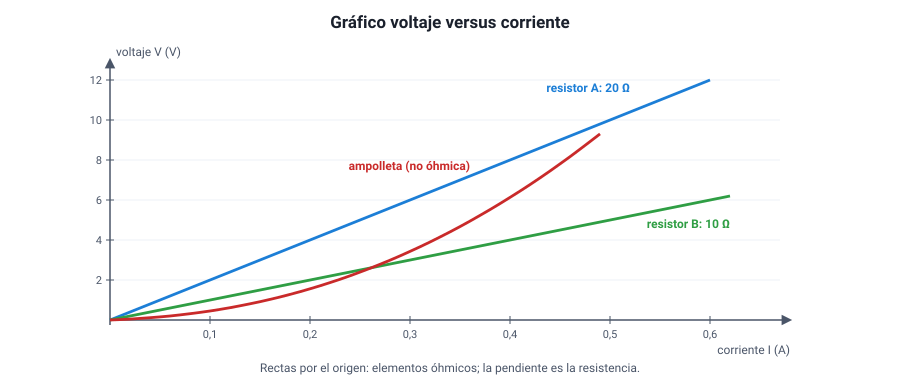

## 4. La ley de Ohm

### a. El enunciado

En 1827, el alemán **Georg Simon Ohm** publicó que, en muchos conductores a temperatura constante, **la corriente es directamente proporcional al voltaje aplicado**. La constante de proporcionalidad es la resistencia:

<strong><em>V</em> = <em>I</em> · <em>R</em></strong> &nbsp;&nbsp;&nbsp; → &nbsp;&nbsp;&nbsp; <strong><em>I</em> = <em>V</em> / <em>R</em></strong> &nbsp;&nbsp;&nbsp; → &nbsp;&nbsp;&nbsp; <strong><em>R</em> = <em>V</em> / <em>I</em></strong>

| Símbolo | Magnitud | Unidad |
|---|---|---|
| *V* | Diferencia de potencial (voltaje) | volt (V) |
| *I* | Intensidad de corriente | ampere (A) |
| *R* | Resistencia | ohm (Ω) |

De aquí sale la definición del ohm: un elemento tiene **1 Ω** si, con **1 V** entre sus extremos, circula por él **1 A**.

Las dos lecturas que más se usan:

- **Con la misma resistencia**, si se duplica el voltaje, se duplica la corriente.
- **Con el mismo voltaje**, si se duplica la resistencia, la corriente se reduce a la **mitad**.

::: ejemplo
**Los tres despejes.**

1. Una ampolleta de 240 Ω se conecta a 12 V: *I* = 12 / 240 = **0,05 A** (50 mA).
2. Por un calefactor conectado a 220 V circulan 5 A: *R* = 220 / 5 = **44 Ω**.
3. Por una resistencia de 100 Ω circulan 0,2 A: el voltaje entre sus extremos es *V* = 0,2 · 100 = **20 V**.
:::

### b. El gráfico voltaje–corriente

<figure><figcaption>Figura 3. En un conductor óhmico, el gráfico <em>V</em>–<em>I</em> es una recta por el origen cuya pendiente es <em>R</em>. El filamento de una ampolleta no es óhmico: su resistencia aumenta al calentarse. Diagrama propio.</figcaption></figure>

- Si un elemento cumple la ley de Ohm, el gráfico de **voltaje versus corriente** es una **recta que pasa por el origen**, y su **pendiente es la resistencia**. Estos elementos se llaman **óhmicos**.
- Un resistor de mayor resistencia tiene una recta **más empinada**: necesita más voltaje para la misma corriente.
- Hay elementos **no óhmicos**. El más común es el **filamento de una ampolleta incandescente**: al aumentar la corriente se calienta, su resistencia aumenta y la curva se empina. Otro es el **diodo** (y el LED), que deja pasar corriente solo en un sentido.

::: tip
**Atento al eje.** Algunos libros grafican *I* versus *V* (corriente en el eje vertical). En ese caso la pendiente es 1/*R*: la recta **más empinada** corresponde a la resistencia **menor**. Lee siempre los ejes antes de comparar pendientes.
:::

### c. Cómo se comprueba en el laboratorio

::: nota
**Un experimento típico.** Se conecta un resistor a una fuente de voltaje variable, con un amperímetro en serie y un voltímetro en paralelo al resistor. Se varía el voltaje de a poco y se anota la corriente.

- **Variable independiente**: el voltaje aplicado.
- **Variable dependiente**: la corriente.
- **Variables controladas**: el mismo resistor y su temperatura (por eso se usan corrientes pequeñas y se desconecta entre mediciones).

Si el cociente *V* / *I* da el mismo valor en todas las mediciones, el resistor es óhmico y ese valor es su resistencia. Si el cociente crece, como en una ampolleta, el elemento no cumple la ley de Ohm.
:::

### d. La ley de Ohm y el cuerpo humano

La piel seca tiene una resistencia de decenas de miles de ohm; mojada, puede bajar a unos pocos cientos o miles de ohm. Con el mismo voltaje de 220 V, la ley de Ohm dice que la corriente que atravesaría el cuerpo puede ser **decenas de veces mayor** con la piel mojada. Por eso es tan peligroso manipular artefactos eléctricos con las manos mojadas o dentro del baño. Lo que daña el cuerpo es la **corriente** que lo atraviesa, y esa corriente depende del voltaje **y** de la resistencia.
