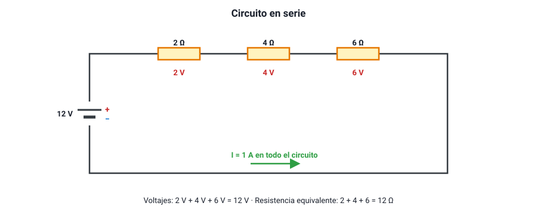

## 5. Circuitos en serie

### a. Qué es una conexión en serie

Dos o más elementos están **en serie** cuando están conectados **uno tras otro**, formando un **único camino** para la corriente. Toda la carga que pasa por el primero debe pasar por el segundo, y así sucesivamente.

<figure><figcaption>Figura 4. Circuito en serie: la misma corriente pasa por todos los resistores y sus voltajes se suman. Diagrama propio.</figcaption></figure>

### b. Las tres reglas del circuito en serie

| Magnitud | Regla | Por qué |
|---|---|---|
| **Corriente** | Es la **misma** en todos los elementos: *I* = *I*1 = *I*2 = *I*3 | Hay un solo camino y la carga no se acumula ni se pierde |
| **Voltaje** | El voltaje de la fuente **se reparte**: *V* = *V*1 + *V*2 + *V*3 | La energía que la fuente da a cada coulomb se va cediendo en cada elemento |
| **Resistencia equivalente** | Se **suman**: *R*eq = *R*1 + *R*2 + *R*3 | La corriente debe atravesar todas las resistencias, una tras otra |

La resistencia equivalente en serie es siempre **mayor** que la mayor de las resistencias. Por eso, al agregar elementos en serie, la corriente del circuito **disminuye**.

Cada resistor recibe un voltaje **proporcional a su resistencia** (*V*i = *I* · *R*i): la resistencia mayor se queda con la mayor parte del voltaje.

::: ejemplo
**Resolver un circuito en serie (figura 4).** Una pila de 12 V alimenta tres resistores en serie de 2 Ω, 4 Ω y 6 Ω.

1. Resistencia equivalente: 2 + 4 + 6 = **12 Ω**.
2. Corriente (la misma en todos): *I* = 12 V / 12 Ω = **1 A**.
3. Voltaje en cada resistor: 1 · 2 = **2 V**, 1 · 4 = **4 V** y 1 · 6 = **6 V**.
4. Comprobación: 2 + 4 + 6 = 12 V, el voltaje de la pila.
:::

### c. Ampolletas en serie

Las ampolletas en serie tienen dos comportamientos característicos:

- **Si una se quema o se saca, todas se apagan.** Al abrirse el único camino, la corriente se detiene en todo el circuito. Así funcionaban las antiguas guirnaldas de luces de Navidad: una ampolleta quemada dejaba a oscuras toda la guirnalda.
- **Al agregar más ampolletas iguales, todas brillan menos.** La resistencia total aumenta, la corriente baja y cada ampolleta recibe una fracción menor del voltaje.

::: ejemplo
**Una, dos y tres ampolletas.** Una ampolleta de 6 Ω conectada sola a una pila de 6 V recibe 1 A y todo el voltaje. Con dos ampolletas iguales en serie: *R*eq = 12 Ω, *I* = 0,5 A y cada una recibe 3 V. Con tres: *I* ≈ 0,33 A y cada una recibe 2 V. Cada ampolleta que se agrega hace que las otras brillen menos.
:::

### d. Dónde se usan las conexiones en serie

- **Interruptores y fusibles**: van en serie con lo que controlan o protegen, para poder cortar la corriente de todo ese camino.
- **Pilas en serie**: en una linterna, dos pilas de 1,5 V conectadas en serie (el polo + de una con el − de la otra) entregan **3 V**.
- **Amperímetros**: se conectan en serie para que por ellos pase la misma corriente que por el elemento que miden.

::: tip
**«La primera ampolleta brilla más porque recibe la corriente antes.»** Es falso. En un circuito en serie, la corriente es la misma en todos los puntos al mismo tiempo: si las ampolletas son iguales, brillan igual, sin importar su posición. Si una brilla más, es porque tiene **mayor resistencia** y se queda con más voltaje y más potencia.
:::
