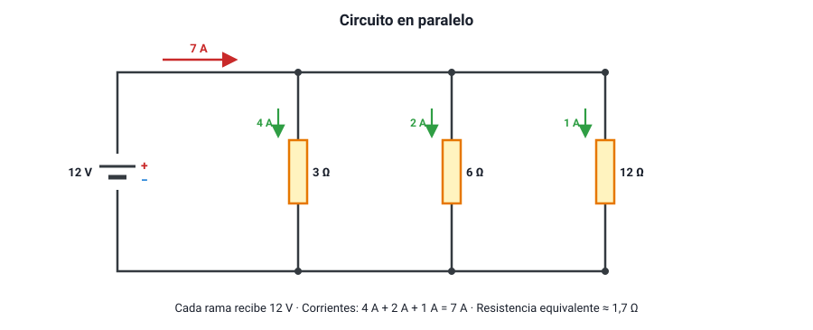

## 6. Circuitos en paralelo

### a. Qué es una conexión en paralelo

Dos o más elementos están **en paralelo** cuando están conectados **entre los mismos dos puntos**, cada uno en su propia **rama**. La corriente que llega a un punto de unión (un **nodo**) se divide entre las ramas y vuelve a juntarse en el otro nodo.

<figure><figcaption>Figura 5. Circuito en paralelo: todas las ramas tienen el mismo voltaje y sus corrientes se suman. Diagrama propio.</figcaption></figure>

### b. Las tres reglas del circuito en paralelo

| Magnitud | Regla | Por qué |
|---|---|---|
| **Voltaje** | Es el **mismo** en todas las ramas: *V* = *V*1 = *V*2 = *V*3 | Todas están conectadas directamente a los mismos dos puntos |
| **Corriente** | La corriente total **se reparte** entre las ramas: *I* = *I*1 + *I*2 + *I*3 | La carga que llega a un nodo es igual a la que sale de él |
| **Resistencia equivalente** | Se suman los **inversos**: 1/*R*eq = 1/*R*1 + 1/*R*2 + 1/*R*3 | Cada rama agrega un camino más para la corriente |

La resistencia equivalente en paralelo es siempre **menor** que la menor de las resistencias. Por eso, al agregar ramas en paralelo, la corriente **total** que entrega la fuente **aumenta**.

Por cada rama circula una corriente **inversamente proporcional a su resistencia** (*I*i = *V* / *R*i): la rama de menor resistencia se lleva la mayor corriente.

::: nota
**Dos atajos útiles.**
- Para **dos** resistencias en paralelo: *R*eq = (*R*1 · *R*2) / (*R*1 + *R*2) («producto sobre suma»).
- Para ***n* resistencias iguales** de valor *R* en paralelo: *R*eq = *R* / *n*. Dos resistencias de 10 Ω en paralelo equivalen a 5 Ω.
:::

::: ejemplo
**Resolver un circuito en paralelo (figura 5).** Una pila de 12 V alimenta tres ramas con resistencias de 3 Ω, 6 Ω y 12 Ω.

1. Voltaje en cada rama: **12 V**.
2. Corrientes: 12/3 = **4 A**, 12/6 = **2 A** y 12/12 = **1 A**.
3. Corriente total: 4 + 2 + 1 = **7 A**.
4. Resistencia equivalente: *R*eq = 12 V / 7 A ≈ **1,7 Ω**. Con la fórmula: 1/*R*eq = 1/3 + 1/6 + 1/12 = 4/12 + 2/12 + 1/12 = 7/12, así que *R*eq = 12/7 ≈ 1,7 Ω. Es menor que 3 Ω, la menor de las tres.
:::

### c. Ampolletas en paralelo

- **Si una se quema, las demás siguen encendidas.** Cada ampolleta tiene su propio camino.
- **Al agregar más ampolletas iguales, cada una brilla igual que antes**, porque cada una sigue recibiendo el voltaje completo de la fuente. Lo que aumenta es la corriente **total** que entrega la fuente, y por eso una pila se agota más rápido.

### d. La instalación de una casa es en paralelo

Todos los enchufes y ampolletas de una casa están conectados **en paralelo**. Por eso:

- todos los artefactos reciben los mismos **220 V**, sin importar cuántos haya encendidos;
- se puede encender o apagar cada uno por separado;
- cada artefacto que se enciende **agrega corriente** al total que circula por los cables principales.

Esto último tiene una consecuencia importante: si se conectan muchos artefactos a la vez en un mismo circuito —con una **zapatilla** o alargador lleno—, la corriente total puede superar lo que soportan los cables. Es una **sobrecarga**, y el interruptor automático del tablero existe para cortarla (sección 10).

::: tip
**Serie contra paralelo: la tabla que conviene recordar.**

| | Serie | Paralelo |
|---|---|---|
| Se reparte… | El voltaje | La corriente |
| Es igual en todos… | La corriente | El voltaje |
| Resistencia equivalente | Mayor que la mayor | Menor que la menor |
| Al agregar un elemento, la corriente total… | Disminuye | Aumenta |
| Si un elemento se abre… | Todo se apaga | Los demás siguen |
:::
