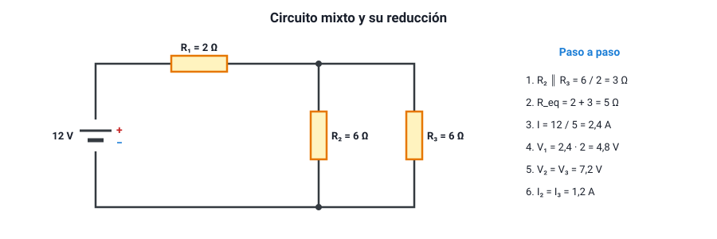

## 7. Circuitos mixtos

### a. Qué es un circuito mixto

Un **circuito mixto** combina conexiones en serie y en paralelo. Para resolverlo no hace falta ninguna regla nueva: se aplican las de serie y paralelo **por partes**, reduciendo el circuito paso a paso hasta una sola resistencia equivalente, y luego se vuelve atrás para encontrar las corrientes y los voltajes de cada elemento.

### b. El procedimiento

1. **Identificar** grupos de resistencias que estén claramente en serie (un solo camino entre ellas, sin ramificaciones) o en paralelo (conectadas entre los mismos dos nodos).
2. **Reemplazar** cada grupo por su resistencia equivalente. Repetir hasta que quede una sola resistencia.
3. **Calcular la corriente total** con la ley de Ohm: *I* = *V* / *R*eq.
4. **Volver atrás**, deshaciendo las reducciones: en los tramos en serie, la corriente es la misma; en los tramos en paralelo, el voltaje es el mismo.

<figure><figcaption>Figura 6. Circuito mixto y su reducción paso a paso. Diagrama propio.</figcaption></figure>

::: ejemplo
**Resolver el circuito de la figura 6.** Una pila de 12 V alimenta un resistor *R*1 = 2 Ω en serie con un grupo de dos resistores de 6 Ω en paralelo (*R*2 y *R*3).

1. **Paralelo**: dos resistencias iguales de 6 Ω → 6 / 2 = **3 Ω**.
2. **Serie**: 2 Ω + 3 Ω = **5 Ω** (resistencia equivalente total).
3. **Corriente total**: *I* = 12 V / 5 Ω = **2,4 A**. Esta es la corriente que pasa por *R*1.
4. **Voltaje en *R*1**: 2,4 · 2 = **4,8 V**.
5. **Voltaje en el grupo en paralelo**: 2,4 · 3 = **7,2 V** (también 12 − 4,8 = 7,2 V). Ese voltaje es el mismo para *R*2 y *R*3.
6. **Corriente por *R*2 y por *R*3**: 7,2 / 6 = **1,2 A** cada una. Comprobación: 1,2 + 1,2 = 2,4 A, la corriente total.
:::

### c. Razonar sin calcular: qué pasa si se cambia algo

La PAES pregunta a menudo qué ocurre con el brillo de las ampolletas o las lecturas de los instrumentos cuando se abre un interruptor, se agrega una rama o se quema un elemento. El razonamiento sigue siempre la misma cadena:

**cambio en el circuito → cambio en la resistencia equivalente → cambio en la corriente total → cambio en cada parte.**

::: ejemplo
**Se quema *R*3 en el circuito de la figura 6.**

- El grupo en paralelo queda solo con *R*2: su resistencia sube de 3 Ω a **6 Ω**.
- La resistencia total sube de 5 Ω a 2 + 6 = **8 Ω**.
- La corriente total **baja** de 2,4 A a 12 / 8 = **1,5 A**: *R*1 recibe menos corriente y, si fuera una ampolleta, **brillaría menos**.
- El voltaje en *R*1 baja a 1,5 · 2 = 3 V, así que el voltaje en *R*2 **sube** a 12 − 3 = **9 V**, y su corriente sube de 1,2 A a 9 / 6 = **1,5 A**: *R*2 **brillaría más**.

Es un resultado que sorprende: al quemarse una ampolleta, otra del circuito se enciende con más fuerza.
:::

::: tip
**Cortocircuito en una parte del circuito.** Si un cable sin resistencia conecta los dos extremos de un elemento, la corriente pasa toda por el cable y **nada** por ese elemento, que se apaga. El resto del circuito ve disminuir su resistencia total, y la corriente aumenta. Si el cable conecta directamente los dos polos de la fuente, la resistencia total es casi cero y la corriente se dispara: es un **cortocircuito** de la fuente, que puede calentar los cables hasta fundirlos.
:::
