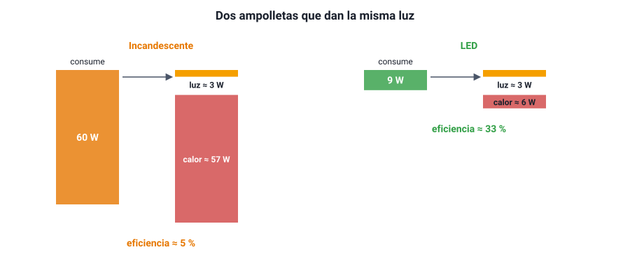

## 9. Consumo y eficiencia energética

### a. Qué es la eficiencia

Ningún artefacto transforma toda la energía eléctrica que recibe en la forma de energía que nos interesa. Una ampolleta quiere producir **luz**, pero parte de la energía se va en **calor**; un motor quiere producir **movimiento**, pero también se calienta y hace ruido. La **eficiencia** (*η*) mide qué fracción de la energía consumida se aprovecha:

<strong><em>η</em> = energía útil / energía consumida = potencia útil / potencia consumida</strong>

Se expresa como fracción o como porcentaje, y siempre es **menor que 1 (100 %)**. La energía que no se aprovecha **no desaparece**: se transforma en formas no deseadas, casi siempre calor.

<figure><figcaption>Figura 7. Dos ampolletas que dan aproximadamente la misma luz. La incandescente convierte en luz alrededor del 5 % de la energía; la LED, varias veces más. Valores aproximados. Diagrama propio.</figcaption></figure>

::: ejemplo
**Comparar ampolletas.** Una ampolleta incandescente de 60 W y una LED de 9 W dan aproximadamente la misma luz. Si ambas producen unos 3 W de luz:

- Eficiencia de la incandescente: 3 / 60 = **5 %**. El resto, 57 W, se va en calor: por eso quema al tocarla.
- Eficiencia de la LED: 3 / 9 ≈ **33 %**.

Cambiar una por otra, con 5 horas de uso diario, ahorra (60 − 9) W · 5 h · 30 días ≈ **7,7 kWh al mes** por cada ampolleta.
:::

### b. Qué consume más en una casa

La energía consumida depende de **potencia por tiempo de uso**. Algunos valores típicos:

| Artefacto | Potencia típica | Observación |
|---|---|---|
| Hervidor eléctrico | 1 500 – 2 200 W | Mucha potencia, pero poco tiempo |
| Estufa eléctrica | 1 000 – 2 000 W | Puede ser el mayor gasto en invierno |
| Horno microondas | 800 – 1 200 W | |
| Plancha | 1 000 – 1 500 W | |
| Refrigerador | 100 – 200 W (en promedio) | Poca potencia, pero funciona todo el día |
| Televisor LED | 50 – 150 W | |
| Computador portátil | 30 – 60 W | |
| Ampolleta LED | 5 – 12 W | Reemplaza a una incandescente de 40 a 100 W |
| Cargador de celular | 5 – 20 W | |

**El consumo en espera (*stand-by*).** Muchos artefactos siguen consumiendo energía cuando están «apagados» con el control remoto: la luz roja del televisor, el decodificador, el cargador enchufado sin celular. Cada uno gasta pocos watt, pero durante las 24 horas del día y todos los días del año. Desenchufarlos, o usar una zapatilla con interruptor, reduce la cuenta.

### c. La etiqueta de eficiencia energética

En Chile, la Superintendencia de Electricidad y Combustibles (**SEC**) exige que refrigeradores, lavadoras, ampolletas, televisores, hornos microondas y otros artefactos lleven una **etiqueta de eficiencia energética**. La etiqueta:

- clasifica el artefacto con **letras y colores**, desde la clase más eficiente (verde, con la letra A o A con signos «+») hasta la menos eficiente (rojo);
- informa su **consumo de energía**, normalmente en **kWh por año** o por ciclo de uso.

Entre dos refrigeradores del mismo tamaño, el de mejor clase puede consumir bastante menos energía al año, y esa diferencia se paga en cada cuenta de luz durante toda la vida útil del artefacto.

::: tip
**Potencia alta no significa ineficiente.** Un hervidor de 2 000 W es muy **eficiente**: casi toda su energía termina calentando el agua. Lo que indica la eficiencia es qué **fracción** de la energía se aprovecha, no cuánta energía se usa por segundo. Y la etiqueta compara artefactos **del mismo tipo**: no tiene sentido comparar la clase de un refrigerador con la de una lavadora.
:::

### d. Por qué importa

Ahorrar energía eléctrica no solo reduce la cuenta. Una parte de la electricidad de Chile todavía se genera quemando carbón, gas o petróleo, que emiten gases de efecto invernadero. Consumir menos, y usar artefactos más eficientes, reduce esas emisiones y la necesidad de construir nuevas centrales.

Medidas simples y efectivas: cambiar ampolletas incandescentes por LED; elegir artefactos de mejor clase energética; no dejar artefactos en espera; usar el hervidor solo con el agua necesaria; no abrir el refrigerador más de lo necesario, y alejarlo de fuentes de calor.
