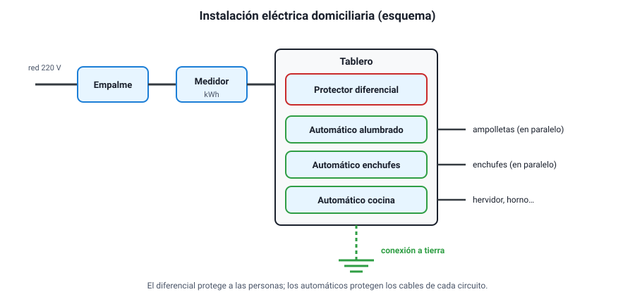

## 10. La instalación eléctrica domiciliaria

### a. De la calle al enchufe

La electricidad llega a una casa desde la red de distribución y recorre un camino con componentes que cumplen funciones precisas:

<figure><figcaption>Figura 8. Componentes principales de una instalación eléctrica domiciliaria. Esquema simplificado. Diagrama propio.</figcaption></figure>

| Componente | Función |
|---|---|
| **Empalme** | Conexión entre la red de la empresa distribuidora y la instalación de la casa |
| **Medidor** | Registra la energía consumida, en **kWh**; con él se calcula la cuenta |
| **Tablero eléctrico** | Caja donde están los dispositivos de protección y desde donde se reparten los circuitos |
| **Interruptor termomagnético (automático)** | Corta un circuito ante una **sobrecarga** o un **cortocircuito**; protege los **cables** y la instalación |
| **Protector diferencial** | Corta el circuito si detecta una **fuga de corriente**, por ejemplo, a través de una persona; protege a las **personas** |
| **Conexión a tierra (tierra de protección)** | Conductor que une las carcasas metálicas de los artefactos con un electrodo enterrado; lleva a tierra la corriente de una falla |
| **Circuitos** | Ramas separadas (alumbrado, enchufes, cocina, etc.), cada una con su propio automático |
| **Interruptores** | Abren o cierran un circuito de alumbrado; van en serie con la ampolleta que controlan |
| **Enchufes** | Puntos de conexión de los artefactos, todos en paralelo. En Chile se usa el enchufe de tres espigas en línea, cuya espiga central es la tierra |

En Chile, la red domiciliaria entrega corriente alterna de **220 V** y **50 Hz**. Las instalaciones deben cumplir el reglamento de seguridad de instalaciones de consumo del Ministerio de Energía y sus pliegos técnicos (**RIC**), vigentes desde 2021. Una instalación nueva debe ser ejecutada y declarada ante la **SEC** por un **instalador eléctrico autorizado**.

### b. Por qué los artefactos van en paralelo

Como se vio en la sección 6, en paralelo cada artefacto recibe los **220 V** completos y funciona de manera independiente: encender el hervidor no hace que la luz se atenúe (idealmente), y apagar la televisión no apaga el refrigerador. Si los artefactos estuvieran en serie, se repartirían el voltaje, ninguno funcionaría bien y apagar uno los apagaría a todos.

### c. Sobrecarga y cortocircuito

Son las dos fallas contra las que protege el **interruptor termomagnético**:

| Falla | Qué pasa | Cómo actúa el automático |
|---|---|---|
| **Sobrecarga** | Se conectan demasiados artefactos al mismo circuito; la suma de sus corrientes supera lo que soportan los cables, que se calientan (efecto Joule) | Su parte **térmica** (una lámina que se curva al calentarse) corta el circuito después de algunos segundos o minutos |
| **Cortocircuito** | Los conductores se tocan directamente, sin pasar por un artefacto; la resistencia cae casi a cero y la corriente se dispara | Su parte **magnética** (una bobina que atrae un contacto) corta el circuito en milésimas de segundo |

::: ejemplo
**¿Salta el automático?** Un circuito de enchufes está protegido por un automático de 16 A. En él se conectan a la vez un hervidor de 2 000 W, un microondas de 1 100 W y una estufa de 1 500 W, todos a 220 V.

- Potencia total: 2 000 + 1 100 + 1 500 = **4 600 W**.
- Corriente total (están en paralelo, las corrientes se suman): *I* = 4 600 / 220 ≈ **20,9 A**.

Como 20,9 A supera los 16 A del automático, **el automático se desconecta**. La solución no es cambiarlo por uno mayor —los cables podrían no resistir esa corriente—, sino repartir los artefactos entre distintos circuitos.
:::

Antes de los automáticos se usaban **fusibles**: un alambre delgado, en serie con el circuito, que se funde cuando la corriente supera cierto valor. Cumplen la misma función, pero hay que reemplazarlos cada vez que actúan.

### d. El protector diferencial y la conexión a tierra

Estos dos componentes protegen a las **personas**, no a la instalación.

- **Conexión a tierra.** Si un cable interno de una lavadora se suelta y toca la carcasa metálica, la carcasa queda «energizada». Sin tierra, quien la toque se convierte en el camino de la corriente hacia el suelo. Con tierra, la corriente de la falla se va por el conductor de protección, que tiene mucho menos resistencia que el cuerpo. Por eso existe la tercera espiga del enchufe.
- **Protector diferencial.** Compara la corriente que **sale** por un conductor con la que **vuelve** por el otro. Si son iguales, todo está bien. Si difieren en más de un umbral pequeño —**30 mA** en las casas—, significa que parte de la corriente se está escapando por otro camino (la tierra o una persona), y el diferencial corta el circuito en una fracción de segundo.

::: tip
**Qué protege cada uno.** El automático protege contra corrientes **grandes** (sobrecarga, cortocircuito), pero **no** detecta una fuga de pocos miliampere a través de una persona: para él, 30 mA es nada. Esa es la función del diferencial. Por eso una instalación segura necesita **los dos**, y además la conexión a tierra.
:::

### e. La corriente y el cuerpo humano

Lo que daña al cuerpo es la **corriente** que lo atraviesa. Los efectos aproximados de la corriente alterna de 50 Hz, según su intensidad:

| Corriente a través del cuerpo | Efecto aproximado |
|---|---|
| Alrededor de 1 mA | Umbral de percepción: se siente un cosquilleo |
| Alrededor de 10 mA | Contracción muscular: la persona puede no ser capaz de soltar el cable |
| 25 – 30 mA | Dificultad para respirar; riesgo grave si se prolonga |
| Del orden de 100 mA | Riesgo de fibrilación del corazón, potencialmente mortal |

(Los umbrales varían según la persona, el recorrido de la corriente y el tiempo de exposición.)

El umbral del diferencial, 30 mA, se eligió justamente para cortar antes de llegar a las corrientes más peligrosas. Y la ley de Ohm explica por qué el agua es tan riesgosa: con la piel mojada, la resistencia del cuerpo baja mucho y, con los mismos 220 V, la corriente sube.

**Medidas básicas de seguridad:** no manipular artefactos ni enchufes con las manos mojadas; no usar alargadores sobrecargados ni cables con el aislante dañado; desconectar el automático antes de cambiar una lámpara o un enchufe; no reemplazar un automático por otro de mayor capacidad sin revisar los cables; y dejar las reparaciones de la instalación a un instalador autorizado.
