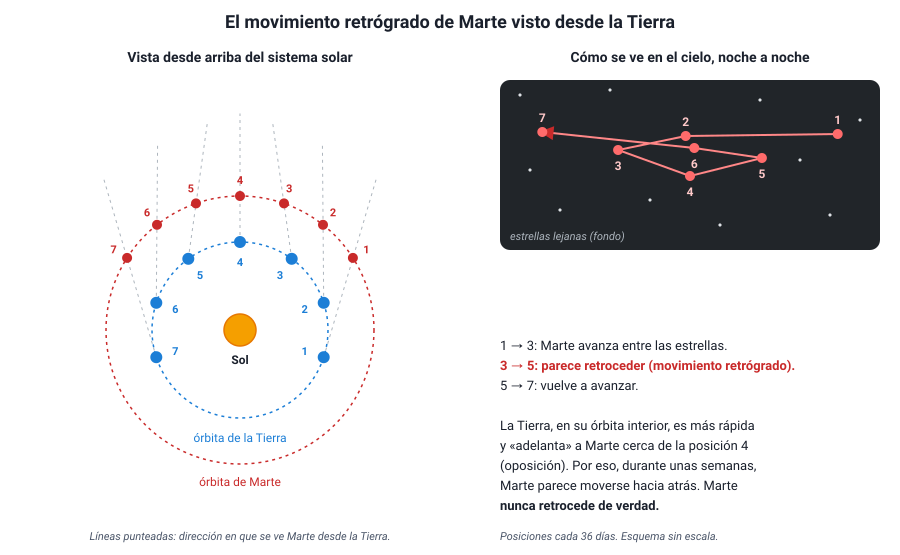

## 2. El cielo visto desde la Tierra

Antes del telescopio, toda la astronomía se hacía mirando el cielo a simple vista y anotando con cuidado las posiciones de los astros. Los modelos que vas a estudiar en este capítulo intentaban explicar **esas observaciones**, así que conviene saber qué se ve.

::: nota
**Qué es un modelo científico.** Un modelo es una representación simplificada de la realidad que sirve para **explicar** lo observado y **predecir** lo que se observará. Un buen modelo no es «el verdadero», sino el que explica más observaciones con menos supuestos y cuyas predicciones se cumplen. Cuando aparece una evidencia que un modelo no explica, se corrige o se reemplaza. Esa es la idea central de este capítulo.
:::

### a. El movimiento diario

Cada día, el Sol, la Luna y las estrellas **salen por el este, cruzan el cielo y se ponen por el oeste**. Las estrellas parecen pegadas a una gran esfera, la **esfera celeste**, que gira alrededor de la Tierra en poco menos de un día (23 h 56 min), y mantienen entre ellas siempre la misma distribución: las constelaciones no cambian de forma. Por eso los antiguos las llamaron **estrellas fijas**.

Hay dos maneras de explicar esta observación: que la esfera de las estrellas gire en torno a una Tierra inmóvil, o que la **Tierra rote** sobre su eje de oeste a este. Las dos predicen exactamente lo mismo para el movimiento diario. Ver el Sol «salir» no prueba que el Sol se mueva: es un problema de **sistema de referencia**, como el del capítulo 5.

### b. El movimiento anual del Sol

Si se observa a la misma hora cada noche, las estrellas salen unos 4 minutos más temprano cada día, y en unos meses se ven constelaciones distintas. Visto contra el fondo de estrellas, el **Sol recorre en un año** una franja del cielo (la eclíptica), pasando por las constelaciones del zodiaco. A lo largo del año también cambia la altura del Sol a mediodía y la duración del día: son las **estaciones**.

::: tip
**Las estaciones no se deben a la distancia al Sol.** La Tierra está más cerca del Sol a comienzos de enero (unos 147 millones de km) y más lejos a comienzos de julio (unos 152 millones de km), y la diferencia es de apenas un 3 %. Además, cuando en Chile es verano, en el hemisferio norte es invierno. La causa es la **inclinación del eje de la Tierra** (unos 23,4°): durante una parte del año cada hemisferio recibe los rayos del Sol de forma más directa y por más horas.
:::

### c. Los planetas y el movimiento retrógrado

Cinco puntos brillantes no se comportan como las estrellas fijas: **Mercurio, Venus, Marte, Júpiter y Saturno** cambian lentamente de posición respecto de las constelaciones. Por eso los griegos los llamaron *planetas*, que significa «errantes». Dos detalles de su movimiento fueron el gran desafío para todos los modelos:

1. **Mercurio y Venus nunca se alejan mucho del Sol.** Se ven solo al atardecer o al amanecer; Venus es el «lucero» de la tarde o de la mañana.
2. **Movimiento retrógrado.** Normalmente los planetas avanzan de oeste a este entre las estrellas, pero de vez en cuando se detienen, **retroceden** durante algunas semanas y luego vuelven a avanzar, dibujando un lazo. Marte lo hace cada unos 26 meses, durante unos dos meses, y justo en esas fechas se ve **más brillante**.

<figure><figcaption>Figura 1. El movimiento retrógrado de Marte explicado con el modelo heliocéntrico: cuando la Tierra lo adelanta, Marte parece retroceder. Diagrama propio.</figcaption></figure>

Cualquier modelo del universo debía explicar el movimiento retrógrado. Como verás, el geocéntrico lo hizo con un mecanismo complicado (los epiciclos), y el heliocéntrico lo explicó de forma natural: es un **efecto de perspectiva**, igual que cuando un auto adelanta a otro en la carretera y, visto desde el más rápido, el más lento parece ir hacia atrás respecto del paisaje lejano.

::: tip
**El retroceso es aparente.** Ningún planeta invierte su movimiento alrededor del Sol. Lo que cambia es la **dirección en que lo vemos** desde una Tierra que también se mueve. Una pregunta típica pide explicar por qué el retrógrado ocurre cuando Marte está más brillante: es el momento en que la Tierra pasa entre el Sol y Marte, y los dos planetas están más cerca.
:::
