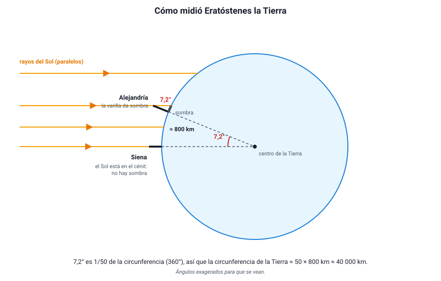
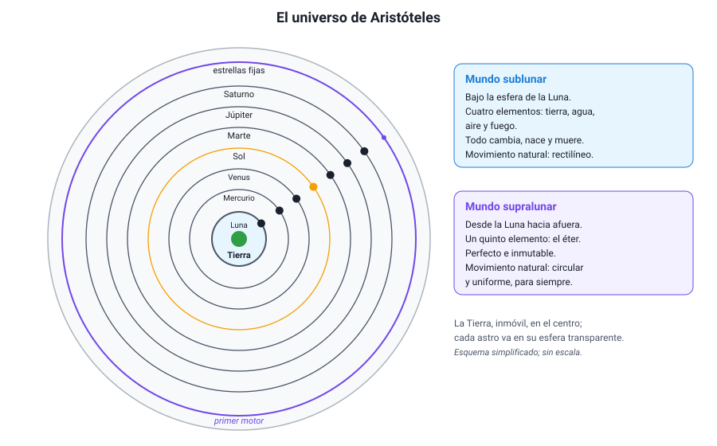
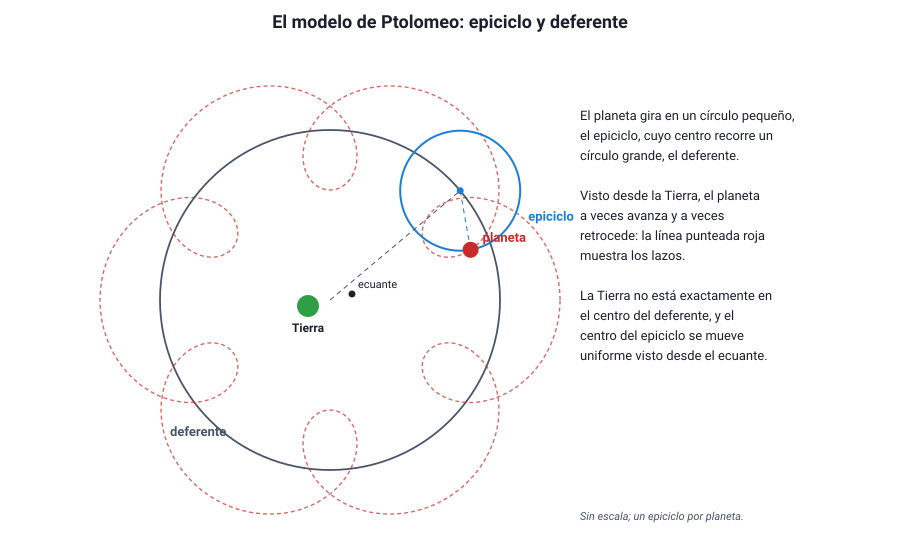

## 3. Los modelos geocéntricos

Durante unos dos mil años, la explicación aceptada fue que la **Tierra está inmóvil en el centro del universo** y que todo gira a su alrededor. No era una idea ingenua: era coherente con lo que se veía y con lo que se sabía de física en ese tiempo, y permitía predecir con bastante precisión las posiciones de los astros.

### a. Una Tierra esférica

Los griegos ya sabían que la Tierra es **esférica**, casi dos mil años antes de que alguien la rodeara navegando. Aristóteles (384–322 a. C.) reunió varias evidencias:

- En los **eclipses de Luna**, la sombra de la Tierra sobre la Luna es siempre un arco de circunferencia. Solo una esfera da una sombra circular en cualquier posición.
- Cuando un barco se aleja, **desaparece primero el casco** y después las velas, como si bajara tras una curva.
- Al viajar hacia el norte o hacia el sur, **cambian las estrellas visibles**: algunas aparecen sobre el horizonte y otras desaparecen.

Hacia el año 240 a. C., **Eratóstenes**, en Alejandría, midió el tamaño de la Tierra con geometría. Sabía que al mediodía del solsticio el Sol quedaba en el cénit en Siena (hoy Asuán), porque iluminaba el fondo de los pozos, mientras que en Alejandría, al norte, una varilla vertical daba una sombra que correspondía a un ángulo de unos 7,2°.

<figure><figcaption>Figura 2. El método de Eratóstenes: con rayos solares paralelos, el ángulo de la sombra en Alejandría es igual al ángulo en el centro de la Tierra entre las dos ciudades. Diagrama propio.</figcaption></figure>

::: ejemplo
**Medir la Tierra con una sombra.** Si los rayos del Sol llegan paralelos, el ángulo de la sombra en Alejandría (7,2°) es igual al ángulo que separa a ambas ciudades visto desde el centro de la Tierra. La distancia entre ellas era de unos 800 km (5 000 estadios, en la unidad de la época).

- Fracción de la circunferencia: 7,2° / 360° = 1/50.
- Circunferencia de la Tierra: 50 × 800 km = **40 000 km**.

El valor actual es de unos 40 000 km. No se sabe con exactitud cuánto medía el estadio que usó Eratóstenes, así que la precisión de su resultado se discute, pero el método es impecable.
:::

### b. El universo de Aristóteles

Aristóteles tomó el modelo de esferas de Eudoxo y lo convirtió en una descripción física del universo:

- La **Tierra, inmóvil**, está en el centro. A su alrededor giran, cada uno en una esfera transparente, la Luna, Mercurio, Venus, el Sol, Marte, Júpiter y Saturno. Más allá está la esfera de las **estrellas fijas**.
- El universo se divide en dos regiones. Bajo la esfera de la Luna está el **mundo sublunar**, hecho de cuatro elementos (tierra, agua, aire y fuego), donde todo cambia, nace y muere, y donde el movimiento natural es rectilíneo: lo pesado cae hacia el centro y lo liviano sube. Desde la Luna hacia afuera está el **mundo supralunar**, hecho de un quinto elemento, el éter, **perfecto e inmutable**, donde el único movimiento natural es el **circular uniforme**.

<figure><figcaption>Figura 3. El universo de Aristóteles: esferas concéntricas en torno a una Tierra inmóvil, con un mundo sublunar cambiante y un mundo supralunar perfecto. Diagrama propio, simplificado.</figcaption></figure>

¿Por qué pensaba que la Tierra no se mueve? Sus argumentos eran razonables con lo que se sabía:

1. **No sentimos ningún movimiento**: si la Tierra girara, un objeto lanzado hacia arriba debería caer atrás, y habría un viento constante.
2. **No se observa paralaje estelar**: si la Tierra diera vueltas alrededor del Sol, las estrellas cercanas deberían cambiar un poco de posición respecto de las lejanas a lo largo del año, y eso no se veía.

::: tip
**El argumento de la paralaje era correcto, pero la conclusión no.** La paralaje estelar **sí existe**, pero es tan pequeña, porque las estrellas están lejísimos, que recién se midió en 1838, con telescopio (Friedrich Bessel). Es un buen ejemplo de cómo la falta de una observación puede deberse a que los instrumentos no son suficientemente precisos, no a que el fenómeno no exista.
:::

Ya en la Antigüedad hubo una alternativa: **Aristarco de Samos** (siglo III a. C.) propuso que el Sol, al que estimó mucho más grande que la Tierra, estaba en el centro y que la Tierra giraba a su alrededor. Para explicar la falta de paralaje, supuso que las estrellas estaban muy lejos. Su idea tuvo poco eco durante casi dos mil años.

### c. El sistema de Ptolomeo

El modelo de esferas no explicaba bien el movimiento retrógrado ni los cambios de brillo de los planetas. Hacia el año 150 d. C., **Claudio Ptolomeo**, en Alejandría, reunió y perfeccionó el trabajo de astrónomos anteriores en un gran tratado, conocido por su nombre árabe: el **Almagesto**. Su modelo seguía siendo geocéntrico y usaba solo movimientos circulares, pero los combinaba:

- **Epiciclo**: cada planeta gira en un círculo pequeño.
- **Deferente**: el centro del epiciclo recorre un círculo grande alrededor de la Tierra.
- **Excéntrica**: la Tierra no está exactamente en el centro del deferente.
- **Ecuante**: el centro del epiciclo se mueve con rapidez angular constante vista desde un punto especial, el ecuante, y no desde el centro.

<figure><figcaption>Figura 4. En el modelo de Ptolomeo, la combinación de epiciclo y deferente produce lazos: vistos desde la Tierra, el planeta a veces avanza y a veces retrocede. Diagrama propio.</figcaption></figure>

Con estos mecanismos, cuando el planeta está en la parte interior de su epiciclo, su movimiento sobre el epiciclo va en sentido contrario al del deferente y, visto desde la Tierra, **retrocede**; además está más cerca, y por eso se ve **más brillante**. Es decir, el modelo explicaba las dos observaciones a la vez.

El sistema de Ptolomeo **predecía bastante bien** las posiciones de los planetas y se usó durante unos 1 400 años. Su debilidad era otra: necesitaba ajustes distintos para cada planeta y no explicaba **por qué**, por ejemplo, Mercurio y Venus siempre acompañan al Sol; había que imponerlo alineando sus epiciclos con el Sol.

::: tip
**Un modelo equivocado puede predecir bien.** El éxito de Ptolomeo muestra que predecir correctamente no basta para que un modelo sea verdadero: con suficientes ajustes, casi cualquier modelo reproduce los datos. Lo que termina decidiendo entre modelos son las **observaciones nuevas** que uno explica y el otro no (como las fases de Venus, en la sección 5) y la **simplicidad** de la explicación.
:::
