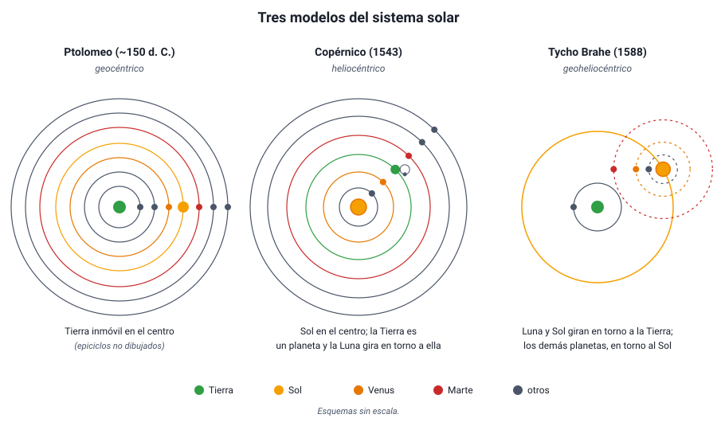

## 4. El modelo heliocéntrico

### a. La propuesta de Copérnico

**Nicolás Copérnico** (1473–1543), un astrónomo y clérigo polaco, retomó la idea de Aristarco y la desarrolló matemáticamente. Su libro *De revolutionibus orbium coelestium* («Sobre las revoluciones de las esferas celestes») se publicó en **1543**, el año de su muerte. Sus afirmaciones principales:

- El **Sol** está inmóvil cerca del centro del universo.
- La **Tierra es un planeta más**: gira alrededor del Sol en un año y rota sobre su eje en un día. El movimiento diario del cielo es un efecto de esa rotación.
- La **Luna** es el único astro que gira alrededor de la Tierra.
- El orden de los planetas desde el Sol es Mercurio, Venus, Tierra, Marte, Júpiter y Saturno, y **mientras más lejos está un planeta, más tarda en dar una vuelta**.
- Las estrellas están tan lejos que su paralaje no se puede observar.

<figure><figcaption>Figura 5. Tres modelos del sistema solar. Los tres explicaban el movimiento retrógrado; se diferenciaban en qué cuerpo ocupa el centro. Diagrama propio.</figcaption></figure>

Pero Copérnico conservó una idea antigua: los astros se mueven en **círculos perfectos con rapidez uniforme**. Como las órbitas reales no son círculos, para ajustar sus predicciones tuvo que seguir usando **epiciclos** pequeños. Por eso su modelo no era más preciso que el de Ptolomeo, ni mucho más simple en los cálculos.

### b. Qué explicaba mejor

La ventaja del modelo heliocéntrico no estaba en la precisión, sino en que explicaba de manera **natural** lo que el geocéntrico tenía que imponer:

| Observación | Modelo geocéntrico (Ptolomeo) | Modelo heliocéntrico (Copérnico) |
|---|---|---|
| Movimiento retrógrado | Epiciclos ajustados para cada planeta | Efecto de perspectiva cuando la Tierra adelanta a un planeta exterior o es adelantada por uno interior |
| Los planetas se ven más brillantes al retroceder | El planeta está en la parte interior de su epiciclo | En ese momento la Tierra y el planeta están más cerca |
| Mercurio y Venus nunca se alejan mucho del Sol | Hay que alinear sus epiciclos con el Sol, sin razón | Sus órbitas están dentro de la de la Tierra |
| Orden y distancias de los planetas | Arbitrarios | Se calculan: los planetas más lejanos tienen períodos más largos |
| Ausencia de paralaje estelar | La Tierra no se mueve | Las estrellas están muy lejos (confirmado en 1838) |

::: ejemplo
**Calcular una distancia con el modelo heliocéntrico.** Venus nunca se aleja más de unos 46° del Sol en el cielo. En el modelo heliocéntrico, esa separación máxima ocurre cuando la línea de visión desde la Tierra es **tangente** a la órbita de Venus, y el triángulo Sol–Venus–Tierra tiene un ángulo recto en Venus. Entonces:

distancia Sol–Venus = distancia Sol–Tierra × sen 46° ≈ 1 UA × 0,72 = **0,72 UA**.

Con razonamientos así, Copérnico calculó las distancias relativas de los planetas al Sol, muy cerca de los valores actuales. En el modelo de Ptolomeo, esas distancias no se podían deducir.
:::

::: tip
**Heliocéntrico no significa «el Sol es el centro del universo».** Hoy sabemos que el Sol es el centro del **sistema solar**, pero es una estrella más entre cientos de miles de millones de la Vía Láctea, y gira alrededor del centro de la galaxia. En la PAES, «modelo heliocéntrico» se refiere al sistema solar.
:::

### c. Tycho Brahe: medir mejor

Para decidir entre modelos que predicen casi lo mismo, hacían falta **mejores datos**. El danés **Tycho Brahe** (1546–1601) construyó, antes de que existiera el telescopio, los instrumentos más precisos de su época, en su observatorio de la isla de Hven. Durante unos veinte años midió las posiciones de los planetas con un error de alrededor de **1 minuto de arco** (1/60 de grado, unas 30 veces menos que el tamaño aparente de la Luna llena).

Dos observaciones suyas golpearon la idea de un cielo inmutable:

- En **1572** apareció una «estrella nueva» en la constelación de Casiopea (hoy se sabe que era una supernova). Tycho mostró que no tenía paralaje diaria, así que estaba **más allá de la Luna**: el mundo supralunar sí cambia.
- En **1577** estudió un gran cometa y demostró que también estaba más lejos que la Luna y que atravesaba las regiones de los planetas, lo que era imposible si existieran esferas sólidas.

Aun así, Tycho no aceptó que la Tierra se moviera, porque tampoco observaba paralaje estelar. Propuso un modelo intermedio, **geoheliocéntrico** (1588): la Luna y el Sol giran alrededor de la Tierra inmóvil, y los demás planetas giran alrededor del Sol. Geométricamente, este modelo explica las mismas observaciones que el de Copérnico.

::: tip
**Cuidado con la trampa de las fases de Venus.** Las fases de Venus que observó Galileo (sección 5) refutan el modelo de **Ptolomeo**, pero **no** el de Tycho, en el que Venus también gira alrededor del Sol. Una pregunta de tipo Evaluar puede preguntar justamente qué modelo queda descartado por una observación.
:::
