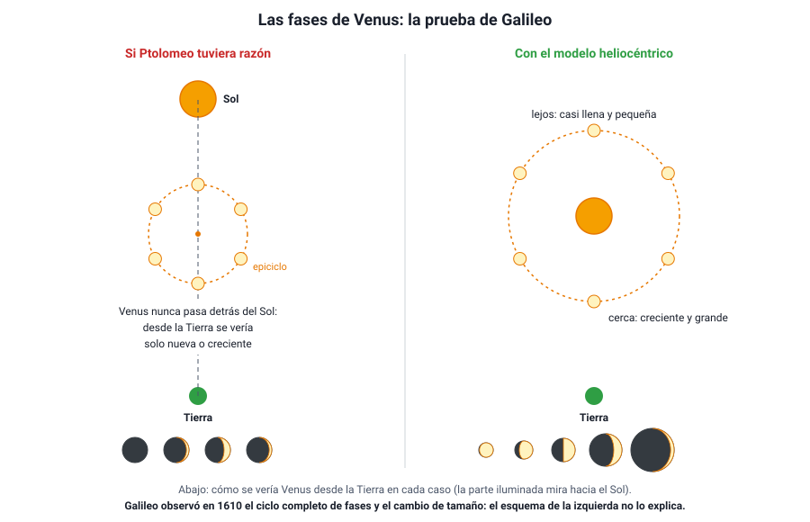

## 5. Galileo y el telescopio

### a. Un instrumento nuevo

**Galileo Galilei** (1564–1642) no inventó el telescopio: los primeros se fabricaron en los Países Bajos en 1608. Pero al enterarse de su existencia construyó los suyos, llegó a unos 20 a 30 aumentos, y a fines de **1609** fue de los primeros en apuntarlo sistemáticamente al cielo. En marzo de **1610** publicó sus primeros descubrimientos en un pequeño libro, *Sidereus Nuncius* («El mensajero sideral»).

La importancia de Galileo para la ciencia no está solo en lo que vio, sino en **cómo** trabajó: usó un instrumento para **ampliar los sentidos**, registró sus observaciones durante semanas, las dibujó y midió, y las usó como **evidencia** para poner a prueba los modelos. Es un ejemplo temprano de lo que hoy llamamos método científico.

### b. Lo que vio y qué significaba

| Observación | Qué mostraba | Contra qué idea |
|---|---|---|
| **Montañas y cráteres en la Luna**; midió su altura por el largo de sus sombras | La Luna es un mundo irregular, parecido a la Tierra | La perfección del mundo supralunar (Aristóteles) |
| **Manchas solares** que se mueven sobre el disco del Sol | El Sol tiene «imperfecciones» y rota sobre su eje | La perfección e inmutabilidad del cielo |
| La **Vía Láctea** se resuelve en innumerables estrellas | Hay muchas más estrellas de las que se ven a simple vista; el universo es mucho mayor | La idea de un cosmos pequeño y cerrado |
| **Cuatro lunas que giran alrededor de Júpiter** (enero de 1610) | Existen cuerpos que giran en torno a **otro** centro que no es la Tierra; un planeta en movimiento puede llevar lunas consigo | Que todo gira en torno a la Tierra; que una Tierra en movimiento «perdería» a su Luna |
| **Fases completas de Venus**, con cambio de tamaño (fines de 1610) | Venus gira alrededor del **Sol** | El modelo de **Ptolomeo** |

Las cuatro lunas de Júpiter que descubrió, **Ío, Europa, Ganímedes y Calisto**, se llaman hoy satélites galileanos.

La observación decisiva fue la de las **fases de Venus**. En el modelo de Ptolomeo, Venus siempre está entre la Tierra y el Sol (su epiciclo acompaña al Sol), así que desde la Tierra se vería siempre con su cara iluminada mirando hacia el lado opuesto: solo **nueva o creciente**. Galileo, en cambio, vio a Venus pasar por **todas las fases**, casi llena y pequeña cuando está al otro lado del Sol, y creciente y grande cuando está cerca de la Tierra. Eso solo es posible si Venus gira **alrededor del Sol**.

<figure><figcaption>Figura 6. Las fases de Venus: el modelo de Ptolomeo predice solo fases nueva y creciente; el heliocéntrico predice el ciclo completo con cambio de tamaño, que es lo que observó Galileo. Diagrama propio.</figcaption></figure>

::: tip
**Qué probó y qué no probó Galileo.** Las fases de Venus **refutaron** el modelo de Ptolomeo, pero no demostraron por sí solas el de Copérnico: el modelo de Tycho Brahe también las explica. Las lunas de Júpiter mostraron que no todo gira en torno a la Tierra, pero tampoco prueban que la Tierra se mueva. Una evidencia puede **descartar** un modelo sin **confirmar** otro en particular. Esa distinción aparece mucho en las preguntas de tipo Evaluar.
:::

### c. ¿Por qué no sentimos que la Tierra se mueve?

El argumento más fuerte contra el movimiento de la Tierra era físico: si la Tierra gira, una piedra soltada desde una torre debería caer atrás, y los pájaros se quedarían rezagados. Galileo lo respondió con una idea que viste en el capítulo 5: la **relatividad de Galileo** y la **inercia**.

En su *Diálogo sobre los dos máximos sistemas del mundo* (1632) propuso un experimento mental: en la bodega de un barco que navega con velocidad constante, sin sacudidas, las moscas vuelan igual en todas direcciones, el agua cae de una botella en el mismo recipiente de abajo y una piedra soltada desde el mástil cae al pie del mástil. Todo ocurre **igual que con el barco detenido**, porque todos los objetos comparten el movimiento del barco. De la misma forma, la piedra y el aire comparten el movimiento de la Tierra, y **no hay experimento mecánico dentro de ella que revele su movimiento uniforme**.

::: nota
**El juicio a Galileo.** El *Diálogo* defendía el modelo de Copérnico, que la Iglesia católica había prohibido enseñar como verdadero en 1616. En 1633 Galileo fue juzgado por la Inquisición, obligado a retractarse y condenado a prisión domiciliaria, en la que vivió hasta su muerte en 1642. En 1992, el papa Juan Pablo II reconoció públicamente el error cometido en su contra. El conflicto mezcló ciencia, religión, política y personalidades, y todavía se discute cómo interpretarlo.
:::
