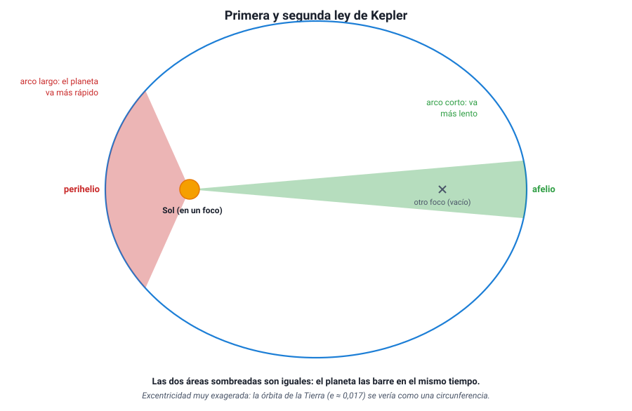
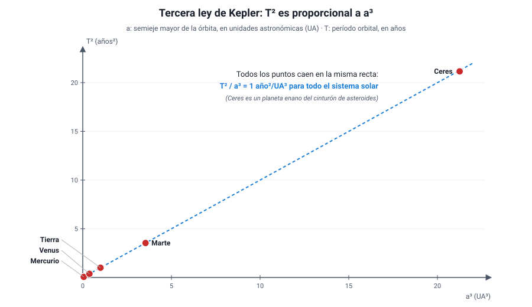

## 6. Las leyes de Kepler

### a. De los datos de Tycho a las leyes

**Johannes Kepler** (1571–1630), un matemático alemán convencido del modelo de Copérnico, trabajó desde 1600 como ayudante de Tycho Brahe en Praga. Al morir Tycho, en 1601, Kepler heredó sus observaciones, las más precisas de la época, y se propuso encontrar la órbita de **Marte**.

Probó durante años con combinaciones de círculos. Su mejor modelo circular se apartaba de las observaciones de Tycho en **8 minutos de arco** como máximo, un error pequeño, pero ocho veces mayor que la precisión de Tycho. Kepler confió en los datos, abandonó el círculo, una idea que venía desde Aristóteles, y encontró que la órbita de Marte es una **elipse**. Publicó sus dos primeras leyes en *Astronomia Nova* (**1609**) y la tercera en *Harmonices Mundi* (**1619**).

::: nota
**Leyes empíricas.** Las leyes de Kepler **describen** cómo se mueven los planetas a partir de los datos, pero no explican **por qué**. La explicación llegó en 1687, con la gravitación universal de Newton (sección 7). Esta distinción entre describir y explicar es importante en la PAES: una ley resume regularidades observadas; una teoría explica su causa.
:::

### b. Primera ley: órbitas elípticas

> **Los planetas describen órbitas elípticas, con el Sol en uno de los focos.**

Una **elipse** es una curva cerrada en la que la suma de las distancias de cualquier punto a dos puntos fijos, los **focos**, es siempre la misma. Se puede dibujar con dos clavos, un hilo y un lápiz. Mientras más separados están los focos, más «achatada» es la elipse; si los focos coinciden, la elipse es una circunferencia. Lo alargada que es una elipse se mide con su **excentricidad** (*e*), entre 0 (circunferencia) y casi 1 (muy alargada).

- El Sol está en **un** foco; el otro foco está vacío. El Sol **no** está en el centro de la elipse.
- El punto de la órbita más cercano al Sol es el **perihelio**; el más lejano, el **afelio**.
- El **semieje mayor** (*a*), la mitad del eje más largo, equivale a la distancia media del planeta al Sol.

Las órbitas de los planetas son elipses **muy poco excéntricas**: la de la Tierra tiene *e* ≈ 0,017 y la de Marte, *e* ≈ 0,093. Dibujadas a escala se ven casi como circunferencias; por eso el modelo de Copérnico funcionaba razonablemente bien. Los cometas, en cambio, tienen órbitas muy alargadas: la del cometa Halley tiene *e* ≈ 0,97.

<figure><figcaption>Figura 7. Primera y segunda ley de Kepler. Las dos áreas sombreadas son iguales y se recorren en el mismo tiempo. Diagrama propio, con excentricidad exagerada.</figcaption></figure>

### c. Segunda ley: áreas iguales en tiempos iguales

> **La línea que une el Sol con un planeta barre áreas iguales en tiempos iguales.**

Cerca del Sol, la línea Sol–planeta es corta; para barrer la misma área en el mismo tiempo, el planeta debe recorrer un **arco más largo**. Por lo tanto:

- En el **perihelio** el planeta se mueve **más rápido**.
- En el **afelio** se mueve **más lento**.

La Tierra pasa por el perihelio a comienzos de enero, a unos 30,3 km/s, y por el afelio a comienzos de julio, a unos 29,3 km/s. Una consecuencia curiosa: en el hemisferio sur, el verano (cuando la Tierra va más rápido) es unos días más corto que el invierno.

::: tip
**La segunda ley habla de áreas, no de distancias.** El planeta **no** recorre distancias iguales en tiempos iguales: recorre más distancia cerca del Sol. Lo que se mantiene constante es el **área barrida** por unidad de tiempo. Si un gráfico muestra la rapidez de un planeta a lo largo de su órbita, el máximo corresponde al perihelio.
:::

### d. Tercera ley: la ley de los períodos

> **El cuadrado del período orbital de un planeta es proporcional al cubo del semieje mayor de su órbita.**

T2 / a3 = constante, la misma para todos los planetas que giran alrededor del Sol.

- *T*: período orbital (tiempo en dar una vuelta).
- *a*: semieje mayor (distancia media al Sol).

Si *T* se mide en **años** y *a* en **unidades astronómicas** (1 UA ≈ 150 millones de km, la distancia media Tierra–Sol), la constante vale 1 para la Tierra y, por lo tanto, para todos los planetas: **T2 = a3**.

| Planeta | a (UA) | T (años) | a3 | T2 |
|---|---|---|---|---|
| Mercurio | 0,387 | 0,241 | 0,058 | 0,058 |
| Venus | 0,723 | 0,615 | 0,378 | 0,378 |
| Tierra | 1,000 | 1,000 | 1,00 | 1,00 |
| Marte | 1,524 | 1,881 | 3,54 | 3,54 |
| Júpiter | 5,20 | 11,86 | 141 | 141 |
| Saturno | 9,54 | 29,5 | 868 | 870 |

<figure><figcaption>Figura 8. Al graficar T² en función de a³ se obtiene una recta que pasa por el origen: T² y a³ son directamente proporcionales. Diagrama propio con datos de los planetas.</figcaption></figure>

::: ejemplo
**Usar la tercera ley.** Un asteroide gira alrededor del Sol con un semieje mayor de 4 UA. ¿Cuál es su período?

- Datos: *a* = 4 UA.
- Fórmula: T2 = a3 (en años y UA).
- Reemplazo: T2 = 43 = 64 → T = √64.
- Resultado: **T = 8 años**.

Al revés: el cometa Halley tarda unos 76 años en volver. Su semieje mayor es a = ∛(762) = ∛5 776 ≈ **18 UA**.

Errores típicos: suponer que el período es proporcional a la distancia (4 UA → 4 años), o elevar al revés (T = 42/3 ≈ 2,5 años).
:::

::: tip
**Mientras más lejos, más lento y más largo.** Un planeta más alejado del Sol tiene un recorrido más largo **y además** se mueve más despacio, por eso su período crece más rápido que su distancia: al doble de distancia, el período es unas 2,8 veces mayor (√8). Ojo: la tercera ley con la constante 1 año²/UA³ solo vale para cuerpos que giran **alrededor del Sol**. Para comparar las lunas de Júpiter entre sí hay que usar otra constante, porque giran alrededor de otro cuerpo central.
:::
