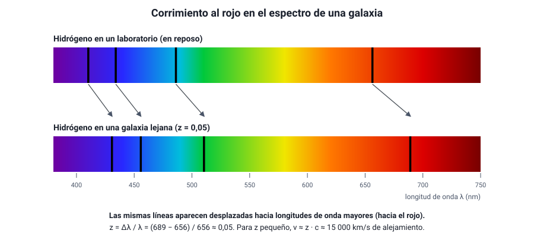
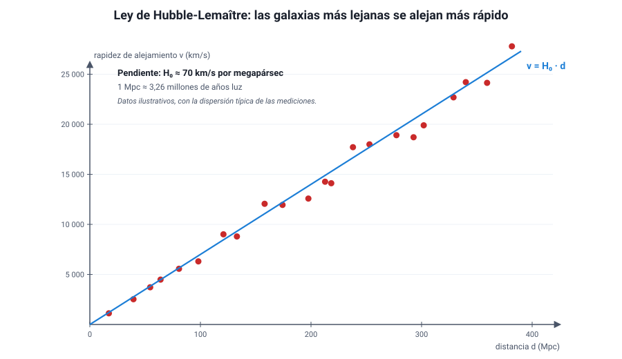
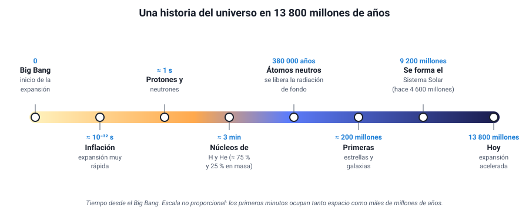

## 8. El origen del universo: la teoría del Big Bang

A comienzos del siglo XX, la mayoría de los científicos, incluido Albert Einstein, pensaba que el universo era **estático** y eterno. En pocas décadas, nuevas observaciones mostraron que el universo **cambia**, que se está **expandiendo** y que tuvo un **comienzo**.

### a. Un universo en expansión

La luz de una estrella o de una galaxia, al pasar por un prisma o una red de difracción, forma un **espectro** con **líneas oscuras** en posiciones características de cada elemento químico, como una huella digital (capítulo 3). Entre 1912 y 1925, Vesto Slipher midió los espectros de decenas de galaxias y notó que en la mayoría esas líneas aparecen **desplazadas hacia el rojo**, es decir, hacia longitudes de onda mayores. Es el **corrimiento al rojo**:

z = Δλ / λ0

- *z*: corrimiento al rojo (sin unidad).
- Δλ: diferencia entre la longitud de onda observada y la de laboratorio.
- λ0: longitud de onda medida en el laboratorio (en reposo).

Para galaxias no muy lejanas, la rapidez con que se alejan es aproximadamente *v* ≈ *z* · *c*, como en el **efecto Doppler** (capítulo 1): si la fuente se aleja, la onda que llega se «estira».

<figure><figcaption>Figura 9. Las líneas del hidrógeno en el espectro de una galaxia lejana aparecen desplazadas hacia el rojo respecto de las del laboratorio. Diagrama propio.</figcaption></figure>

En **1927**, el sacerdote y físico belga **Georges Lemaître**, usando la relatividad general, propuso que el universo se expande y predijo que las galaxias deberían alejarse con una rapidez proporcional a su distancia (el ruso Alexander Friedmann ya había encontrado en 1922 soluciones de un universo en expansión). En **1929**, **Edwin Hubble**, que antes había demostrado que existen galaxias fuera de la nuestra, midió las distancias de varias galaxias y las comparó con su corrimiento al rojo. Encontró la relación que hoy se llama **ley de Hubble-Lemaître**:

v = H0 · d

- *v*: rapidez de alejamiento de la galaxia (km/s).
- *d*: distancia a la galaxia (en megapársecs, Mpc; 1 Mpc ≈ 3,26 millones de años luz).
- *H*0: **constante de Hubble**, hoy estimada entre unos 67 y 73 km/s por megapársec.

<figure><figcaption>Figura 10. Ley de Hubble-Lemaître: la rapidez de alejamiento es proporcional a la distancia. La pendiente de la recta es la constante de Hubble. Datos ilustrativos; diagrama propio.</figcaption></figure>

::: ejemplo
**Distancia a una galaxia.** El espectro de una galaxia muestra la línea roja del hidrógeno (656 nm en el laboratorio) en 669 nm. Considera *c* = 3 × 105 km/s y *H*0 = 70 km/s/Mpc.

1. Corrimiento: z = (669 − 656) / 656 = 13 / 656 ≈ 0,02.
2. Rapidez: v ≈ z · c = 0,02 × 3 × 105 km/s = **6 000 km/s**.
3. Distancia: d = v / H0 = 6 000 / 70 ≈ **86 Mpc**, unos 280 millones de años luz.
:::

**¿Qué significa que todas las galaxias se alejen?** No que estemos en el centro. Imagina un pan con pasas que se infla en el horno: la masa se expande y **cada pasa ve a todas las demás alejarse**, más rápido mientras más lejos están. No hay una pasa central. Del mismo modo, lo que se expande es el **espacio entre las galaxias**; las galaxias no viajan a través del espacio desde un punto de partida. Por eso, en rigor, el corrimiento al rojo cosmológico no es un efecto Doppler: la luz se estira porque el espacio por el que viaja se estira.

::: tip
**Tres confusiones frecuentes.** (1) «Todas se alejan de nosotros, así que somos el centro»: falso, cualquier observador en cualquier galaxia ve lo mismo. (2) «Las galaxias cercanas también se alejan»: no siempre; en las más cercanas domina la gravedad y algunas se acercan, como Andrómeda, que muestra **corrimiento al azul**. (3) «Se expanden las galaxias, las estrellas y los átomos»: no, la gravedad y las demás fuerzas los mantienen unidos; se separan los grupos de galaxias entre sí.
:::

### b. Qué dice la teoría del Big Bang

Si las galaxias se separan, en el pasado estaban más juntas. Retrocediendo en el tiempo, todo el universo observable estuvo concentrado en un estado **extremadamente denso y caliente**. La **teoría del Big Bang** describe la evolución del universo desde ese estado hasta hoy:

- El universo tiene una **edad**: unos **13 800 millones de años**, según las mediciones de la radiación de fondo (satélite Planck). Una estimación simple es el «tiempo de Hubble», 1/*H*0: con 70 km/s/Mpc, da unos 14 000 millones de años.
- Desde entonces, el universo se **expande y se enfría**. A medida que se enfrió, se formaron partículas, luego núcleos, átomos, estrellas y galaxias.

<figure><figcaption>Figura 11. Etapas principales de la historia del universo según la teoría del Big Bang (escala no proporcional). Diagrama propio.</figcaption></figure>

| Tiempo desde el Big Bang | Qué ocurre |
|---|---|
| Fracciones ínfimas de segundo | **Inflación**: una expansión extremadamente rápida que habría dejado el universo casi uniforme |
| ≈ 1 segundo | Existen protones, neutrones, electrones y fotones; demasiado calor para formar núcleos |
| ≈ 3 a 20 minutos | **Nucleosíntesis primordial**: se forman núcleos de hidrógeno y de helio, y trazas de litio |
| ≈ 380 000 años | La temperatura baja a unos 3 000 K y se forman **átomos neutros**; la luz puede viajar libremente y el universo se vuelve **transparente**. Esa luz es la radiación de fondo |
| ≈ 200 millones de años | Se encienden las **primeras estrellas** y se forman las primeras galaxias |
| ≈ 9 200 millones de años (hace 4 600 millones) | Se forman el Sol y el sistema solar |
| 13 800 millones de años | Hoy: el universo sigue expandiéndose, y lo hace cada vez más rápido |

::: tip
**El Big Bang no fue una explosión en un punto del espacio.** No hubo un centro desde el que saliera disparada la materia hacia un espacio vacío: fue una expansión **del espacio mismo**, que ocurrió en todas partes a la vez. Tampoco explica «qué había antes» ni la causa del comienzo: la teoría describe la **evolución** del universo desde un estado inicial muy caliente y denso. Su nombre, además, se lo dio en 1949 el astrónomo Fred Hoyle, que defendía una teoría rival.
:::

### c. Las evidencias del Big Bang

Una teoría científica se acepta cuando sus **predicciones** se confirman con observaciones. El Big Bang se apoya en varias evidencias independientes:

| Evidencia | Qué se observa | Por qué apoya el Big Bang |
|---|---|---|
| **Expansión del universo** | Corrimiento al rojo de las galaxias, proporcional a su distancia (ley de Hubble-Lemaître) | Si el universo se expande, en el pasado estuvo concentrado |
| **Radiación de fondo de microondas** | Una radiación muy débil que llega de **todas las direcciones** por igual, con el espectro de un cuerpo a **2,7 K** | Es el «resplandor» del universo caliente de hace 380 000 años, enfriado y estirado por la expansión hasta las microondas. Se predijo antes de detectarse |
| **Abundancia de elementos livianos** | En el universo hay, en masa, cerca de **75 % de hidrógeno y 25 % de helio**, en todas partes | Es la proporción que predice la nucleosíntesis de los primeros minutos; las estrellas no alcanzan a producir tanto helio |
| **Evolución de las galaxias** | Las galaxias muy lejanas, que vemos como eran hace miles de millones de años, son distintas de las cercanas: más pequeñas, irregulares y con más cuásares | El universo **cambia** con el tiempo, como predice una teoría con historia |

La **radiación de fondo** fue la evidencia decisiva. George Gamow, Ralph Alpher y Robert Herman habían predicho en 1948 que el universo debía estar lleno de una radiación remanente de pocos kelvin. En **1964–1965**, **Arno Penzias y Robert Wilson**, que trabajaban con una antena de radio en Estados Unidos, detectaron por casualidad un «ruido» de microondas que venía de todas las direcciones y que no podían eliminar. Era esa radiación. Recibieron el Premio Nobel de Física en 1978. Después, los satélites COBE (1989), WMAP (2001) y Planck (2009) la midieron con enorme detalle: su temperatura es de **2,725 K** y tiene pequeñísimas variaciones, de 1 parte en 100 000, que son las «semillas» de las galaxias.

::: ejemplo
**¿Por qué microondas?** Según la ley de Wien, la longitud de onda en que un cuerpo emite con más intensidad es inversamente proporcional a su temperatura: λmáx ≈ 2,9 × 10−3 m·K / *T*.

- A 3 000 K (cuando se liberó): λmáx ≈ 2,9 × 10−3 / 3 000 ≈ 1 × 10−6 m, en el infrarrojo cercano, muy cerca de la luz visible.
- Hoy, a 2,7 K: λmáx ≈ 2,9 × 10−3 / 2,7 ≈ 1,1 × 10−3 m = **1,1 mm**, en las **microondas**.

La expansión del universo estiró esa radiación unas 1 100 veces.
:::

::: tip
**Evidencia versus interpretación.** En las preguntas de tipo Evaluar, distingue lo **observado** (el corrimiento al rojo, la radiación de 2,7 K, el 25 % de helio) de la **conclusión** que se saca (el universo se expande, estuvo caliente y denso). Una sola observación rara vez prueba una teoría; lo que da fuerza al Big Bang es que **varias evidencias independientes** apuntan a lo mismo.
:::
