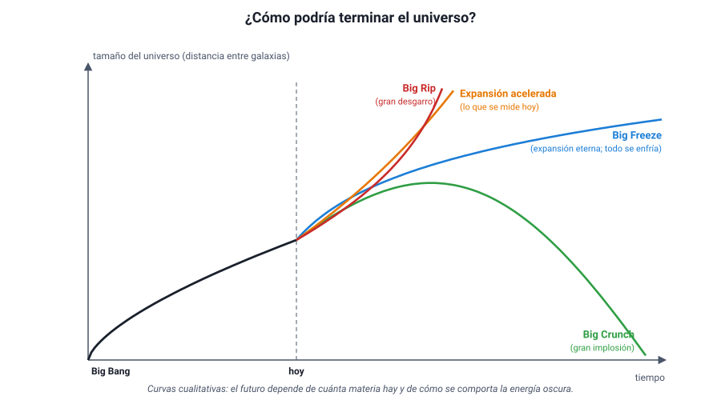

## 9. Evolución y destino del universo

### a. Una teoría rival: el estado estacionario

La ciencia avanza comparando explicaciones. En **1948**, Hermann Bondi, Thomas Gold y Fred Hoyle propusieron la **teoría del estado estacionario**: el universo se expande, pero **no tuvo un comienzo** y se ve igual en todas las épocas. Para que su densidad no disminuya con la expansión, suponían que se **crea materia continuamente** en el espacio vacío, en cantidades tan pequeñas que no se podrían detectar directamente.

Durante unos quince años, ambas teorías compitieron, porque las dos explicaban la expansión. Las observaciones las separaron:

| Observación | Big Bang | Estado estacionario |
|---|---|---|
| Expansión (ley de Hubble-Lemaître) | La explica | La explica |
| Radiación de fondo de microondas (1965) | La **predice** | No la explica: sin un pasado caliente y denso, no hay de dónde salga |
| 25 % de helio en todas partes | Lo predice | No lo explica: las estrellas producen muy poco helio |
| El universo lejano (antiguo) es distinto del cercano | Lo predice: el universo evoluciona | Lo contradice: el universo debería verse igual en todas las épocas |

Tras el descubrimiento de la radiación de fondo, la mayoría de los científicos abandonó el estado estacionario. Hoy el **Big Bang** es la teoría aceptada, aunque sigue en revisión: por ejemplo, las dos formas de medir *H*0 dan valores distintos (unos 67 y 73 km/s/Mpc), una discrepancia llamada **«tensión de Hubble»** que aún no se explica.

::: nota
**Otras ideas sobre el origen.** Existen hipótesis como la de un universo **cíclico u oscilante**, que se expande y se contrae indefinidamente (a veces llamado **Big Bounce**, «gran rebote»), o la de muchos universos. Son propuestas teóricas que, por ahora, no tienen evidencias que las favorezcan sobre el modelo estándar.
:::

### b. Lo que no vemos: materia oscura y energía oscura

Al medir el universo con más precisión aparecieron dos sorpresas:

- **Materia oscura.** En los años 70, la astrónoma estadounidense **Vera Rubin** midió cómo giran las estrellas en las galaxias espirales. Las estrellas de las orillas giran tan rápido como las del interior, cuando, según la gravitación de Newton y la materia visible, deberían ir más lento (como los planetas lejanos del Sol, sección 6). Debe haber mucha más masa que la que vemos: una materia que **no emite ni absorbe luz** y que se detecta solo por su **gravedad**. También lo muestran los cúmulos de galaxias y la forma en que desvían la luz de objetos lejanos (lentes gravitacionales). Todavía no se sabe de qué está hecha.
- **Energía oscura.** Se esperaba que la gravedad **frenara** la expansión. En **1998**, dos equipos que medían la distancia a supernovas muy lejanas (un tipo de explosión estelar que sirve como «vela estándar», porque todas tienen casi el mismo brillo máximo) encontraron que se veían **más débiles** de lo esperado: están más lejos de lo previsto, porque la expansión **se está acelerando**. A lo que causa esa aceleración se le llama energía oscura. El descubrimiento recibió el Premio Nobel de Física en 2011.

::: nota
**Chile en el Nobel de 2011.** La técnica para medir distancias con supernovas se perfeccionó con el **proyecto Calán/Tololo** (1989–1996), de la Universidad de Chile y el Observatorio Interamericano de Cerro Tololo, liderado entre otros por los astrónomos chilenos **José Maza** y **Mario Hamuy**. La Academia Sueca de Ciencias reconoció su aporte esencial al descubrimiento de la expansión acelerada.
:::

Según las mediciones del satélite Planck, el contenido del universo se reparte aproximadamente así:

| Componente | Porcentaje aproximado | Qué es |
|---|---|---|
| **Materia ordinaria** | ≈ 5 % | Todo lo formado por átomos: estrellas, planetas, gas, nosotros |
| **Materia oscura** | ≈ 27 % | Materia invisible que se detecta por su gravedad |
| **Energía oscura** | ≈ 68 % | Lo que acelera la expansión; su naturaleza es desconocida |

::: tip
**Todo lo que vemos es solo cerca del 5 %.** Que se desconozca el 95 % del contenido del universo no invalida el Big Bang, pero muestra que el modelo está incompleto. En la PAES, lo importante es reconocer **qué evidencia** llevó a cada idea: las velocidades de rotación de las galaxias, a la materia oscura; el brillo de las supernovas lejanas, a la energía oscura.
:::

### c. ¿Cómo terminará el universo?

El destino del universo depende de la competencia entre dos efectos: la **gravedad** de toda la materia, que tiende a frenar la expansión, y la **energía oscura**, que la acelera. Se han propuesto varios escenarios:

<figure><figcaption>Figura 12. Posibles futuros del universo según cuánta materia contenga y cómo se comporte la energía oscura. Curvas cualitativas; diagrama propio.</figcaption></figure>

| Escenario | Qué ocurriría | Cuándo ocurriría |
|---|---|---|
| **Big Crunch** («gran implosión») | La gravedad detiene la expansión y el universo empieza a **contraerse**, hasta volver a un estado muy denso y caliente, como un Big Bang al revés | Si hubiera suficiente materia y la energía oscura no dominara (o se debilitara y cambiara de signo) |
| **Big Freeze** («gran congelamiento» o muerte térmica) | El universo se expande **para siempre**; las galaxias se alejan, las estrellas agotan su combustible y se apagan, y todo se enfría hasta acercarse al cero absoluto | Si la expansión continúa indefinidamente, como indican las observaciones actuales |
| **Big Rip** («gran desgarro») | La energía oscura aumenta con el tiempo y la expansión se vuelve tan violenta que **desgarra** galaxias, sistemas planetarios, estrellas y finalmente átomos | Si la energía oscura se hiciera cada vez más intensa |

Con las mediciones actuales, el escenario más probable es una **expansión eterna y acelerada**, que lleva a un **Big Freeze**. Pero la respuesta depende de la naturaleza de la energía oscura, que no se conoce: en 2024 y 2025, el proyecto DESI encontró indicios, todavía no confirmados, de que la energía oscura podría estar **debilitándose** con el tiempo. Si eso se confirma, los escenarios tendrían que revisarse. Es un buen ejemplo de conocimiento científico **provisorio**, que cambia con las evidencias.

::: nota
**Chile, ventana al universo.** El norte de Chile tiene cielos despejados casi todo el año, aire muy seco, gran altitud y poca contaminación lumínica. Por eso ahí se instalaron observatorios como **Cerro Tololo** (1967), **La Silla** (1969), **Las Campanas**, el **VLT** en Paranal (primera luz en 1998), **ALMA**, un radiotelescopio de 66 antenas a unos 5 000 m de altura en el llano de Chajnantor (inaugurado en 2013), y el **Observatorio Vera C. Rubin** en Cerro Pachón (primeras imágenes en 2025). En Cerro Armazones se construye el **ELT**, con un espejo de 39 m, cuya primera luz está prevista para 2029. Chile concentra hoy cerca del **40 %** de la capacidad mundial de observación astronómica, y se proyecta que supere el 60 % hacia 2030.
:::
